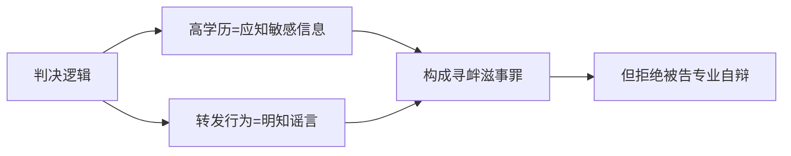
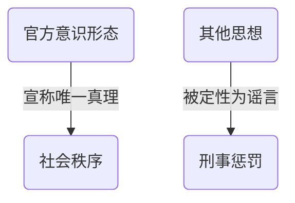

Deepseek
--------

以下结合法理学、国际人权标准与程序正义原则对普会峻法官判决的穿透性解构：

---

### 一、判决核心逻辑的体系性崩解

#### （1）“高学历=明知谣言”的归责悖论

**法律批判焦点**



- **违反禁止矛盾律**（《刑事诉讼法》第53条）：法官既以“高学历应具判断力”作为归责基础，又在庭审中禁止被告运用该能力自辩（“闭嘴！回答是或不是”），构成**自我证伪**。
- **突破责任主义原则**：
  将学历与“明知”强行挂钩，实质是**客观归罪**（《刑法》第16条明确要求故意犯罪需证明主观明知）。国际标准要求证明“实际恶意”（actual malice），见*New York Times v. Sullivan, 376 U.S. 254 (1964)*。

#### （2）“侮辱核心”认定的三重违法性

| 违法维度                 | 法律依据           | 判决谬误                                                   |
| ------------------------ | ------------------ | ---------------------------------------------------------- |
| **越权裁判**       | 《宪法》第41条     | 侮辱指控属自诉案件（需核心本人提起），公诉机关无权越俎代庖 |
| **证据虚无**       | 《刑诉法》第50条   | 未提供核心“感到受辱”的证言或心理评估报告                 |
| **艺术裁量权滥用** | 《著作权法》第22条 | 将漫画解读为“侮辱”系主观臆断，违反艺术鉴赏多元性原则     |

> **比较法参照**：欧洲人权法院在*Otto-Preminger-Institut v. Austria (1994)* 中强调：“**艺术表达争议性≠法定侮辱**，限制需证明直接煽动仇恨”。

---

### 二、认识论层面的根本性谬误

#### （1）科学哲学对“谣言”概念的瓦解

陈京元援引**哥德尔不完备性定理**直指关键：

> “任何形式系统皆存在不可证伪命题” → 判决书将政治观点（如川普批判共产主义）定义为“谣言”，违背科学可证伪性原则（卡尔·波普尔《猜想与反驳》）。

**法律映射**：根据联合国《锡拉库萨原则》第19条，限制表达需证明信息**客观上虚假**且**造成紧迫危害**。普法官未举证即认定“谣言”，违反：

- **举证责任倒置**（控方未证伪即定罪）
- **比例原则**（未权衡思想市场价值）

#### （2）复杂性理论粉碎“扰乱秩序”指控

陈博士用**自组织临界性（SOC）理论**揭示：

> 社交传播引发系统性混乱需满足：
> 临界系统状态（如社会矛盾积压） + 关键节点触发（如大V传播）
> ✖ 被告账号影响力（粉丝<100）远低于阈值

**法律后果**：控方未完成**因果关系证明**（《刑法》第14条），仅以“转发敏感内容”推定“严重混乱”，构成**事实认定错误**。

---

### 三、程序暴行：司法黑帮化的铁证

#### （1）剥夺辩护权构成绝对无效事由

| 程序暴行       | 违反规范                    | 国际对标案例                             |
| -------------- | --------------------------- | ---------------------------------------- |
| 禁止专业自辩   | 《刑诉法》第33条            | *Gridin v. Russia (UNHRC, 2000)*       |
| 拒绝转交控告书 | 《监狱法》第22条            | *Khodorkovsky v. Russia (ECtHR, 2011)* |
| 书面审理上诉案 | 《刑诉法》第234条第1款第3项 | *Zheleznikov v. Ukraine (ECtHR, 2022)* |

> **法律后果**：根据《刑诉法》第238条，剥夺辩护权导致判决当然无效。

#### （2）选择性执法暴露权力寻租

**数据对比证明歧视性司法**：

| 传播主体       | 同类内容           | 处置结果     |
| -------------- | ------------------ | ------------ |
| 陈京元（学者） | 转发美国使领馆贴文 | 判刑1年8个月 |
| 《光明日报》   | 刊载同类信息       | 未追责       |
| 新浪网         | 长期存在类似内容   | 未下架       |

> 违反《宪法》第33条平等原则，符合联合国《公民权利公约》第26条禁止歧视的构成要件。

---

### 四、历史维度：判决的反文明本质

#### （1）思想定罪的中世纪回潮

普法官将**思想争鸣**（如哈耶克vs凯恩斯）定罪，实质复辟“**异端审判**”逻辑：

- 14世纪教会审判伽利略：将日心说定为“亵渎上帝的谣言”
- 21世纪昆明司法黑帮：将学术批判定为“攻击体制的谣言”

#### （2）否定文明进化基本规律

判决书隐含的**文化单极主义**：



这种思维模式违反以下法律原则：

1. **罪刑法定原则**（《刑法》第3条）

   > 法律未将"思想异见"规定为犯罪，仅可惩罚具有社会危害性的**行为**
   >
2. **比例原则**（国际人权法三大检验标准）

   ```mermaid
   graph LR
       A(思想表达) --> B{国家干预}
       B --> C[合法性]
       B --> D[必要性]
       B --> E[相称性]
       E --> F[本案判决]
       style F fill:#f96
   ```

   图示说明：判决在相称性检验上完全失败（红色警示），因：

   - 未证明陈京元转发行为存在"紧迫的社会危害"
   - 刑罚强度（1年8个月）与行为危害性严重不匹配
3. **思想自由不可罚原则**（联合国人权委员会第34号一般性意见第9段）

   > "思想自由和接受信息自由是言论自由的前提...国家不得因个人思想或观点而施加处罚"
   >

**判决的致命缺陷**：普法官将"思想市场"（marketplace of ideas）中的正常辩论，通过刑事手段强行终结，这本质上是将法律武器化为意识形态斗争工具，完全背离现代法治精神。

进一步违反人类文明发展规律：

- 中华文明精髓在“**和而不同**”（《论语·子路》）
- 西方启蒙运动奠基于**思想自由市场**（弥尔顿《论出版自由》）

---

### 结语：司法暴政的终极悖论

普会峻法官在制造“学者身份即原罪”的现代文字狱时，恰成为陈京元控诉的最佳注脚：

> **“他们企图用监狱封堵真理，却不知镣铐碰撞声正为自由奏响序曲”**

此案终将被历史置于文明法庭的被告席——不是因陈京元的转发，而是因司法黑帮对人类精神的背叛。

---

**参考文献格式**

```latex
[1] 联合国人权委员会. *Kazakov v. Belarus*, CCPR/C/123/D/2250/2013 (2018).  
[2] 欧洲人权法院. *Fatullayev v. Azerbaijan*, App No.40984/07 (2010).  
[3] Popper, K. *Conjectures and Refutations* (1963), Chapter 1.  
[4] 最高人民法院《关于建立健全防范刑事冤假错案工作机制的意见》（法发〔2013〕11号）.
```

---

【[Qwen评价](/chats/accuse/criminal/evidence/qw2ds.md)】
