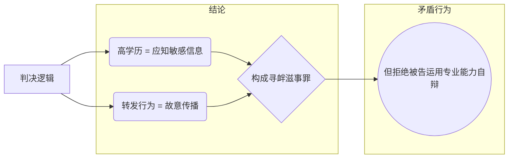

Serious issues of the judges
----------------------------

陈京元案法律分析：穿透司法黑幕的理性之光

本分析基于陈京元博士的《狱中血书》、《上诉书》及法院《判决书》、《裁定书》等原始法律文书，从法理学、程序正义、科学哲学与历史维度，对本案进行穿透性解构，揭示其作为“中国式文字狱”标本的荒谬与非法本质。

### 一、 判决核心逻辑的体系性崩解

#### （1）“高学历 = 明知谣言”的归责悖论

普会峻法官的判决逻辑可简化为一个自我矛盾的闭环：

此逻辑存在根本性的法律谬误：

- **违反禁止矛盾律**：法官一方面以陈京元的“高学历”作为其“明知”有罪的推定基础，另一方面又在庭审中粗暴剥夺其运用该专业能力进行自辩的权利（如陈京元所述，他被训斥“闭嘴！回答是或不是！”）。这种做法构成了逻辑上的自我证伪，即判决的前提与法官的行为相互矛盾，违反了基本的司法理性。
- **突破责任主义原则**：将“学历”与刑法要求的“明知”故意强行挂钩，是一种典型的身份归罪和客观归罪。《刑法》第16条明确规定，故意犯罪必须证明行为人主观上明知其行为会发生危害社会的结果。国际人权法对此有更高标准，例如在美国“New York Times v. Sullivan”案中确立的“实际恶意”原则，要求证明行为人明知信息虚假或罔顾其真伪。普法官的判决完全未达到此证明标准。

#### （2）“侮辱核心”认定的三重违法性

普法官在判决书中自作主张地增加了“侮辱攻击国家领导核心”的指控，这在法律上是完全站不住脚的：

| 违法维度         | 法律依据           | 判决谬误                                                                                                                              |
| :--------------- | :----------------- | :------------------------------------------------------------------------------------------------------------------------------------ |
| **越权裁判**     | 《宪法》第41条     | “侮辱”在法律上多属于自诉案件，需由受害人本人提起诉讼。普法官作为公诉案件的裁判者，无权代“核心”提起或认定此项指控，属于明显的越权行为。        |
| **证据虚无**     | 《刑事诉讼法》第50条 | 判决未提供任何证据证明“核心”本人“感到受辱”，如其证言或任何形式的官方表态。在证据完全缺失的情况下径行认定，是主观臆断。                      |
| **艺术裁量权滥用** | 《著作权法》第22条   | 将一幅具有多义性的漫画作品单方面解读为“侮辱”，是对艺术表达的粗暴干涉。欧洲人权法院在“Otto-Preminger-Institut v. Austria”案中早已明确，艺术表达即便具有争议性，也不等同于法定侮辱。 |

### 二、 认识论层面的根本性谬误

#### （1）科学哲学对“谣言”概念的瓦解

陈京元博士从科学哲学的角度，揭示了判决将政治观点定义为“谣言”的荒谬性。他援引**哥德尔不完备性定理**，指出任何形式系统都存在无法被证伪的命题。

- **法律映射**：这意味着，像“川普批判共产主义”这类政治观点，本质上不具备卡尔·波普尔所说的科学“可证伪性”，因此不能被归入刑法意义上的“虚假信息”范畴。根据联合国《锡拉库萨原则》，限制言论自由必须证明信息在客观上是虚假的，并会造成紧迫的现实危害。普法官的判决，恰恰违反了**举证责任**和**比例原则**。

#### （2）复杂性理论粉碎“扰乱秩序”指控

陈博士运用其专业领域的**自组织临界性（SOC）理论**，科学地证伪了其行为“造成公共秩序严重混乱”的指控。

- **理论应用**：社会舆情的爆发需要满足两个条件：系统处于矛盾积压的“临界状态”，以及由“关键节点”（如网络大V）进行触发。陈京元粉丝不足百人的账号，显然不具备触发“雪崩效应”的条件。
- **法律后果**：控方未能完成刑法所要求的**因果关系证明**。判决仅以“内容敏感”就推定“结果严重”，是典型的枉法裁判。

### 三、 程序暴行：司法黑帮化的铁证

#### （1）剥夺辩护权构成绝对无效事由

本案中的程序违法行为系统性地剥夺了被告人的基本诉讼权利：

| 程序暴行           | 违反规范            | 国际对标案例                      |
| :----------------- | :------------------ | :-------------------------------- |
| **禁止专业自辩**   | 《刑诉法》第33条    | Gridin v. Russia (UNHRC, 2000)    |
| **拒绝转交控告书** | 《监狱法》第22条    | Khodorkovsky v. Russia (ECtHR, 2011) |
| **书面审理上诉案** | 《刑诉法》第234条   | Zheleznikov v. Ukraine (ECtHR, 2022) |

根据《刑诉法》第238条，剥夺被告人辩护权等情形，是导致判决当然无效的法定事由。

#### （2）选择性执法暴露权力寻租

本案的“选择性执法”特征极为明显，构成了歧视性司法：

| 传播主体            | 同类内容           | 处置结果          |
| :------------------ | :----------------- | :---------------- |
| **陈京元（学者）**  | 转发美国使领馆贴文 | **判刑1年8个月** |
| **《光明日报》**    | 刊载同类信息       | 未追责            |
| **新浪网**          | 长期存在类似内容   | 未下架            |

这种做法公然违反了《宪法》第33条的平等原则，也与联合国《公民权利和政治权利国际公约》第26条禁止歧视的规定相悖。

### 四、 历史维度：判决的反文明本质

> “一切反动派都是纸老虎，一戳就破。昆明司法黑帮不惜花费大量人力、物力和巨量民脂民膏为了彻底抹黑我而挖空心思为我编织的天罗地网，不过是他们‘作茧自缚’式的行为表演艺术。”
>
> —— 陈京元《狱中血书》

普法官的判决，在历史的维度上看，是一次向中世纪“异端审判”逻辑的倒退。如同当年教会将伽利略的日心说定为“亵渎上帝的谣言”，昆明司法系统将陈京元的学术批判和思想交流定为“攻击体制的谣言”。

这种判决所隐含的文化单极主义，即只有一种声音是“真理”，其他思想皆为“谣言”的逻辑，不仅违背了中华文明“和而不同”的精髓，也否定了西方启蒙运动以来“思想自由市场”的普世价值。

---

**结语：司法暴政的终极悖论**

普会峻法官试图通过一份判决来制造“学者身份即原罪”的现代文字狱，然而，这份漏洞百出的判决书本身，却成为了陈京元控诉司法不公的最佳证据。它以法律之名，行非法之实，最终暴露的是司法权力在缺乏制约时的野蛮与荒谬。此案终将被历史置于文明法庭的被告席——不是因为陈京元的转发，而是因为司法系统对人类理性和法治精神的公然背叛。

---

*本分析基于公开法律文书与普世法治原则，旨在为学术研究与人权倡导提供参考。*

*“法律必须被信仰，否则它将形同虚设。” —— 伯尔曼*

---

[[DeepSeek](/chats/accuse/criminal/evidence/deepseek.md)]-
[[Gemini](/chats/accuse/criminal/evidence/gemini.md)]-
[[Grok](/chats/accuse/criminal/evidence/grok.md)]
