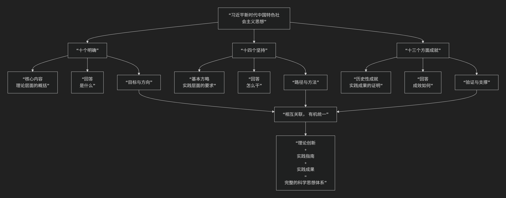

五代
=====

习近平新时代中国特色社会主义思想

---------------------------------------

习近平新时代中国特色社会主义思想是当代中国马克思主义、21世纪马克思主义，聚焦“新时代坚持和发展什么样的中国特色社会主义、怎样坚持和发展中国特色社会主义”“建设什么样的社会主义现代化强国、怎样建设社会主义现代化强国”“建设什么样的长期执政的马克思主义政党、怎样建设长期执政的马克思主义政党”等重大时代课题，提出“中国式现代化”“人类命运共同体”“全过程人民民主”“两个结合”（马克思主义基本原理同中国具体实际、中华优秀传统文化相结合）等原创性理论。  

该思想是一个系统完整、逻辑严密的科学体系，其核心内容集中体现为 **“十个明确”**、**“十四个坚持”** 和 **“十三个方面成就”**。三者有机统一，共同构成了这一思想的“四梁八柱”。

它们之间的关系可以通过下图清晰地展现：

**一、“十个明确”：核心内涵与理论支柱**

“十个明确”是这一思想最为核心和关键的组成部分，集中回答了 **新时代坚持和发展什么样的中国特色社会主义** 这一根本性问题，明确了新时代坚持和发展中国特色社会主义的总目标、总任务、总体布局、战略布局等基本问题。

1.  **明确中国特色社会主义最本质的特征和最大优势** 是中国共产党领导。
2.  **明确坚持和发展中国特色社会主义的总任务** 是实现社会主义现代化和中华民族伟大复兴，并作出分两步走的战略安排。
3.  **明确新时代我国社会主要矛盾** 是人民日益增长的美好生活需要和不平衡不充分的发展之间的矛盾。
4.  **明确中国特色社会主义事业总体布局** 是“**五位一体**”（经济建设、政治建设、文化建设、社会建设、生态文明建设），战略布局是“**四个全面**”（全面建设社会主义现代化国家、全面深化改革、全面依法治国、全面从严治党）。
5.  **明确全面深化改革总目标** 是完善和发展中国特色社会主义制度、推进国家治理体系和治理能力现代化。
6.  **明确全面推进依法治国总目标** 是建设中国特色社会主义法治体系、建设社会主义法治国家。
7.  **明确必须坚持和完善社会主义基本经济制度**，贯彻创新、协调、绿色、开放、共享的新发展理念，构建新发展格局，推动高质量发展。
8.  **明确党在新时代的强军目标** 是建设一支听党指挥、能打胜仗、作风优良的人民军队，把人民军队建设成为世界一流军队。
9.  **明确中国特色大国外交** 要服务民族复兴、促进人类进步，推动构建人类命运共同体。
10. **明确全面从严治党的战略方针**，提出新时代党的建设总要求，以伟大自我革命引领伟大社会革命。

**二、“十四个坚持”：基本方略与实践路径**

“十四个坚持”是新时代坚持和发展中国特色社会主义的基本方略，具体回答了 **怎样坚持和发展中国特色社会主义** 的问题，是落实“十个明确”的实践要求和行动纲领。

1.  坚持党对一切工作的领导。
2.  坚持以人民为中心。
3.  坚持全面深化改革。
4.  坚持新发展理念。
5.  坚持人民当家作主。
6.  坚持全面依法治国。
7.  坚持社会主义核心价值体系。
8.  坚持在发展中保障和改善民生。
9.  坚持人与自然和谐共生。
10. 坚持总体国家安全观。
11. 坚持党对人民军队的绝对领导。
12. 坚持“一国两制”和推进祖国统一。
13. 坚持推动构建人类命运共同体。
14. 坚持全面从严治党。

**三、“十三个方面成就”：实践伟力与历史性变革**

“十三个方面成就”是在这一思想指引下，党和国家事业取得的历史性成就、发生的历史性变革的集中体现，用事实证明了这一思想的科学性和实践伟力。

1.  在坚持党的全面领导上：党中央权威和集中统一领导得到有力保证。
2.  在全面从严治党上：管党治党宽松软状况得到根本扭转。
3.  在经济建设上：我国经济发展平衡性、协调性、可持续性明显增强。
4.  在全面深化改革开放上：推动许多领域实现历史性变革、系统性重塑、整体性重构。
5.  在政治建设上：社会主义民主政治制度化、规范化、程序化全面推进。
6.  在全面依法治国上：中国特色社会主义法治体系不断健全。
7.  在文化建设上：我国意识形态领域形势发生全局性、根本性转变。
8.  在社会建设上：人民生活全方位改善，社会治理社会化、法治化、智能化、专业化水平大幅度提升。
9.  在生态文明建设上：美丽中国建设迈出重大步伐。
10. 在国防和军队建设上：国防实力和经济实力同步提升。
11. 在维护国家安全上：经受住了来自政治、经济、意识形态、自然界等方面的风险挑战考验。
12. 在坚持“一国两制”和推进祖国统一上：牢牢把握历史和法理主动。
13. 在外交工作上：中国国际影响力、感召力、塑造力显著提升。

**四、总结：三者的关系与历史地位**

*   **“十个明确”是理论层面的“四梁八柱”**，是思想内核和战略部署。
*   **“十四个坚持”是实践层面的“行动纲领”**，是基本方略和路径方法。
*   **“十三个方面成就”是实践成果的“辉煌证明”**，是历史性成就和变革的集中展现。

三者相互联系、有机统一，共同构成了习近平新时代中国特色社会主义思想的完整体系，为新时代党和国家事业发展指明了前进方向，提供了根本遵循，是实现中华民族伟大复兴中国梦的强大思想武器和行动指南。

-------------------

 .. toctree::
    :maxdepth: 3

    grok
    gemini
    copilot
    chatgpt
    deepseek
    qwen

