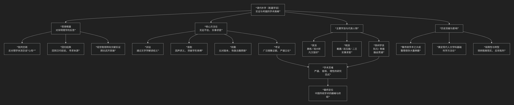

朴学
=========

基于清代朴学的理论视角。

-------

清代朴学，又称 **实学**、 **考据学** 或 **汉学** ，是中国学术史上的一座高峰。它主导了清代尤其是乾隆、嘉庆年间（故亦称 **乾嘉学派** ）的学术思想。其核心可概括为：**一种以复兴汉代经学为旗帜，以考据实证为方法，以整理、还原古代经典真实面貌为宗旨的学术思潮。它是对宋明理学空谈心性之风的深刻反动，体现了高度的科学理性与严谨精神。**

清代朴学的整体面貌与演变脉络，可以通过下图清晰地把握：

以下，我们将沿此逻辑脉络，深入解析其核心要义。

一、基本思想：朴学何以“朴”？

“朴”即质朴、朴实。朴学的思想内核体现在对学术研究方法的彻底革新上。

1.  **思想根基：对宋明理学的反动**

    *   **批判空疏**：朴学家认为宋明理学（尤其是心学末流）束书不观，空谈“心性”、“天理”，脱离了经典文本本身，是导致明朝灭亡的重要原因之一。

    *   **回归汉代经学**：为纠其弊，他们主张越过宋代注疏，直接回归到汉代经师（如郑玄、贾逵、马融）的著作，认为汉儒去古未远，训诂名物更为可靠。故称“汉学”。

2.  **核心方法：“无征不信”与“实事求是”**

    *   **无征不信**：任何论点必须有 **确凿的证据** 支持。证据来源广泛，包括文献、金石、音韵、典章制度等。

    *   **实事求是**：从 **具体的事实** 出发，通过严谨的推理来探求真理，而非主观臆测。这八个字是朴学的灵魂。

3.  **研究范式：一套科学的治学流程**

    *   **训诂**：通过研究文字的本义来解读经典。

    *   **音韵**：懂得古今音变，才能“因声求义”，打破字形束缚，发现通假关系。

    *   **校勘**：广泛搜集不同版本，比对文字异同，力求恢复古籍原貌。

    *   **考证**：对古籍中的人物、事件、制度、名物进行广泛而细致的考据验证。

二、代表人物：朴学的星空

清代朴学大家辈出，按其学术风格和地域，可主要分为吴派、皖派和扬州学派。

**1. 先驱与奠基者**

.. list-table:: 
   :header-rows: 1
   :widths: 30 70
   :align: left

   * - **人物**
     - **核心贡献**
   * - **顾炎武**
     - **朴学开山祖师**。提出 **"经学即理学"** ，反对空谈，主张回归经典。其《日知录》、《音学五书》等著作，以扎实的考据方法为后世树立了典范。名言："**读经自考文始，考文自知音始。**"
   * - **阎若璩**
     - **考据学巨擘**。其《古文尚书疏证》以铁证考定流传千年的《古文尚书》为伪书，震动学界，彰显了考据学的威力。

**2. 吴派（苏州学派）：“凡汉皆好”**

此派崇尚汉儒经说，学风较为保守。

.. list-table:: 
   :header-rows: 1
   :widths: 30 70
   :align: left

   * - **人物**
     - **核心贡献与特点**
   * - **惠栋**
     - **吴派奠基人**。学风遵循 **"凡古必真，凡汉皆好"** 。代表作《周易述》。
   * - **钱大昕**
     - **吴派巨擘，学术顶峰之一**。学识极博，在史学、音韵学、金石学等领域成就卓著。代表作《廿二史考异》。他提出的"古无轻唇音"等音韵规律至今被认可。

**3. 皖派（徽州学派）：“实事求是”的顶峰**

此派是朴学的 **主力与高峰**，学风更为精审和科学，强调实证。

.. list-table:: 
   :header-rows: 1
   :widths: 30 70
   :align: left

   * - **人物**
     - **核心贡献与特点**
   * - **戴震**
     - **皖派核心，朴学集大成者**。提出从 **"训诂"** 入手以探求 **"义理"** （**"由字以通其词，由词以通其道"**）。不仅是考据大师，也是重要哲学家。代表作《孟子字义疏证》。
   * - **段玉裁**
     - **戴震弟子，文字学泰斗**。其《说文解字注》是研究《说文》的集大成之作，被誉为"千七百年来无此作"。
   * - **王念孙、王引之父子**
     - **训诂学领域的巅峰**。王念孙的《读书杂志》、王引之的《经义述闻》，解决了大量古籍中的疑难问题，方法之严谨，结论之精当，堪称典范。

**4. 扬州学派：融会贯通**

此派能汲取吴、皖两派之长，学术视野更为开阔。

.. list-table:: 
   :header-rows: 1
   :widths: 30 70
   :align: left

   * - **人物**
     - **核心贡献**
   * - **阮元**
     - **清代中期的学术领袖**。组织编纂《经籍籑诂》、校刻《十三经注疏》、主编《皇清经解》，对乾嘉学术成果进行了大规模总结。
   * - **焦循**
     - 博通经学、易学、算学。代表作《孟子正义》。

三、历史评价

*   **巨大贡献**：

    1.  **集传统学术之大成**：对古代文献进行了空前规模的整理、校勘、辨伪和注释，为后人研究提供了可靠的基础。

    2.  **确立科学方法**：其“无征不信”的实证精神，为中国现代人文学科（如历史、语言、考古）奠定了方法论基础。

    3.  **文化传承**：保存和延续了中华文化的血脉。

*   **历史局限**：

    1.  **琐碎饾饤**：部分学者沉溺于一字一句的考据，流于琐碎， “只见树木，不见森林”。

    2.  **脱离现实**：在清廷文化高压下，学者为避祸而躲入故纸堆，导致学术研究与社会现实严重脱节。

    3.  **后世批判**：晚清以来，面对西方冲击，学者批评其“无用”，遂有今文经学的复兴和新学的兴起。

四、总结

总而言之，清代朴学是一次 **中国学术的理性转向**。它将学术研究建立在 **坚实的证据和严谨的逻辑** 之上，达到了传统学术方法的顶峰。尽管有其时代局限，但其倡导的 **实事求是、无征不信** 的科学精神，至今仍是学术研究的黄金准则。

-------------------

 .. toctree::
    :maxdepth: 3

    grok
    gemini
    copilot
    chatgpt
    deepseek
    qwen
