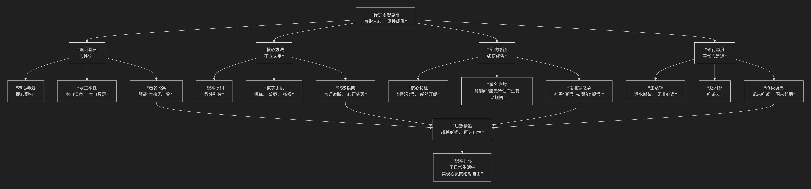

禅宗
=====

基于禅宗的核心思想

---------------------------------

禅宗是中国化佛教最典型的代表，其核心思想极为独特和深刻，可以概括为：**“直指人心，见性成佛”。它摒弃繁琐的经典仪轨，强调依靠自力，通过内心的瞬间觉悟，发现并认证人自身本具的、与佛无二的纯净本性，从而达成生命的终极解脱。**

禅宗的思想体系直接而富有革命性，其核心架构与修行路径可以通过下图清晰地展现：

以下，我们将沿此逻辑脉络，深入解析禅宗的核心要义。

一、理论基石：“即心即佛”的心性论

这是禅宗所有思想的出发点。

*   **核心命题**：**“即心即佛”**，或者说 **“佛向性中作，莫向身外求”**。

    *   意思是，**众生本身就具有圆满的佛性（成佛的可能性），佛就在每个人的心中，不需要向外寻求。** 解脱的根本在于向内认识自己的本心。

*   **众生本性**：禅宗认为，人的本心本性是：

    *   **本自清净**：先天是纯净、无染的，如同明镜。烦恼执着只是后天蒙上的尘埃。

    *   **本自具足**：本身已经圆满，什么都不缺，无需外求。

*   **著名例证**：六祖慧能的得法偈：**“菩提本无树，明镜亦非台。本来无一物，何处惹尘埃。”** 这首偈语比神秀的“时时勤拂拭”更彻底地指向了心性本空的本质，因而得到五祖弘忍的认可，继承了衣钵。

二、核心方法：“不立文字，教外别传”

这是禅宗最革命性、最著名的特征，是其区别于其他佛教宗派的根本所在。

*   **根本原则**：禅宗认为，最高的真理（真如佛性）是 **超越语言和文字** 的。拘泥于经典文字，反而会束缚心灵，无法见到真实。因此，禅宗宣称自己是 **“教外别传，不立文字，直指人心，见性成佛”**。

*   **教学手段**：既然不用文字，禅师如何教导弟子？他们发展出一套极其独特的方式：

    *   **机锋**：师生或师兄弟间快速、含蓄、往往不合常规逻辑的问答，旨在切断对方的惯性思维，激发悟性。

    *   **公案**：记录前辈禅师开悟经历或机锋对答的典故，供后人参究。著名的如“赵州茶”（“吃茶去”）、“庭前柏树子”等。

    *   **棒喝**：更直接的身体动作，如临济宗的当头棒喝，用突然的刺激使学人瞬间放下思虑，直下承当。

*   **目的**：所有这些方法，都是为了 **“言语道断，心行处灭”**——打断逻辑思维和语言分别，让心灵在无路可走之处，豁然开朗。

三、实践路径：“顿悟成佛”

与“渐悟”（逐步修行、逐渐觉悟）相对，禅宗，尤其是南宗慧能一系，强调 **“顿悟”**。

*   **核心特征**：觉悟的发生是 **瞬间的、彻底的**，如同突然打开开关，整个房间瞬间明亮。它不是知识的积累，而是 **心灵视角的根本转换**。一旦开悟，则“一即一切，一切即一”，全体洞然明白。

*   **著名典故**：慧能本人就是在卖柴时听人诵《金刚经》至 **“应无所住而生其心”** 一句，言下大悟。

*   **南北宗之争**：神秀主张 **“时时勤拂拭，勿使惹尘埃”** ，强调持续渐修的功夫；而慧能则认为心性本净，**“顿悟”** 的关键在于一念之间的转变。慧能的南宗最终成为禅宗的主流。

四、修行态度：“平常心是道”与“生活禅”

禅宗将修行彻底地融入日常生活，这是其中国化的极致体现。

*   **核心主张**：**“运水搬柴，无非妙道”**。真正的道不在遥远的深山古刹，而在日常的点点滴滴中。**“饥来吃饭，困来即眠”** 就是修行。

*   **著名公案**：有僧问赵州和尚什么是佛法大意，赵州答：**“吃茶去。”** 这表示最深的佛法就在最平常的生活里，用一颗平常心去体会即可。

*   **终极境界**：一个开悟者，不是拥有神通或特异功能，而是在任何情境下都保持 **心灵的自在与清明**，做事时全心投入，事过则心无挂碍。

五、核心要义总结

.. list-table:: 
   :header-rows: 1
   :widths: 25 40 35
   :align: center

   * - **理论维度**
     - **核心命题**
     - **关键概念与体现**
   * - **心性论**
     - **"即心即佛"：众生本具佛性，无需外求。**
     - **本自清净、本自具足、慧能得法偈**
   * - **方法论**
     - **"不立文字"：真理超越言诠，直指人心。**
     - **教外别传、机锋、公案、棒喝**
   * - **修行论**
     - **"顿悟成佛"：觉悟是刹那间的根本转变。**
     - **言下大悟、一念相应、南北宗之争**
   * - **生活论**
     - **"平常心是道"：佛法在世间，修行于日常。**
     - **运水搬柴、吃茶去、饥食困眠**

六、思想特质与历史影响

*   **彻底的内心革命**：禅宗是一场将成佛的权威从“佛祖”、“经典”转移到 **“个人内心”** 的革命，极大地高扬了人的主体性和自信心。

*   **高度的中国化**：它深度融合了道家“自然无为”和儒家“入世”的精神，形成了独特的面貌，是印度佛教中国化的最高成果。

*   **深远的文化影响**：禅宗深刻影响了中国的 **文学、艺术（尤其是写意山水画）、茶道、武术**，并远播日、韩，塑造了东亚文化的精神气质。

*   **现代的共鸣**：其“直指本质”、“打破框架”的思维方式，在现代心理学、管理学、艺术创作等领域仍能引发广泛共鸣。

七、总结

总而言之，禅宗的核心思想在于，它是一位 **“心灵的破障者”和“生活的点化者”** 。它教导我们，**生命的真理不在浩瀚的经典中，也不在遥远的彼岸，而就在我们每一个当下的起心动念和行住坐卧之中。解脱之道，无非是扫除妄念的尘埃，让本自光明的心性自然显现。**

它的全部工作是对 **佛教修行方式** 的一次最彻底的简化与升华。它卸下了沉重的宗教形式负担，直抵智慧的核心，为世人开辟了一条 **简洁、直接、充满生机** 的觉悟之路。在这个意义上，禅宗不仅是佛学的一支，更是一种活生生的、充满智慧的生命艺术。

------------------------

 .. toctree::
    :maxdepth: 3

    grok
    copilot
    chatgpt
    deepseek
    gemini
    qwen

