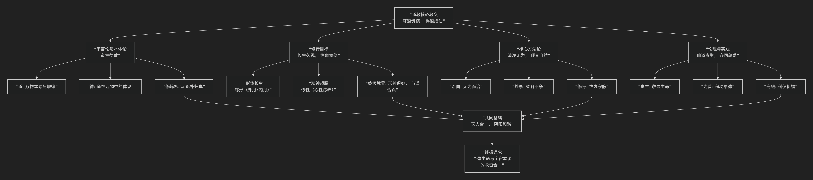

道教
=========

基于道教核心教义。

-------

道教的核心教义深邃而丰富，其思想源于 :doc:`【先秦道家】 </chats/outlaw/analyse/chinese/school/dao/index>`，并在后世发展中融入了宗教修持、科仪方术等内容。其核心可概括为：**以“道”为最高信仰，以“德”为修行准则，通过“无为”、“清静”的修养，追求“长生久视”、“得道成仙”的终极目标，并达到“天人合一”的最高境界。**

为了更直观地理解道教核心教义的体系与修行路径，下图清晰地勾勒了其核心架构：

以下，我们将沿此逻辑脉络，深入解析其核心要义。

一、根本基石：“道”与“德”

这是道教信仰和哲学的基石。

1.  **道**

    *   **定义**：“道”是宇宙万物的本源、创造者和最终法则。它无形无象，先于天地而生，寂静空虚，周行不殆。正如《道德经》所言：“**有物混成，先天地生。寂兮寥兮，独立而不改，周行而不殆，可以为天下母。吾不知其名，强字之曰道。**”
    
    *   **特性**：道是超越言语和概念的，它自然无为，生化万物。

2.  **德**

    *   **定义**：“德”是“道”在具体个体（包括人和万物）身上的体现和功能。万物得之于“道”的本性，就是“德”。

    *   **关系**：老子说：“**道生之，德畜之。**” 道生成万物，德养育万物。因此，“尊道”必须“贵德”。对于修行者而言，积德是悟道、证道的前提。

二、核心目标：“长生久视”与“得道成仙”

道教与其他宗教最大的不同之一，在于其对生命的高度肯定和积极追求。

1.  **贵生恶死**：道教认为生命是极其可贵的，反对消极的顺应以死亡。葛洪在《抱母子》中直言：“**天地之大德曰生**”，追求长生是符合天地之道的。

2.  **性命双修**：追求长生不仅是肉体的永恒（“命功”），也包括精神的超越和解脱（“性功”）。理想的成仙状态是“形神俱妙”，即身体和精神都达到不朽和自由的境界。

3.  **仙真境界**：“仙”是突破了生死局限、与道合一的理想人格。他们逍遥自在，拥有神通，是修道者追求的终极目标。

三、根本方法：“无为”与“自然”

这是达到上述目标的核心修行原则，常被误解为“什么都不做”。

1.  **无为**

    *   **真义**：不是消极无为，而是 **“不妄为”** 。即不违背自然规律（道）强行干预，而是顺应事物的本性去行动。如治理天下要“无为而治”，个人修养要“清净无为”。

2.  **自然**

    *   **真义**：“自然而然”，是“道”的运行方式。老子说：“**人法地，地法天，天法道，道法自然。**” 修行的要诀就是去除人为的造作和私欲，回归到最本真、最自然的状态。

四、主要实践：“炼养”与“斋醮”

为了实现目标，道教发展出了一套极其丰富的实践体系。

1.  **炼养方术（个体修行）**：

    *   **内丹术**：将人体视为“炉鼎”，以体内的“精、气、神”为药物，通过特定的步骤炼养，最终在体内结成“圣胎”（金丹），达成生命的蜕变。这是道教最高深的修行法门。

    *   **外丹术**：通过炉火烧炼自然界的金石草药，制成丹药，服食以求长生。虽然外丹术在历史上造成一些问题，但它促进了古代化学（炼丹术）的发展。

    *   **其他方术**：如导引（类似体操，如五禽戏）、吐纳（呼吸修炼）、服气、房中等。

2.  **斋醮科仪（集体宗教活动）**：

    *   通过一系列庄严的仪式、诵经、礼拜，来祭拜神灵、祈福禳灾、超度亡灵。这些仪式体现了道教对神明的信仰和“齐同慈爱”的伦理关怀。

五、伦理基础：“齐同慈爱”与“积功累德”

道教同样强调道德是修道的基础。**“欲修仙道，先修人道”**。

1.  **核心伦理**：受《道德经》和《太平经》影响，道教提倡 **“齐同慈爱”** 的平等博爱精神，要怜悯一切众生。

2.  **具体规范**：如《太上感应篇》强调“诸恶莫作，众善奉行”，通过行善积德来感通天地，作为成仙的资粮。

六、总结

总而言之，道教的核心教义在于，它是一位 **“生命的修行者”和“自然的顺应者”** 。它教导人们，**宇宙的本质是生生不息的“道”，人生的最高意义在于通过“清净无为”的修行，使个人的生命与宇宙的本体“道”合而为一，从而达到长生久视、逍遥物外的神仙境界。**

它的全部工作是对 **生命本身** 的一次最积极的肯定和探索。在道教看来，**人生的悲剧不在于死亡，而在于迷失了与道合一的本来面目。真正的解脱不是等待来世的救赎，而是在此生此世，通过自身的修炼，实现生命的升华和永恒。** 在这个意义上，道教不仅是一种宗教信仰，更是一种充满实践精神的生命哲学。

-------------------

 .. toctree::
    :maxdepth: 3

    grok
    gemini
    copilot
    chatgpt
    deepseek
    qwen

----------------------------------------------------------

道教常识：

-----------

:doc:`中国道教宗派 </chats/outlaw/analyse/chinese/main/dao/review>`

-------------------------------------------------------------------------

**道教经典文献**

最具代表性的是 **《道德经》首章** 和 **《清静经》的开篇段落**。它们以精炼的语言概括了道教的核心宇宙观、修行目标与方法。

以下是对比分析：

一、根本纲领：《道德经》首章

《道德经》第一章被视为道家哲学的“总纲”，直接阐释“道”的本体与认知方法：

.. important::   

    道可道，非常道；名可名，非常名。  
    无，名天地之始；有，名万物之母。  
    故常无，欲以观其妙；常有，欲以观其徼。  
    此两者同出而异名，同谓之玄，玄之又玄，众妙之门。

**纲领性解读：**  

1. **道的超越性**：开篇点明“道”不可被言语完全限定（类似《大学》开宗明义）。 

2. **宇宙生成**：以“无”为天地本源，“有”为万物之母，奠定道教宇宙论基础。  

3. **修行方法**：通过“观无”“观有”体认道妙，指向内在悟道的实践路径。  

4. **统一辩证**：“有”与“无”同出而异名，体现道教对立统一的核心思维。

二、修行纲领：:doc:`《清静经》 </chats/outlaw/analyse/chinese/main/dao/abc>` 开篇  

这部短小精悍的经典开篇即点明修行核心，更具实践指导性，堪称“道教心性论纲领”：

.. important::   

    大道无形，生育天地；大道无情，运行日月；大道无名，长养万物。吾不知其名，强名曰道。  
    夫道者，有清有浊，有动有静。天清地浊，天动地静；男清女浊，男动女静。降本流末，而生万物。  
    **清者浊之源，动者静之基。人能常清静，天地悉皆归。**

**纲领性解读：**  

1. **道体描述**：首句概括道的创生性与超越形名之特性（呼应《道德经》）。  

2. **化生规律**：由道之动静、清浊衍生万物，揭示宇宙秩序。  

3. **修行总诀**：最终落脚于“常清静”——既是方法（守静笃），也是境界（天人合一），直接对应《大学》“知止而后有定…静而后能安”的修养阶梯。

三、与儒家《大学》纲领的对比

.. list-table:: 
   :header-rows: 1
   :widths: 25 35 40
   :align: center

   * - **特征**
     - **儒家《大学》开篇**
     - **道教《清静经》开篇**
   * - **核心目标**
     - **明明德、亲民、止于至善（道德与社会理想）**
     - **契道归真、天地悉归（天人合一的境界）**
   * - **实践路径**
     - **格物致知…治国平天下（外向推展）**
     - **澄心遣欲、回归清静（内向修炼）**
   * - **逻辑结构**
     - **三纲八目，次第分明**
     - **道体→化生→修心，环环相扣**

四、其他候选纲领性文本

- **《庄子·齐物论》首段**：提出“吾丧我”境界，概括道家破除执念、万物齐一的精神追求。  

- **《阴符经》开篇**：“观天之道，执天之行，尽矣”——强调观察自然规律并与之协同，为道教应用哲学的纲领。

.. important::   

    观天之道，执天之行，尽矣。故天有五贼，见之者昌。五贼在心，施行于天。宇宙在乎手，万化生乎身。  

若需选出一段最接近儒家《大学》开篇“纲领”地位的文字，**《清静经》开篇** 最为贴切：  

- 它同样 **简短精悍**；  

- 清晰交代了 **宇宙本源→万物化生→修行方法→终极境界** 的完整框架；  

- 在道教内部广为流传，是日常诵经的必读篇章，**实践指导性极强**。

