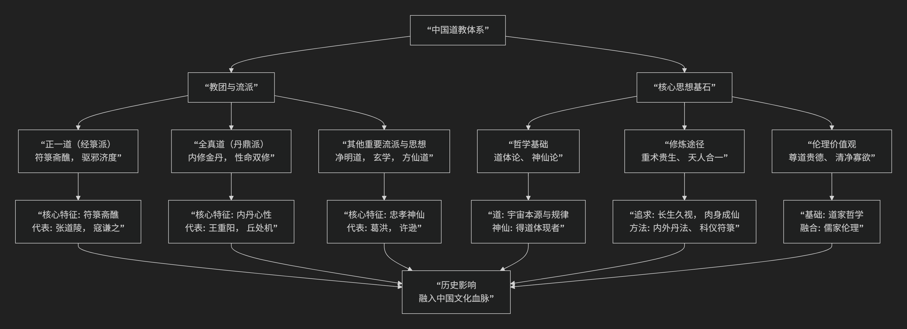

# 中国道教宗派

---

中国道教是一个博大精深、流派纷呈的体系，其发展历程漫长而复杂。其核心思想与流派演变，可以通过下图清晰地概览：

以下，我们将沿此脉络，深入解析道教的核心要义与主要流派。

---

### **一、核心思想：道教的共同基石**

尽管流派各异，但所有道教分支都共享一些最根本的思想理念：

1.  **尊“道”贵“德”**
    *   **“道”**：被认为是宇宙万物的本源、本体和运行规律。它无形无名，化生天地，是终极的信仰核心。
    *   **“德”**：是“道”在具体事物中的体现和功能。修道即是“积德”，最终目标是“与道合真”。

2.  **神仙信仰**
    *   道教相信通过特定修炼，人可以“长生不死”，成为“神仙”。神仙是“道”的化身和体现，是修道者追求的终极目标。这是一个庞大的、有等级的神灵体系。

3.  **重生贵生**
    *   道教极度珍视生命，追求**长生久视**、**肉体成仙**。这与许多宗教追求死后解脱截然不同，形成了其“乐生”的鲜明特色。

4.  **天人合一**
    *   认为人体是小宇宙，与天地大宇宙相对应和感应。通过修炼自身，可以沟通天地能量，达到天人合一的境界。

5.  **方术修炼**
    *   为达到长生目标，发展出极其丰富的修炼“术法”，主要包括：
        *   **外丹术**：炼制和服食金丹。
        *   **内丹术**：以自身为鼎炉，炼化“精、气、神”。
        *   **斋醮科仪**：通过仪式、符咒与神明沟通，祈福禳灾。
        *   **养生术**：导引、吐纳、服食、房中等。

---

### **二、主要流派：两大主流与历史支流**

道教流派在历史上不断演变，最主要的是**正一道**与**全真道**这两大延续至今的宗派。

#### **1. 正一道（又称天师道、符箓派）**

*   **核心特征**：以**符箓斋醮**为主要修行方式。擅长画符念咒、驱邪治鬼、祈福禳灾。道士可以结婚，不住宫观，在家修行，世袭罔替。
*   **历史源流**：
    *   **创立**：东汉末年，张道陵在鹤鸣山创立“五斗米道”，为道教有组织的教团开端，其孙张鲁割据汉中，政教合一。
    *   **革新**：南北朝时，寇谦之改革“天师道”（北天师道），陆修静整理三洞经书（南天师道），使教义和仪轨规范化。
    *   **正名**：元成宗封张道陵后代为“正一教主”，主领江南道教，从此得名“正一道”。
*   **代表人物**：
    *   **张道陵**：教团创始人，被尊为祖天师。
    *   **寇谦之**：北魏道士，改革天师道，使其得到官方承认。
*   **经典**：《正一经》为核心经典。

#### **2. 全真道（又称内丹派）**

*   **核心特征**：强调**内修心性**，追求**性命双修**。以修炼内丹为主要途径，不尚符箓，主张“识心见性”。道士必须出家、住观、素食、清修，有严格的戒律。
*   **历史源流**：
    *   **创立**：金代初年，由王重阳于陕西终南山所创。
    *   **发展**：王重阳收“全真七子”为徒，其中丘处机西行觐见成吉思汗，“一言止杀”，被尊为国师，使全真道走向鼎盛。
*   **代表人物**：
    *   **王重阳**：创始人，主张儒释道三教合一。
    *   **丘处机**：发扬光大者，开创全真龙门派，影响最为深远。
*   **经典**：重视《道德经》、《清静经》、《孝经》和《心经》，体现三教合一思想。

#### **3. 其他重要流派与思想**

*   **净明道**：宋元时期兴起，强调 **“忠孝为本，净明为用”** ，将儒家伦理与道教修炼紧密结合，被称为“净明忠孝道”。
*   **玄学**（魏晋）：虽非宗教教团，但何晏、王弼等人用道家思想诠释儒家经典，追求“玄远”、“自然”，为道教的成熟提供了深厚的哲学基础。
*   **方仙道**（先秦至汉）：道教前身，燕齐一带方士寻求长生不老仙方活动的总称，奠定了道教的神仙思想和方术基础。

---

### **总结对比**

| 流派 | **正一道** | **全真道** |
| :--- | :--- | :--- |
| **核心修行** | **符箓斋醮**（外在仪式） | **内丹心性**（内在修炼） |
| **戒律生活** | **入世**，可结婚，居家修行 | **出世**，须出家，住观清修 |
| **成仙路径** | 积累功德，召神役鬼 | 性命双修，识心见性 |
| **代表人物** | 张道陵、寇谦之 | 王重阳、丘处机 |
| **标志特征** | 画符、念咒、世袭天师 | 内丹、清修、三教合一 |

### **历史影响与地位**

总而言之，道教作为中国本土宗教，其**重术贵生、天人合一**的思想深深融入了中国文化血脉。正一派代表了道教**民间性、仪式性**的传统，而全真派则代表了其**制度化、心性学**的巅峰。两者共同构成了道教“**体用兼备**”的完整面貌，对中国古代的哲学、科技、医学、文学、艺术等领域产生了不可估量的影响。