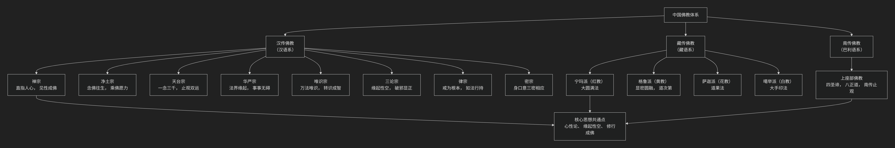

# 中国佛教宗派

---

中国佛教在近两千年的发展历程中，成功地将印度佛教本土化，形成了独具特色的三大语系佛教和八大主要宗派。其核心思想可以概括为：**以“缘起性空”为哲学基石，以“心性论”为修行枢纽，通过不同的实践路径（如禅定、念佛、观智等）来实现“转迷成悟”、解脱生死、普度众生的终极目标。**

中国佛教的主要流派、核心思想与代表人物，可以通过下图清晰地概览其全貌与相互关系：

以下，我们将沿此脉络，深入解析各流派的核心要义。

---

### 一、汉传佛教（汉语系）—— 主体与核心

汉传佛教是中国佛教的主流，最具中国特色，宗派林立，思想博大精深。

#### **1. 禅宗 —— 中国化佛教的顶峰**

* **核心思想**：**“直指人心，见性成佛”**。主张不依赖经典文字，通过内在的瞬间觉悟（顿悟），发现人人本具的佛性。强调“平常心是道”，将修行融入日常生活。
* **代表人物**：
  * **初祖达摩**：禅宗东来开创者。
  * **六祖慧能**：实际创始人，其《坛经》是唯一被尊称为“经”的中国僧侣著作，倡导“顿悟”法门。
  * **后世高僧**：马祖道一（创丛林）、百丈怀海（立清规），以及临济、曹洞等五家七宗的祖师。

#### **2. 净土宗 —— 普及最广的法门**

* **核心思想**：**“念佛往生”**。认为末法时代众生靠自力难以解脱，应仰仗阿弥陀佛的愿力，通过虔诚念诵佛号（“南无阿弥陀佛”），往生西方极乐净土。
* **代表人物**：
  * **慧远**：被尊为初祖，在庐山结社念佛。
  * **善导**：净土宗的实际组织者，大力倡导称名念佛，使净土宗广为流行。

#### **3. 天台宗 —— 教观双美**

* **核心思想**：**“一念三千”**、**“三谛圆融”**。认为一念心具足宇宙万有（三千世间），空、假、中三谛相互圆融。修行上主张 **“止观双修”** （禅定与智慧并重）。
* **代表人物**：
  * **智顗**：天台宗的实际创始人，思想体系宏大精密。

#### **4. 华严宗 —— 圆融无碍的哲学**

* **核心思想**：**“法界缘起”**、**“事事无碍”**。认为宇宙万物相互含容，一即一切，一切即一，彼此圆融无碍。展现了宇宙生命的终极和谐。
* **代表人物**：
  * **法藏**：华严宗的实际创立者，其学说深刻影响了宋明理学。

#### **5. 唯识宗 —— 精深的心识分析**

* **核心思想**：**“万法唯识”**。认为一切外在现象都是内在心识的投射。将人的心识分为八识（眼、耳、鼻、舌、身、意识、末那识、阿赖耶识），修行目标是将有污染的识转为清净的智（**转识成智**）。
* **代表人物**：
  * **玄奘**：伟大的译经家，从印度取回并翻译唯识经典。
  * **窥基**：玄奘高足，发扬唯识学说。

#### **其他重要宗派**：

* **三论宗**：以“缘起性空”为核心，专攻 **中观学**，擅长破邪显正的辩论。三论宗就是中观思想在中国的宗派化形态和正统代言人。**中观派** （梵语：Madhyamaka）​ 是大乘佛教的两个主要哲学流派之一（另一个是瑜伽行派，即唯识宗）。它由印度佛教哲学家龙树菩萨（Nāgārjuna，约公元2-3世纪）正式创立，被誉为 “大乘佛学的理论基石”​ 和 “空的哲学”的集大成者。三论宗是中观派在中国的宗派化继承者和忠实阐发者；二者的关系可以概括为：“源”与“流”、“理论核心”与“宗派建构”的关系，类似于 “马克思主义”与“某个国家的共产党”​ 的关系。虽然三论宗作为宗派在唐以后逐渐衰微，但其核心的“空性”智慧已深深融入天台、华严、禅宗等几乎所有中国化佛教宗派的血液之中，成为大乘佛教不可动摇的理论基石。

* **律宗**：以研习和持守佛教戒律为核心，代表僧人为**鉴真**，他将律宗传入日本。

* **密宗**（唐密）：唐代盛行，强调**身、口、意**三密相应，即身成佛。后传入日本成为东密。

---

### 二、藏传佛教（藏语系）—— 显密结合的雪域明珠

藏传佛教融合了印度大乘佛教的显宗和密宗，形成了独特的政教合一文化和严密的修行次第。

* **核心思想**：**“显密圆融”**。先系统学习显宗理论（中观、唯识等），打好基础，再进入密法实修，追求即身成佛。注重上师（喇嘛）传承和实修仪轨。
* **主要派别与代表人物**：
  * **宁玛派（红教）**：最古老的派别，重“大圆满”法。
    * **代表人物**：莲花生大士（入藏开创者）。
  * **格鲁派（黄教）**：最晚形成但影响最大，强调戒律和显密次第。
    * **代表人物**：**宗喀巴**（改革者，著有《菩提道次第广论》）、历代达赖喇嘛和班禅额尔德尼。
  * **萨迦派（花教）**、**噶举派（白教）** 等也各有特色。

---

### 三、南传佛教（巴利语系）—— 古朴的上座部传承

主要分布于云南傣族地区，保存了早期佛教的风貌。

* **核心思想**：恪守原始佛教教义，核心是 **“四圣谛”**、**“八正道”** 和 **“十二因缘”** 。修行目标是通过戒定慧的修行，断除烦恼，证得**阿罗汉果位**。
* **修行特色**：注重**止观禅修**，强调个人修行和解脱。
* **代表人物**：没有明确的创派祖师，传承的是佛陀时代的原始经典和修行体系。

---

### 核心思想总结

| 流派系别           | 核心命题                                                 | 修行特色与目标                                                                |
| :----------------- | :------------------------------------------------------- | :---------------------------------------------------------------------------- |
| **汉传佛教** | **“一切众生皆有佛性”**，关键在于“迷”与“悟”。 | 路径多元：**顿悟（禅）、他力（净土）、止观（天台）** 等，目标多是成佛。 |
| **藏传佛教** | **“显密结合，次第修行”**，依止上师。             | 体系严密：先显后密，**即身成佛**。                                      |
| **南传佛教** | **“诸法无我，涅槃寂静”**，恪守原始教法。         | 朴实内观：**戒定慧**三学，证**阿罗汉**。                          |

### 总结

总而言之，中国佛教的主要流派展现了**印度佛教中国化的惊人创造力**。它们从不同角度和路径，共同阐发了佛教关于**心性、缘起和觉悟**的核心智慧。

* **汉传八宗**体现了中国人**圆融、简易、直指人心**的思维特质，尤其是禅宗和净土宗，彻底重塑了佛教的面貌，使其深深嵌入中国文化肌理。
* **藏传佛教**展现了**体系化、次第化**的实修特色，保留了丰富的密法传承。
* **南传佛教**则如一面古镜，映照出早期佛教**朴实、内省**的风貌。

这三支脉络共同构成了中国佛教**多元、丰富而和谐**的宏大图景，成为世界佛教文化宝库中不可或缺的瑰宝。
