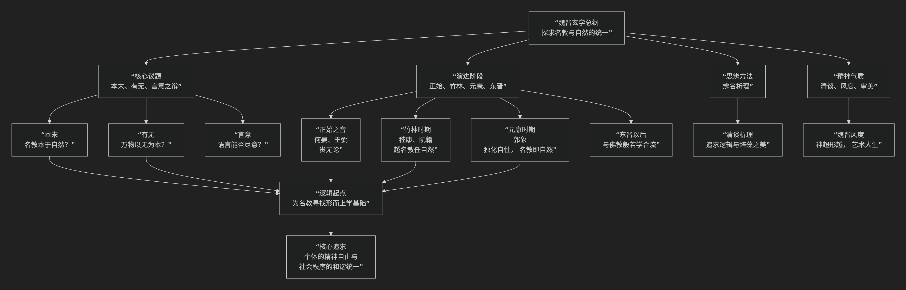

玄学
=====

基于玄学（魏晋）的核心思想

---------------------------------

魏晋玄学是中国思想史上一次极具魅力的哲学飞跃。它的核心思想可以概括为：**一场以《老子》《庄子》《周易》“三玄”为经典，以“名教与自然”之辩为焦点，以“辨名析理”的抽象思辨为方法，旨在探寻宇宙本源与社会纲常内在统一性的哲学运动。它标志着汉代经学僵化体系的瓦解，和个体理性与精神的空前觉醒。**

魏晋玄学的思想体系深邃而富有层次，其核心议题与演进脉络，可以通过下图清晰地把握：

以下，我们将沿此逻辑脉络，深入解析玄学的核心要义。

一、核心议题：玄学探讨的三大基本问题

玄学的思辨围绕几个核心的哲学范畴展开：

1.  **本末之辩（现象与本质）**

    *   **核心问题**：什么是一切存在的根本（本）？什么是派生出的现象（末）？

    *   **玄学答案**：普遍认为 **“无”** 或 **“自然”** 是“本”，而 **“有”** 或 **“名教”** （社会伦理制度）是“末”。玄学的任务是为“名教”找到源于“自然”的终极依据。

2.  **有无之辩（存在与本源）**

    *   **核心问题**：“有”（具体存在）是如何从“无”（终极本源）中产生的？

    *   **代表性理论**：

        *   **王弼的“贵无论”**：**“天下万物生于有，有生于无。”** 认为“无”是统摄万有、本然存在的本体，强调“崇本以举末”。

        *   **郭象的“独化论”**：反对“有生于无”，认为万物是 **“独化于玄冥之境”** 的，即每个事物都依其自身的“性分”而突然产生、变化和消亡，不存在一个造物主“无”。

3.  **言意之辩（语言与思想）**

    *   **核心问题**：语言能否完全表达思想和意义？

    *   **代表性观点**：

        *   **“言不尽意”**：以嵇康为代表，认为精微的思想（意）难以用语言（言）完全表达。

        *   **“得意忘言”**：王弼提出 **“得意在忘象，得象在忘言。”** 主张语言只是捕捉意义的工具，一旦领悟了意义，就应超越语言的局限。这极大地促进了中国艺术和美学中追求“象外之旨”、“韵外之致”的传统。

二、核心焦点：“名教”与“自然”的关系

这是贯穿玄学始终的 **现实焦点**，是上述抽象哲学思辨在社会伦理领域的直接体现。

*   **名教**：指以正名定分为中心的封建礼教，包括伦理纲常、等级制度。

*   **自然**：指道家的“道法自然”，即万物本然的状态、自发的规律。

玄学家们对二者关系有不同主张：

1.  **名教本于自然（王弼）**

    *   认为名教是“自然”本体的自然流露，最好的名教是符合自然无为原则的。试图为名教找到崇高的哲学根基。

2.  **越名教而任自然（嵇康、阮籍）**

    *   激烈批判名教的虚伪，主张超越名教的束缚，回归人的自然本性。嵇康提出 **“非汤武而薄周孔”** ，行为上放浪形骸，是对黑暗政治的抗争。

3.  **名教即自然（郭象）**

    *   这是玄学的成熟形态。郭象认为，现存的 **社会等级秩序本身就是“自然”** 的体现。安于自己的名分（命运），就是顺应“自然”。这为门阀士族的统治提供了理论依据。

三、演进阶段与代表人物

玄学的发展大致可分为四个阶段：

.. list-table:: 
   :header-rows: 1
   :widths: 25 35 40
   :align: center

   * - **阶段**
     - **核心议题与代表**
     - **主要思想**
   * - **正始玄学（创立期）**
     - **何晏、王弼（贵无论）**
     - 奠定玄学基础，主张"以无为本"，调和名教与自然。
   * - **竹林时期（激荡期）**
     - **嵇康、阮籍、向秀**
     - 因政治黑暗，激烈批判名教，主张"越名教而任自然"，行为旷达。
   * - **元康时期（综合期）**
     - **裴頠（崇有论）、郭象（独化论）**
     - 裴頠批判"贵无"弊病，郭象综合"有""无"，提出"独化论"，完成名教与自然的合一。
   * - **东晋以后（衰变期）**
     - **张湛等**
     - 玄学与佛教般若学合流，清谈逐渐变为空洞的言语游戏。

四、精神气质与历史影响

*   **清谈**：玄学家们的学术活动，围绕哲学议题进行机智的辩论，注重逻辑、修辞和风度，是思想交流的主要形式。

*   **魏晋风度**：玄学思想外化出的生活方式，表现为 **旷达、率真、重才情、轻礼法**，追求精神自由和人格独立。如“竹林七贤”的放达行为。

*   **历史影响**：

    *   **思想解放**：打破了两汉经学的僵化，促进了人的自觉和思想的解放。

    *   **哲学深化**：将中国哲学的思辨水平提升到空前高度。

    *   **艺术滋养**：直接影响了中国山水诗、书画艺术追求“意境”、“神韵”的审美理想。

    *   **三教融合**：为佛教的中国化（特别是般若学）和宋明理学的产生准备了条件。

五、总结

总而言之，魏晋玄学的核心在于，它是一场 **“精神的启蒙”和“哲学的突破”** 。在政治动荡的黑暗年代，它把思考的目光从繁琐的经学训诂和虚伪的道德说教，转向了对宇宙本源、生命意义、个体价值等根本问题的深邃追问。

它的全部工作是为 **个体生存** 寻找一个形而上的 **安身立命之本**。无论是以“无”为本，还是“独化自性”，其最终目的都是试图在乱世中，为心灵寻找到一片**逍遥之地**。在这个意义上，玄学不仅是哲学，更是一种在困境中保持精神高贵和内心自由的生活艺术。

------------------------

 .. toctree::
    :maxdepth: 3

    grok
    copilot
    chatgpt
    deepseek
    gemini
    qwen

