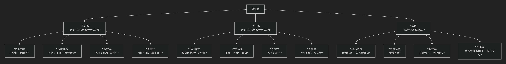

基督教派别
----------

基督教派别繁多，但其主要分支和教义差异可以通过一个清晰的框架来理解。历史上，基督教有两次大分裂，形成了三大主要传统：

1.  **公元1054年，东西教会大分裂**：形成了**天主教**和**东正教**。
2.  **公元16世纪，宗教改革**：从天主教中分离出了**新教**。

下面的图表清晰地展示了这三大传统的关系及其核心差异的对比维度，可以帮助您快速建立一个整体印象：

以下，我们将沿此脉络，深入解析各派的核心要义。

---

### **一、天主教 —— 以教皇为首的统一体系**

天主教是历史最悠久、组织最集中的基督教派，强调**传承的统一性和教皇的至高权威**。

*   **核心特征**：**教皇首席权与无误性**。相信罗马主教（即教皇）是圣彼得的继承人，是普世教会的最高领袖。在特定情况下（如界定教义时），教皇以教会元首的身份发表的言论是“无误”的。
*   **权威来源**：**圣经 + 圣传 + 教皇的权威**。除了《圣经》，天主教同样重视从使徒时代传承下来的教导和实践（圣传），以及教皇和大公会议的权威解释。
*   **救赎观**：**信心 + 善功**。称义（灵魂得救）不仅靠对上帝的信仰，也需要通过行善功（如祈祷、慈善、圣事）来配合上帝的恩典。
*   **圣事与礼仪**：有**七件圣事**（洗礼、坚振、圣体、告解、病人傅油、圣秩、婚配）。礼仪（弥撒）隆重繁复，强调神父在信徒与上帝之间的中介作用。
*   **玛利亚与圣徒**：特别尊崇圣母玛利亚和圣徒，认为他们可以代信徒转求。

### **二、东正教 —— 保持古老传统的正统信仰**

东正教又称正统教会，非常看重**信仰的纯正性和历史的延续性**，强调与上帝生命联合的“神秘”体验。

*   **核心特征**：**正统性与和谐性（同心合意）**。不承认教皇的至高权力，认为各地区的自主教会（如君士坦丁堡、亚历山大、俄罗斯等牧首区）在信仰上是平等且共融的。权力分散，共同尊奉前七次大公会议的决议。
*   **权威来源**：**圣经 + 圣传 + 大公会议**。特别重视早期教父的著作和礼仪传统。
*   **救赎观**：**信心 + 成神（神化）**。救赎的最终目的是让人类通过恩典，有份于上帝的神性，与上帝联合，这个过程称为“神化”。
*   **圣事与礼仪**：同样有**七件圣事**，礼仪极其华丽、充满象征意义，使用圣像（视为“通往天国的窗户”）且烛光缭绕，氛围神秘而庄严。
*   **玛利亚与圣徒**：同样尊崇，但神学表达上与天主教略有不同。

### **三、新教 —— 因信称义的改革宗信仰**

新教是16世纪宗教改革的产物，核心精神是 **“回归圣经”** ，对天主教会的某些传统和权威提出挑战。

*   **核心特征**：**“五个唯独”**——唯独圣经、唯独信心、唯独恩典、唯独基督、唯独上帝的荣耀。这是其神学根基。
*   **权威来源**：**唯獨圣经**。否认教皇的权威，认为《圣经》是信仰的唯一最高权威，信徒可以凭借圣灵引导自己读经。
*   **救赎观**：**因信称义**。这是宗教改革的核心教义。认为人得救完全是**因着上帝的恩典，透过人的信心**，而非靠善行。善行是得救后的结果和见证，而非条件。
*   **圣事与礼仪**：大多只承认**两件圣事**（洗礼和圣餐）。礼仪非常简化，注重讲道。对圣餐的理解多为纪念意义（象征主义）或基督的临在，而非天主教的“变质说”。
*   **信徒皆祭司**：强调所有信徒在上帝面前都是平等的，都可以直接向上帝祷告，无需神父作中介。

---

### **核心差异总结表**

| 对比维度 | **天主教** | **东正教** | **新教** |
| :--- | :--- | :--- | :--- |
| **权威来源** | 圣经 + 圣传 + 教皇 | 圣经 + 圣传 + 大公会议 | **唯獨圣经** |
| **救赎方式** | 信心 + 善功 | 信心 + 成神（神化） | **因信称义**（唯靠信心） |
| **教会领袖** | **教皇**（最高元首） | 牧首（平等共融） | 无单一领袖，组织多元 |
| **圣事数量** | **七件** | **七件** | **通常两件**（洗礼、圣餐） |
| **礼仪风格** | 隆重、统一（拉丁礼等） | 神秘、华丽（圣像、烛光） | 简化、注重讲道 |
| **神职角色** | 神父是神人之间的**中保** | 与天主教类似 | **信徒皆祭司**，牧师是引导者 |

### **重要提示：新教内部的多样性**

需要特别注意的是，**新教本身不是一个统一的教会，而是成千上万个独立教会的总称**。其主要宗派包括：
*   **路德宗**：强调“因信称义”。
*   **改革宗/长老会**：强调上帝主权和预定。
*   **浸信会**：强调信徒成年后受洗（浸礼）和教会自治。
*   **卫理公会**：强调圣洁生活与社会服务。
*   **五旬节派/灵恩派**：强调圣灵的恩赐（如说方言、神医）。

### **总结**

总而言之，基督教的三大传统在 **“权威由何而来”** 和 **“人如何得救”** 这两个根本问题上给出了不同的答案。这些差异塑造了它们独特的信仰生活、教会体制和礼仪形式，展现了基督教内部丰富而多元的神学图景。