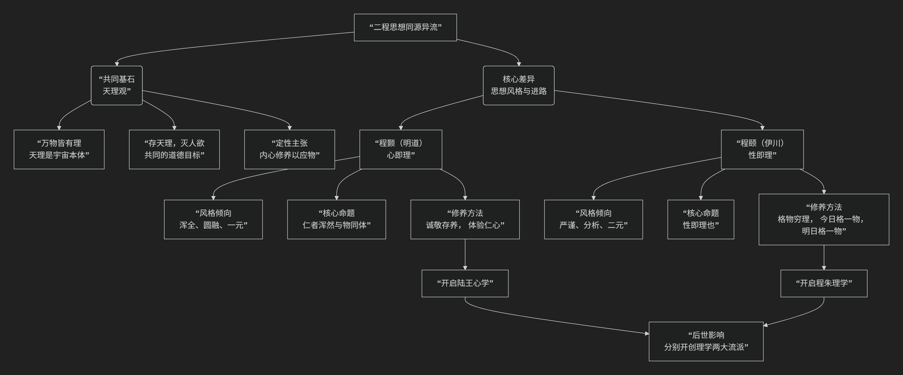

## 程颢和程颐

程颢（明道先生）和程颐（伊川先生）兄弟并称“二程”，同为宋代理学的奠基人。他们的思想同大于异，共同构建了以 **“天理”** 为核心的理学体系，但在气质、风格和某些侧重面上有显著区别，可谓 **“同源异流”**。

其思想“同源”与“异流”的关系，可以通过下图清晰地把握：

---

### 一、共同基石：“同源”于“天理”

二程兄弟最根本、最重要的共同贡献是确立了 **“天理”** 作为理学最高范畴的地位。

1. **万物皆有理**：他们共同认为，“天理”是宇宙万物的本源、本体和普遍法则，它永恒存在，不以人的意志为转移。程颢说：“吾学虽有所受，‘天理’二字却是自家体贴出来。” 这表明“天理”观是他们的核心创造。
2. **道德本体**：他们都将“天理”与儒家伦理直接等同。**“人伦即天理”**。仁、义、礼、智等道德规范不仅是社会规范，更是宇宙的最高法则。
3. **“存天理，灭人欲”**：这是他们共同的道德修养目标。人需要克服一己的私欲（人欲），使自己的言行符合普遍的天理。
4. **“定性”主张**：都强调内在的修养，主张通过“定性”（保持内心的安定和本性）来应对外物，达到“物来顺应”的境界。

### 二、核心差异：“异流”于风格与进路

尽管共享“天理”观，但兄弟二人在探寻和体认“天理”的路径上风格迥异。下表清晰地对比了他们的核心差异：

| 对比维度                 | **程颢（明道先生）**                                                 | **程颐（伊川先生）**                                                               |
| :----------------------- | :------------------------------------------------------------------------- | :--------------------------------------------------------------------------------------- |
| **思想风格**       | **一元、浑全、圆融**                                                 | **二元、严谨、分析**                                                               |
| **核心命题**       | **“仁者浑然与物同体”**、**“心是理，理是心”**               | **“性即理也”**、**“冲漠无朕，万象森然已具”**                             |
| **心、性、理关系** | **“心即理”**：强调心、性、理是一回事，心与天地万物本是一体。       | **“性即理”**：天理体现在人身上是“性”，心是认知和主宰，需通过心去认知性中之理。 |
| **修养方法**       | **“诚敬存之”**：通过内心体验和存养，直接体认与万物同体的“仁心”。 | **“格物穷理”**：今日格一物，明日格一物，积累久了，自然能豁然贯通，悟得普遍天理。 |
| **气象与影响**     | 倾向**直觉体悟**，更有诗人气质，开创了**陆王心学**的先声。     | 倾向**渐进积累**，严谨如哲学家，为**朱熹的理学体系**奠定了主干。             |

---

### 三、差异的具体体现

1. **对“仁”的理解**

   * **程颢**：**“仁者浑然与物同体”**。他认为“仁”是一种与宇宙万物合一的**最高精神境界**，一种广大的胸怀和生命力。识“仁”不需要外求，只需反身而诚，体验到自己与万物血脉相连的一体感。
   * **程颐**：**“仁是性，爱是情”**。他对概念进行精确区分，认为“仁”是人性中本具的**道德理性（性）**，而“爱”是这种理性发动后产生的**情感（情）**。他强调通过理智来把握“仁”的本质。
2. **修养功夫的路径**

   * **程颢**：路径是**由内而外**的。功夫在于“识仁”，然后“以诚敬存之”。只要内心保持诚敬，勿忘勿助长，自然能应事得当。这更**简易直接**。
   * **程颐**：路径是**由外而内**的。功夫在于“格物穷理”，即通过研究具体事物（包括读书、应事、待人等）来穷究其中的“理”。这是一个**渐进积累**的过程，最终达成贯通。

### 总结与历史地位

* **程颢**的思想更**主观、内在、一元化**，强调**直觉与境界**，开创了后来由陆九渊、王阳明发展的 **“心学”** 一脉。
* **程颐**的思想更**客观、外在、析理精密**，强调**知识与积累**，奠定了后来由朱熹集大成的 **“理学”**（程朱理学）体系的主干。

尽管存在差异，但二程共同将儒家思想提升到了全新的哲学高度，构建了理学的根本框架。可以说，**没有二程，就没有后来的程朱理学和陆王心学**。他们的“同源”奠定了理学的基石，而他们的“异流”则开启了理学内部两条丰富而富有张力的发展道路。
