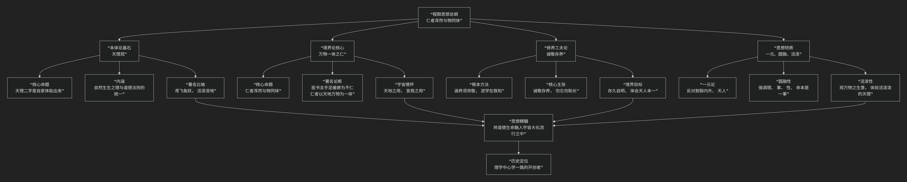

程颢
======

基于程颢（明道先生）核心哲学思想

---------------------------------

程颢（明道先生）是宋代理学的奠基者之一，与其弟程颐并称“二程”。但他的思想路径独特，更侧重于内在的、活泼泼的生命体验与宇宙的合一，可视为后来陆王心学的先声。其核心思想可概括为：**一种以“天理”为根基，以“仁者浑然与物同体”为最高境界，强调通过“诚敬存养”的内心工夫来体认“与物同体”之乐，充满生机与圆融意味的生命哲学。**

程颢的思想体系浑然一体，其核心架构与内在逻辑可以通过下图清晰地展现：

以下，我们将沿此逻辑脉络，深入解析程颢思想的核心要义。

---

一、本体论基石：“天理”观

程颢与其弟程颐最大的共同贡献，是确立了 **“天理”** 作为宇宙本原的地位。但他对“天理”的体认更具个人色彩。

*   **核心命题**：他自豪地说：**“吾学虽有所受，‘天理’二字却是自家体贴出来。”** 这表明“天理”对他而言，不是外在的研究对象，而是 **内在的、真切的生命体验**。

*   **“天理”的内涵**：程颢所说的“天理”，是 **自然界的“生生之理”** 与 **人伦道德的“当然之则”** 的统一。春生夏长是“天理”，仁、义、礼、智也是“天理”，二者本是一体。

*   **著名比喻**：他常用 **“鸢飞鱼跃，活泼泼地”** 来形容天理，强调天理是 **充满生机与活力** 的宇宙生命律动，而非僵死的教条。

二、境界论核心：“万物一体之仁”

这是程颢思想中最富感染力、最具特色的部分，是其哲学的巅峰境界。

*   **核心命题**：**“仁者，浑然与物同体。”** 真正的仁者，感受到自我与宇宙万物是血脉相连、不可分割的整体。

*   **著名论断**：他用医学比喻阐明“仁”：**“医书言手足痿痹为不仁，此言最善名状。仁者以天地万物为一体，莫非己也。”**

    *   一个人手脚麻木，不知痛痒，医学上叫“不仁”。同样，一个人如果感觉不到万物与自己是一体的，对万物的痛痒漠不关心，就是道德上的 **“不仁”**。

    *   达到“仁”的境界的人，视天地万物如同自己的身体一样，感同身受。

*   **宇宙情怀**：**“天地之用，皆我之用。”** 达到此境界，便会拥有一种博大的宇宙情怀，以天下事为己任。

三、修养工夫论：“诚敬存养”

要达到“万物一体”的境界，需要一套修养工夫。程颢的工夫论侧重内在的存养，而非外在的穷索。

*   **根本方法**：**“涵养须用敬，进学则在致知。”** 但相较于其弟程颐侧重“致知”，程颢更强调 **“涵养用敬”**。

*   **核心主张**：**“诚敬存养”**。

    *   **诚**：保持内心的真实无妄，不自我欺骗。

    *   **敬**：保持内心的专一、警觉与敬畏，但并非拘谨紧张，而是 **“心中无事”** 的自然安宁。

    *   关键在于 **“勿忘勿助长”** ，即既不遗忘本心，也不拔苗助长，只是顺其自然地存养。

*   **境界目标**：通过持续的诚敬存养，**“存久自明”** ，久而久之，自然能明了天人本是一体的道理，体验到 **“天人本无二，不必言合”** 的境界。

四、思想特质：一元、圆融、活泼

程颢的思想具有鲜明的整体性、圆融性与活泼性。

*   **一元论**：他强烈反对将事物割裂开来。他认为 **“道之外无物，物之外无道。”** 反对将“内心”与“外物”、“人性”与“天道”分为两截。

*   **圆融性**：他强调 **“只心便是天”** ，认为理、性、命、心、道等概念，其实都是 **从不同角度描述同一个本体**，本质上是相通的。

*   **活泼性**：他教导学生 **“观天地生物气象”**，从草木生长、雏鸡啄食中体会宇宙的“生意”，让道德修养成为一种活泼、愉悦的生命体验，而非枯燥的戒律。

---

五、核心要义总结

.. list-table:: 
   :header-rows: 1
   :widths: 25 45 30
   :align: center

   * - **理论维度**
     - **核心命题**
     - **关键概念与贡献**
   * - **天理观**
     - **"天理是自家体贴出来的"，是生生不息的自然与道德法则。**
     - **天理、生生之理、鸢飞鱼跃**
   * - **境界论**
     - **"仁者浑然与物同体"，将宇宙万物视为与己一体的生命。**
     - **万物一体之仁、手足痿痹喻、天地万物为一体**
   * - **工夫论**
     - **"诚敬存养"，通过内心的真实与专注来体认天理。**
     - **诚敬存养、勿忘勿助长、涵养用敬**
   * - **思想特质**
     - **"只心便是天"，强调天人一元、圆融无碍、活泼泼的体验。**
     - **天人一本、心便是天、观生物气象**

六、思想特质与历史影响

*   **心学路向的开创者**：程颢强调“心便是天”，其思想路径更侧重于内向的体验和直觉，为后来的陆九渊、王阳明的“心学”一脉开启了方向。与其弟程颐（及朱熹）侧重“格物穷理”的路径形成对照。

*   **圆融的境界**：他的哲学充满了生命的情调和艺术的意味，将崇高的道德境界转化为一种与宇宙大化同流的审美体验和生命乐趣。

*   **深远影响**：其“万物一体之仁”的思想，成为宋明理学共同的精神理想，深刻影响了后世中国知识分子的宇宙观和价值观。

七、总结

总而言之，程颢的核心思想在于，他是一位 **“生命的哲学家”和“圆融的境界者”** 。他教导我们，**宇宙不是一个冷冰冰的、需要我们去格物穷理的对象，而是一个生机盎然、与我们血脉相连的生命整体。道德修养的最高境界，不是遵守外在的规范，而是通过“诚敬”的工夫，唤醒并扩大我们内心本有的“仁心”，最终体验到一种与天地万物痛痒相关、浑然一体的至高快乐。**

他的全部工作是对 **儒家“仁学”** 的一次充满诗意的升华。在理学的开创期，他为其注入了一种温暖的生命情怀和崇高的精神境界。在这个意义上，程颢不仅是一位理学家，更是一位指引人们如何将有限的生命融入无限的宇宙大化之中，从而获得最高精神自由的智慧导师。

------------

 .. toctree::
    :maxdepth: 3

    grok
    copilot
    chatgpt
    deepseek
    gemini
    qwen

---------------------------

[:doc:`程颢和程颐 </chats/outlaw/analyse/chinese/person/middle/cc>`]
