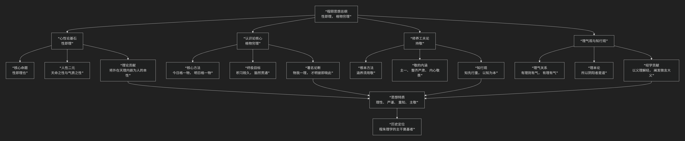

程颐
======

基于程颐（伊川先生）核心哲学思想

---------------------------------

程颐（世称伊川先生）是宋代理学的奠基人之一，与其兄程颢并称“二程”。但兄弟二人的思想风格迥异。程颐的核心思想可以概括为：**一个以“性即理”为理论基石，以“格物穷理”为认知路径，以“持敬”为修养工夫，结构严谨、富于理性精神的哲学体系。他特别强调知识的积累和理性的探索，为后世朱熹集大成的理学体系奠定了主干。**

程颐的思想体系逻辑严密，其核心架构与内在逻辑可以通过下图清晰地展现：

以下，我们将沿此逻辑脉络，深入解析程颐思想的核心要义。

---

一、心性论基石：“性即理”

这是程颐最根本的哲学贡献，是与程颢“仁者浑然与物同体”的体验路径不同的、更具分析性的理论建构。

*   **核心命题**：**“性即理也。”** 这一命题将《中庸》的“天命之谓性”与《易传》的“穷理尽性”贯通起来。

    *   含义：人与万物所禀受于“天”的本性（性），其内容就是普遍的、客观的“天理”。换言之，**人的内在道德本性（仁、义、礼、智）就是宇宙最高法则“天理”在人与上的体现。**

*   **人性二元论**：他继承并明确了张载的区分，将人性分为：

    1.  **天命之性**：源于天理，是纯然至善的，是人之为人的根本。

    2.  **气质之性**：人禀受阴阳二气而生，气有清浊昏明，故气质之性有善有恶。人的贤愚善恶，源于“气禀”的遮蔽。

*   **理论意义**：“性即理”的命题，**将外在的、客观的“天理”收归于人的内在本性**，为道德实践找到了坚实的内在依据，同时也为“格物穷理”提供了可能性——因为物性、人性皆是天理的表现，故穷究物理即可通达天性。

二、认识论核心：“格物穷理”

这是程颐哲学中最具影响力也最富理性精神的部分，后被朱熹发扬光大。

*   **核心方法**：**“格物穷理”**。 “格”即“至”、“穷尽”之意。“格物”就是深入探究事物，直至穷尽其背后的“所以然”之理。

*   **著名论述**：**“今日格一件，明日又格一件，积习既多，然后脱然自有贯通处。”**

    *   这是一个从 **知识的逐渐积累** 到 **智慧的豁然贯通** 的过程。他强调从具体事物入手，一件一件地研究，久而久之，便能触类旁通，领悟到那个统一的、普遍的“天理”。

*   **理论依据**：**“万物皆是一理”**。一草一木皆有其“理”，而这个“理”与人心中的“理”是相通的。因此，**“才明彼，即晓此”** ，明白了外在事物的理，也就启发了对内心天理的认识。

三、修养工夫论：“持敬”

与“格物”的外向求知相配合，程颐提出了内向的修养工夫——“主敬”。

*   **根本方法**：**“涵养须用敬，进学则在致知。”** 修养心性需要用“敬”的工夫，增进学问则需要“格物致知”。二者如鸟之双翼，不可偏废。

*   **“敬”的内涵**：

    *   **主一之谓敬**：内心专一，心无旁骛，不分散注意力。

    *   **整齐严肃**：保持外在容貌的庄重和内心的敬畏。

    *   **“有主则虚”**：心中有了“敬”这个主心骨，才能达到虚静清明、不被外物牵引的状态。

*   **与“静”的区别**：他区分“敬”与“静”，认为“敬”是 **积极的、动态的修养**，并非心如死灰般的绝对静止，而是“动亦敬，静亦敬”，在任何状态下都保持内心的警觉与主宰。

四、理气观与知行观

*   **理气关系**：程颐明确提出了 **“理本论”**。他认为 **“有理则有气”** ，理在逻辑上先于气。**“所以阴阳者是道”** ，阴阳是气，是现象；支配阴阳变化的内在规律才是“道”（理）。这为朱熹的“理在气先”论奠定了基础。

*   **知行观**：他主张 **“知先行重”**。深刻的认识（知）是行动（行）的前提和指导，**“以知为本”** 。“知之深，则行之必至”，没有真知，便没有自觉的、正确的行动。他更强调“知”的优先性。

---

五、核心要义总结

.. list-table:: 
   :header-rows: 1
   :widths: 25 45 30
   :align: center

   * - **理论维度**
     - **核心命题**
     - **关键概念与贡献**
   * - **心性论**
     - **"性即理也"：人的本性即是天理，为道德找到了内在根据。**
     - **性即理、天命之性、气质之性**
   * - **认识论**
     - **"格物穷理"：通过今日格一物，明日格一物的积累，最终豁然贯通天理。**
     - **格物致知、积习贯通、物我一理**
   * - **工夫论**
     - **"涵养须用敬"：以"主一"和"整齐严肃"的"敬"的工夫来涵养心性。**
     - **主敬、涵养用敬、整齐严肃**
   * - **理气观**
     - **"有理则有气"，"所以阴阳者是道"：确立了"理"为本的本体论。**
     - **理本论、理气关系、道器关系**

六、思想特质与历史影响

*   **理性主义色彩**：与程颢重体验、重境界的风格不同，程颐的思想 **结构严谨、析理精密、富于逻辑性**，展现出强烈的理性精神。

*   **重知倾向**：他极其强调“知”的重要性，认为道德实践必须建立在理性认知的基础上，这使其思想带有 **主智主义** 倾向。

*   **程朱理学的主干**：其“性即理”、“格物穷理”、“持敬”等核心思想，几乎被朱熹全盘继承并系统化，构成了 **程朱理学体系的主干**。因此，后世所称的“程朱理学”，其中“程”主要指程颐。

*   **严肃的学风**：其“持敬”的修养论，也塑造了后世理学家严肃、庄重的人格风貌。

七、总结

总而言之，程颐的核心思想在于，他是一位 **“理性的建筑师”和“知识的耕耘者”** 。他教导我们，**通达天理的道路，是一条需要严谨、耐心和持续努力的理性探索之路。它既需要向外“格物”以穷究事理，也需要向内“持敬”以涵养本心，最终通过知识的积累达到对宇宙普遍法则的觉悟。**

他的全部工作是为 **儒家成德之学** 构建了一套系统而精密的方法论和认识论。在理学开创期，他与其兄程颢分别开启了“尊德性”与“道问学”的两大路向。程颐所开创的这条重知、重学、重积累的路径，经由朱熹的集大成，成为了宋明理学中最具统治力的正统。在这个意义上，程颐不仅是理学的奠基人，更是塑造了中国后期传统社会思维模式的关键人物。

------------

 .. toctree::
    :maxdepth: 3

    grok
    copilot
    chatgpt
    deepseek
    gemini
    qwen

---------------------------

[:doc:`程颢和程颐 </chats/outlaw/analyse/chinese/person/middle/cc>`]
