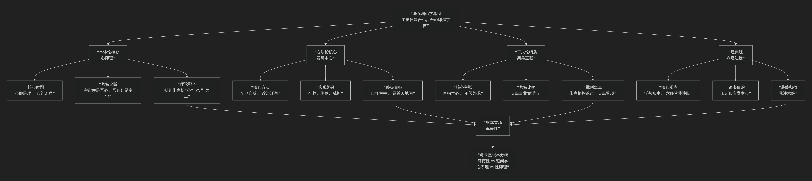

陆九渊
======

基于陆九渊核心哲学思想

---------------------------------

陆九渊是南宋著名哲学家，与朱熹双峰并峙，是 **心学** 流派的开创者。他的核心思想可以概括为：**一种高扬人的道德本心，主张“心即理”，认为宇宙的真理内在于每个人的心中，强调通过“发明本心”的简易功夫来实现道德觉醒，并与朱熹的“格物穷理”之路形成鲜明对比的哲学体系。**

陆九渊的思想直指本源，其核心架构与内在逻辑可以通过下图清晰地展现：

以下，我们将沿此逻辑脉络，深入解析陆九渊心学的核心要义。

一、本体论核心：“心即理”

这是陆九渊全部思想的基石，也是最震撼的命题。

*   **核心命题**：**“心即是理”**， **“心外无理，心外无物”**。

    *   他反对朱熹将“理”客观化、外在化。他认为，**宇宙的普遍法则（天理）并不在外部的万事万物中，而是先天地存在于每个人的“本心”之中。** 人的道德本心，就是宇宙之理的显现。

*   **著名论断**：**“宇宙便是吾心，吾心即是宇宙。”**

    *   这并不是说个人的意识创造了物质宇宙，而是指 **宇宙的终极意义和道德秩序（理），只有在人的道德心灵中才能被真正认识和实现。** 人的本心与宇宙之理是同一的、不可分割的。

*   **理论靶子**：他批判朱熹的哲学是 **“裂天人为二”** ，将“心”与“理”割裂开了。朱熹认为需要通过“格物”去外部寻找“理”，而陆九渊认为这是绕远路，因为“理”本就具足于心。

二、方法论核心：“发明本心”

既然“理”在内而不在外，那么修养功夫的方向就完全不同了。

*   **核心方法**：**“发明本心”** 或 **“存心、养心、求放心”**。

    *   功夫不在于向外研究多少事物，而在于 **向内反省、发现、扩充自己固有的道德本心**，找回可能被欲望和习气遮蔽的“初心”。

*   **实现路径**：

    1.  **先立乎其大**：首先要确立“本心”是根本这一信念。

    2.  **切己自反**：在一切事上反省自己的本心是否被蒙蔽。

    3.  **剥落**：像剥笋一样，剥去物欲、意见、习气等对本心的遮蔽。

    4.  **减担**：减少外在知识的沉重负担，让本心自然显露。

*   **终极目标**：**“自作主宰”**。人若能发明本心，就能不被外物所牵引，达到“仰首攀南斗，翻身倚北辰，举头天外望，无我这般人”的精神独立与自由境界。

三、工夫论特质：“简易直截”

与朱熹“格物穷理”的繁复路径相比，陆九渊的功夫论显得极为“简易”。

*   **核心主张**：道德修养的路径是 **简易直接** 的，因为它直指人心的本源，无需旁求。

*   **著名辩论**：在历史性的 **“鹅湖之会”** 上，陆九渊作诗批评朱熹的治学方法：**“易简功夫终久大，支离事业竟浮沉。”**

    *   **“易简功夫”** 指他自己的“发明本心”。

    *   **“支离事业”** 指朱熹的“格物穷理”，认为其过于繁琐、不得要领。

四、经典观：“六经注我”

对于儒家经典的态度，陆九渊也展现出鲜明的心学特色。

*   **核心观点**：**“学苟知本，六经皆我注脚。”**

    *   如果一个人已经把握了“本心”这个根本，那么 **六经（所有经典）都只是在为我本已具足的道理作注解和印证罢了。**

*   **读书目的**：读书不是为了积累知识，而是为了 **启发和印证本心**。如果读书反而使本心被书本知识所束缚，那就是“溺于文义”，是本末倒置。

*   **最终归宿**：从“我注六经”（解释经典）转向 **“六经注我”** （用经典来印证和阐发自己的思想）。

五、核心要义总结

.. list-table:: 
   :header-rows: 1
   :widths: 25 45 30
   :align: center

   * - **理论维度**
     - **核心命题**
     - **关键概念与贡献**
   * - **心本论**
     - **"心即理"：宇宙之理内在于人之本心，心外无理。**
     - **心即理、吾心即是宇宙、心外无物**
   * - **工夫论**
     - **"发明本心"：为学之方在于向内反省，存养、扩充固有之良心。**
     - **发明本心、切己自反、剥落、减担、自作主宰**
   * - **方法论特质**
     - **"易简功夫"：道德修养的路径是简易直接的，批判"支离"学问。**
     - **易简功夫、支离事业、鹅湖之会**
   * - **经典观**
     - **"六经注我"：经典是印证本心的注脚，学问的根本在于立心。**
     - **六经皆我注脚、我注六经、学苟知本**

六、思想特质与历史影响

*   **主体性的高扬**：陆九渊的心学极大地突出了人的道德主体性和尊严，将人从对外在权威（包括经典和繁琐知识）的依赖中解放出来。

*   **与朱熹的根本分歧**：这场争论被称为 **“朱陆异同”** ，其核心是 **“尊德性”** （陆，强调道德直觉）与 **“道问学”** （朱，强调知识积累）何者为先的路径之争。

*   **深远影响**：陆九渊的思想在当时是少数派，但为明代 **王阳明** 所继承和发扬光大，最终形成了与程朱理学分庭抗礼的 **陆王心学** 体系，成为中国哲学史上一条光辉的脉络。

七、总结

总而言之，陆九渊的核心思想在于，他是一位 **“本心的呼唤者”和“简易功夫的倡导者”** 。他教导我们，**真理和道德的源泉不在遥远的天际，也不在汗牛充栋的书籍中，而就在我们每个人当下的内心。人生的首要任务，不是向外无尽地求索，而是向内深刻地反省，擦亮被尘埃遮蔽的本心，让它如明镜般自然映照出天理的光辉。**

他的全部工作是对**儒家道德实践**的一次方向性扭转。在朱熹理学如日中天的时代，他独树一帜，开辟了一条内向的、直指人心的修养路径，为后来的心学运动奠定了基石。在这个意义上，陆九渊不仅是一位哲学家，更是一位唤醒内在良知的精神导师。

------------

 .. toctree::
    :maxdepth: 3

    grok
    copilot
    chatgpt
    deepseek
    gemini
    qwen
