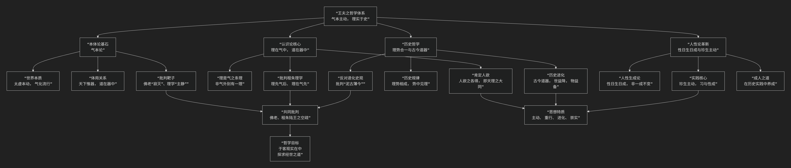

王夫之
======

基于王夫之核心思想

---------------------------------

王夫之是明末清初最具哲学深度和系统性的思想家，与顾炎武、黄宗羲并称“明清之际三大儒”。他的核心思想可以概括为：**一个以“气本论”为哲学基石，以“主动求变”的辩证思维为方法，以“理在气中”、“理势合一”为纲领，深刻批判宋明理学空疏之弊，并最终落脚于“珍生主动”的人性论与“古今道器”进化史观的宏大体系。其根本精神是“崇实黜虚”，强调在客观实在的运动变化中把握天理人性。**

王夫之的思想体系极其精密且富有思辨性，其核心架构与内在逻辑可以通过下图清晰地展现：

以下，我们将沿此逻辑脉络，深入解析王夫之的核心要义。

一、哲学基石：气本论与主动哲学

王夫之在本体论上回到了张载的气学，并进行了深刻的发挥，以此批判佛老和程朱陆王。

*   **核心命题：“太虚即气”、“虚空皆气”**

    *   宇宙的本质是 **永不停息运动变化的“气”**。所谓“太虚”（看似虚无的空间）并非真正的无，而是充满气的本体状态。“气”的聚散、升降、氤氲变化，构成了宇宙万物。

*   **“天下惟器”与“道在器中”**

    *   **“器”** 指具体的事物，**“道”** 指事物的规律、法则。他提出 **“天下惟器而已矣。道者器之道，器者不可谓之道之器也。”**

    *   这意味着：**规律（道）不能脱离具体事物（器）而独立存在**。先有具体的事物，然后才有该事物的规律。这彻底颠倒了程朱理学“理在事先”的唯心论。

*   **主动哲学**：由于气的本性是运动的，因此宇宙的根本法则是 **“动静互涵，而以动为本”** 。他批判主“静”的佛老思想和理学倾向，强调运动是绝对的，静止是相对的。世界是一个生生不息的创造过程。

二、认识论核心：“理在气中”与“理欲合一”

从气本论出发，王夫之在认识论和天理人欲之辩上得出了革命性的结论。

*   **理在气中**：**“理”是“气”运动变化中所固有的秩序和规律**，并非如朱熹所说是在“气”之先、之上、之外的精神实体。**“气外更无虚托孤立之理”**。

*   **理欲合一**：他猛烈抨击“存天理，灭人欲”的教条，认为“天理”即在“人欲”之中。

    *   **著名论断**：**“私欲之中，天理所寓。”** “人欲之各得，即天理之大同。”

    *   正当的、健康的生命欲望（如饮食男女）本身就是天理的体现。道德的目标不是灭绝欲望，而是 **合理地满足和调节欲望**，使其各得其所。

三、历史哲学：“理势合一”与进化史观

王夫之的历史观极具前瞻性，突破了传统的循环史观和退化史观。

*   **理势合一**：**“理”** （历史规律）就体现在 **“势”** （历史发展的必然趋势）之中。不能离开具体的历史趋势空谈天道性理。历史的进程有其内在的、客观的必然趋势，智者应“**于势之必然处见理**”。

*   **进化史观**：历史是 **不断进化发展** 的，后世必然胜过上古（“世益降，物益备”）。他批判“泥古薄今”的复古思想，认为制度应随时代变化而变革（“一代之治，各因其时”）。

*   **“古今道器”论**：如同“道在器中”，历史的原理（道）也体现在不同时代的具体制度、文物（器）之中。古代的道适用于古代的器，今天的道需要今天的器。因此，不能 **“执一以贼道”**，即不能固守古代的具体制度而阻碍历史的发展。

四、人性论革新：“性日生日成”与“珍生主动”

在人性论上，王夫之提出了一个动态的、强调实践生成的革命性理论。

*   **性日生日成**：人性 **并非与生俱来、一成不变的**，而是在生命过程中 **每日每时都在不断生成、变化和发展的** （“夫性者生理也，日生则日成也”）。人性是一个开放的过程，受先天禀赋（“天命”）和后天习行（“习”）的共同塑造。

*   **珍生主动**：他高扬人的主体性，主张 **珍视生命、主动作为**。反对佛老的“寂灭”和“无为”。人生在世，就要充分发挥潜能，治理万物，建功立业。

*   **习与性成**：强调 **后天习行和环境** 对人性形成的决定性作用。人在改造环境的实践中，也同时改造着自身的人性。

五、核心要义总结

.. list-table:: 
   :header-rows: 1
   :widths: 25 45 30
   :align: center

   * - **理论维度**
     - **核心命题**
     - **关键概念与贡献**
   * - **本体论**
     - **宇宙本质是运动不息的"气"，规律（道）存在于具体事物（器）之中。**
     - **气本论、太虚即气、天下惟器、主动哲学**
   * - **认识论**
     - **"理在气中"，天理寓于人欲之中，肯定合理欲望。**
     - **理在气中、理欲合一、批判禁欲主义**
   * - **历史观**
     - **历史是"理势合一"的进化过程，反对复古，主张通变。**
     - **理势合一、古今道器、进化史观**
   * - **人性论**
     - **人性是"日生日成"的动态过程，强调"珍生主动"、习行成性。**
     - **性日生日成、习与性成、珍生主动**

六、思想特质与历史地位

*   **体系性与深刻性**：王夫之的思想体系庞大而严密，在本体论、认识论、历史观、人性论等方面一以贯之，达到了中国古代哲学的高峰。

*   **批判性与总结性**：他对宋明理学乃至整个传统哲学进行了系统的批判总结，是中国古代唯物论和辩证法传统的集大成者。

*   **实践性与启蒙性**：其“主动”、“重行”、“进化”的思想，极具活力，为后世变法维新和思想启蒙提供了重要的哲学资源（如谭嗣同深受其影响）。

*   **历史局限**：其思想仍包裹在传统经典注疏的形式中，且具有朴素性，未能突破传统思想的整体框架。

七、总结

总而言之，王夫之的核心思想在于，他是一位 **“古代哲学的集大成者”和“唯物辩证思想的先驱”** 。他教导我们，**真理不在虚无寂灭的彼岸，也不在故纸堆中，而是在永不停息、充满活力的客观现实和人类自身的生命实践与历史创造之中。**

他的全部工作是对 **中国古代哲学** 的一次辉煌的、富有深度的综合与超越。在“天崩地解”的时代，他以其深邃的思辨，力图为文明的重建寻找一个坚实可靠的哲学基础。在这个意义上，他不仅是中国古代思想的顶峰，其思想中蕴含的主动、求实、进化的精神，也使其成为连接传统与现代的一位关键人物。

------------

 .. toctree::
    :maxdepth: 3

    grok
    copilot
    chatgpt
    deepseek
    gemini
    qwen
