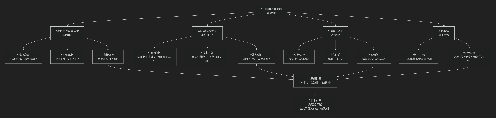

王阳明
======

基于王阳明核心哲学思想

---------------------------------

王阳明是心学的集大成者，其哲学思想以其 **震撼的穿透力和强烈的实践性** 深刻影响了东亚文明。其核心可概括为：**一个以“心即理”为起点，以“知行合一”为实践原则，最终以“致良知”为根本宗旨的宏大体系。他彻底将抽象的天理收归于人活泼的道德本心，高扬了人的主体性，为儒家的成德之教提供了一条简易直截的实践路径。**

王阳明的思想体系环环相扣，其核心架构与内在逻辑可以通过下图清晰地展现：

以下，我们将沿此逻辑脉络，深入解析王阳明哲学的核心要义。

---

一、逻辑起点：“心即理”

这是对朱熹“性即理”思想的根本性扭转，是阳明心学的基石。

*   **核心命题**：**“心外无物，心外无事，心外无理。”**

    *   他反对朱熹向万事万物去“格物穷理”的路径。他认为，**事物的意义（理）离不开人的意识（心）的关照。** 例如，山花自开自落，其“理”本身寂然不动，只有当人心观照它时，花的颜色形态才一时明白起来，其“理”才得以显现。

*   **理论革新**：将“天理”从外在的、客观的规范，拉回到人的 **内在的道德意识** 本身。道德的法则不是外在于人的教条，而是人本心固有的、自发的要求。**“心之本体即是天理”**。

二、核心认识实践论：“知行合一”

这是王阳明最富创见、最著名的学说之一，旨在纠正“知而不行”的流弊。

*   **核心论断**：**“知是行的主意，行是知的功夫；知是行之始，行是知之成。”**

    *   “知”与“行”是一个活动的两个方面，**如同手心手背，不可分离**。“知”必然包含着“行”的冲动，是“行”的开端；而“行”是“知”的完成和真切体现。

*   **根本主张**：**“真知必能行，不行只是未知。”**

    *   如果你声称自己“知道”孝道，却不去孝顺父母，那么你并非真正“知孝”，顶多是听说过“孝”这个字眼。真正的“知”必然体现为行动的决心和力量。这极大地强调了道德的 **实践品格**。

三、根本方法论：“致良知”

这是王阳明晚年的“定本”之论，是其思想的最终归宿和最高概括。

*   **终极命题**：**“良知”** 是每个人与生俱来的、不假外求的 **内在道德判断力**。它能自然知是知非、知善知恶，是“心之本体”。

*   **“致良知”**：即 **“致吾心之良知于事事物物”**。

    1.  **“体认良知”**：通过静坐反省，破除私欲杂念，体认到本心自有的良知。

    2.  **“扩充良知”**：将这份良知在待人接物的具体实践中 **推广、落实** 出来，使事物各得其理。

*   **四句教**：是其思想的浓缩精华，尤以第一句最为根本：

    *   **“无善无恶心之体”**：心的本体（良知）是超越具体善恶的、绝对纯净的灵明，是判断善恶的“尺度”本身。

    *   **“有善有恶意之动”**：意念发动，便有了善恶之分。

    *   **“知善知恶是良知”**：良知能自然辨别意念的善恶。

    *   **“为善去恶是格物”**：格物的真义，就是依从良知，去做为善去恶的功夫。

四、实践指向：“事上磨练”

王阳明反对脱离实际的空想，强调修养必须在具体事务中进行。

*   **核心主张**：**“人须在事上磨练，做功夫，乃有益。”** 良知不是悬空想象的，必须在 **处理诉讼、应对危机、治理政事** 等实际活动中，去考验、运用和光大自己的良知。

*   **终极目标**：通过持续“事上磨练”，达到 **“随心所欲而不逾矩”** 的境界，使一切言行自然合乎天理。

---

五、核心要义总结

.. list-table:: 
   :header-rows: 1
   :widths: 25 45 30
   :align: center

   * - **理论维度**
     - **核心命题**
     - **关键概念与贡献**
   * - **心本论**
     - **"心即理"：心外无物，心外无理，天理内在于人心。**
     - **心即理、心外无物、心之本体**
   * - **知行论**
     - **"知行合一"：知与行是一个功夫的两面，真知必能行。**
     - **知行合一、知是行之始、行是知之成**
   * - **良知说**
     - **"致良知"：发掘并践行人与生俱来的内在道德判断力。**
     - **良知、致良知、四句教、为善去恶**
   * - **工夫论**
     - **"事上磨练"：修养必须在具体实践中进行，反对空谈。**
     - **事上磨练、在格物中用功**

六、思想特质与历史影响

*   **主体性的高扬**：将人从对外在权威和经典的盲从中解放出来，确立了“吾性自足”的强大道德自信。

*   **强烈的实践性**：“知行合一”与“事上磨练”使其思想极具行动力，培养出众多能建功立业的实干家。

*   **简易直截**：将繁琐的“格物”功夫收归于“致良知”一念，使道德修养变得简单明了，易于践行。

*   **深远影响**：其思想远播日、韩等国，推动了日本的明治维新（如吉田松阴、西乡隆盛均为阳明学者），并深刻影响了梁启超、孙中山、蒋介石、毛泽东等近现代中国人物。

七、总结

总而言之，王阳明的核心思想在于，他是一位 **“行动的心学家”和“良知的唤醒者”** 。他教导我们，**每个人心中都拥有足以为圣贤的无限道德潜能（良知）。人生的根本任务，不是向外苦苦求索，而是向内发现这颗明珠，并在纷繁复杂的世事中，勇敢地、一刻不停地依循它、践行它、光大它。**

他的全部工作是对 **儒家“内圣”之学** 的一次雷霆般的升华。在程朱理学成为官方教条的背景下，他完成了一场思想上的“哥白尼革命”，将价值判断的终极权威从外在的“天理”转移到了人的“本心”，为儒家的道德实践注入了前所未有的主体能动性。在这个意义上，王阳明不仅是心学的集大成者，更是一位指引个体如何通过真诚的自我审视和坚定的行动，活出生命光辉的精神导师。

------------

 .. toctree::
    :maxdepth: 3

    grok
    copilot
    chatgpt
    deepseek
    gemini
    qwen
