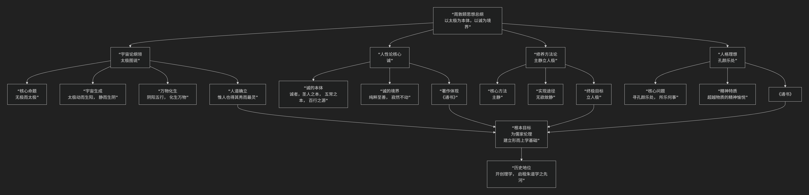

周敦颐
======

基于周敦颐核心哲学思想

---------------------------------

周敦颐是北宋理学的开山鼻祖，被后世尊称为“宋代理学开山”。他的核心思想可以概括为：**一个以《太极图说》为纲领，融汇道家宇宙论与儒家伦理学，为宋明理学奠定了“无极而太极”的本体论和“诚”为最高道德境界的心性论基础的开创性体系。**

周敦颐的思想体系简洁而深邃，其核心架构与内在逻辑可以通过下图清晰地展现：

以下，我们将沿此逻辑脉络，深入解析周敦颐思想的核心要义。

一、宇宙论纲领：《太极图说》

这是周敦颐最著名的著作，虽仅249字，却构建了一个完整的宇宙生成模型，全文融合《易经》与道家思想，被朱熹誉为“道理大纲纲”，为理学奠定了本体论基础。

以下是全文内容（据《周敦颐集》通行本整理）：

.. note::
    
    无极而太极。太极动而生阳，动极而静，静而生阴，静极复动。一动一静，互为其根；分阴分阳，两仪立焉。阳变阴合，而生水、火、木、金、土。五气顺布，四时行焉。五行，一阴阳也；阴阳，一太极也；太极，本无极也。五行之生也，各一其性。无极之真，二五之精，妙合而凝。乾道成男，坤道成女。二气交感，化生万物，万物生生而变化无穷焉。

    惟人也，得其秀而最灵。形既生矣，神发知矣，五性感动而善恶分，万事出矣。圣人定之以中正仁义（自注：圣人之道，仁义中正而已矣）而主静（自注：无欲故静），立人极焉。故圣人与天地合其德，日月合其明，四时合其序，鬼神合其吉凶。君子修之吉，小人悖之凶。故曰：“立天之道，曰阴与阳；立地之道，曰柔与刚；立人之道，曰仁与义。”又曰：“原始反终，故知死生之说。”大哉易也，斯其至矣！

**附注**：首句“无极而太极”存在版本差异（朱熹《近思录》作“无极而太极”，另本或作“自无极而为太极”），现通行本多从前者。  

*   **核心命题：“无极而太极”**

    *   开篇第一句 **“无极而太极”** 是其思想的总纲。

    *   **“太极”** 是宇宙的终极本源，是存在的最高实体（儒家概念）。

    *   **“无极”** 描述“太极”无形无象、无声无臭、无法言说的本然状态（道家色彩）。

    *   此句意为：**宇宙的本源是“太极”，它存在于“无极”的状态之中**。这巧妙地将儒家的实在论与道家的境界论融合在一起。

*   **宇宙生成序列**：

    1.  **“太极动而生阳，动极而静；静而生阴，静极复动。一动一静，互为其根。”**
 
        *   太极的动静变化产生 **阴阳** 两种基本力量。

    2.  **“分阴分阳，两仪立焉。阳变阴合，而生水、火、木、金、土。”**

        *   阴阳交互作用化生出 **五行**。

    3.  **“五气顺布，四时行焉。五行，一阴阳也；阴阳，一太极也；太极，本无极也。”**

        *   五行之气流行，形成四季更替。万物皆可追溯回五行、阴阳，最终归于太极/无极。

    4.  **“惟人也，得其秀而最灵。”**

        *   在万物中，人禀受了最精秀的“气”，因而最具灵性。

    5.  **“形既生矣，神发知矣，五性感动而善恶分，万事出矣。圣人定之以中正仁义而主静，立人极焉。”**

        *   人有了形体、精神和知觉，与外物接触便产生了善恶之分。于是，圣人便制定“中正仁义”的道德准则，并以“主静”为修养方法，为人类确立了最高的道德标准（**“人极”**）。

*   **理论意义**：此说将儒家伦理（中正仁义）置于一个宏大的宇宙论框架内，使道德规范获得了 **天道自然的合法性**。

二、人性论核心：“诚”

在另一著作《通书》中，周敦颐将《太极图说》的宇宙论落实于心性论，其核心概念是 **“诚”**。

*   **“诚”的本体地位**：

    *   **“诚者，圣人之本。”** “诚”是成为圣人的根本。

    *   **“大哉乾元，万物资始，诚之源也。”** “诚”源于天道，是万物创始的根源。

    *   **“诚，五常之本，百行之源也。”** 仁、义、礼、智、信这“五常”以及一切道德行为，都以“诚”为根本。

*   **“诚”的境界**：

    *   “诚”是一种 **“纯粹至善”** 、 **“寂然不动”** 的绝对真实无妄的精神状态。它是道德生命的本体，人若能恢复并保持此“诚”，便可达至圣贤境界。

三、修养方法论：“主静立人极”

如何达到“诚”的境界？周敦颐提出了具体的修养工夫。

*   **核心方法：“主静”**

    *   他在《太极图说》中总结道：**“圣人定之以中正仁义而主静，立人极焉。”**

*   **如何主静？——“无欲”**

    *   在《通书》中，他明确指出：**“无欲则静虚动直。”** 只有去除私欲，内心才能虚静明澈，行为才能正直无私。

    *   “主静”并非绝对的静止，而是指 **不受欲望干扰的心灵宁静状态**，在此状态下，人才能依循“中正仁义”的天理而行。

四、人格理想：“孔颜乐处”

周敦颐曾教导程颢、程颐兄弟“寻孔颜乐处”，即探究孔子和颜回在贫贱生活中为何能保持快乐。这成为了理学的一大精神命题。

*   **核心问题**：圣贤之“乐”，并非源于外在的物质享受或功名利禄，而是源于 **内心与天道合一的道德愉悦和精神充实**。

*   **精神特质**：这种“乐”是一种超越了世俗得失的、内在的、永恒的快乐，是体悟到“天人合一”境界后的精神自在。

五、核心要义总结

.. list-table:: 
   :header-rows: 1
   :widths: 25 45 30
   :align: center

   * - **理论维度**
     - **核心命题**
     - **关键概念与贡献**
   * - **宇宙本体论**
     - **"无极而太极"：宇宙本源是太极，它存在于无极状态中。**
     - **《太极图说》、无极、太极、阴阳五行**
   * - **道德本体论**
     - **"诚者，圣人之本"：诚是源于天道的纯粹至善，是道德的本源。**
     - **《通书》、诚、五常之本、百行之源**
   * - **修养工夫论**
     - **"主静立人极"：通过无欲主静的修养，确立人生的最高道德标准。**
     - **主静、无欲、立人极**
   * - **精神境界论**
     - **"寻孔颜乐处"：追求与天道合一的内在精神愉悦。**
     - **孔颜乐处、圣贤气象**

六、思想特质与历史地位

*   **开创性**：周敦颐是第一位成功 **为儒家伦理学建立一个系统宇宙论基础** 的哲学家，正式开启了宋明理学的新方向。

*   **融合性**：其思想明显吸收了道家（无极、主静）和佛家（寂然不动）的概念，但最终目的是为了 **重建儒家的道德形而上学**，体现了“出入释老，返归六经”的特点。

*   **奠基性**：他的“太极”、“理”、“气”、“性”、“诚”等概念，经由二程、朱熹等人的发扬光大，成为理学的核心范畴。因此，他被后世尊为 **“道学宗主”**。

*   **简洁性**：其著作言简意赅，寓意深远，为后世留下了巨大的阐释和发展空间。

七、总结

总而言之，周敦颐的核心思想在于，他是一位 **“理学的奠基者”和“儒道思想的融汇者”** 。他教导我们，**人类的道德法则并非人为的设定，而是源于宇宙自然的根本规律；人生的最高价值，在于通过内心的修养（主静无欲），恢复与生俱来的“诚”的本性，从而达到与天地万物合一的圣贤境界。**

他的全部工作是对 **儒家学说** 的一次哲学上的根本性提升。在儒学面临佛道挑战的背景下，他通过《太极图说》和《通书》，为儒家心性论找到了一个坚实的宇宙本体论根基，从而开启了持续数百年之久的宋明理学思潮。在这个意义上，周敦颐不仅是理学的开创者，更是整个中国哲学史上承前启后的关键人物。

------------

 .. toctree::
    :maxdepth: 3

    grok
    copilot
    chatgpt
    deepseek
    gemini
    qwen

---------------------------

[:doc:`周敦颐与张载 </chats/outlaw/analyse/chinese/person/middle/zz>`]
