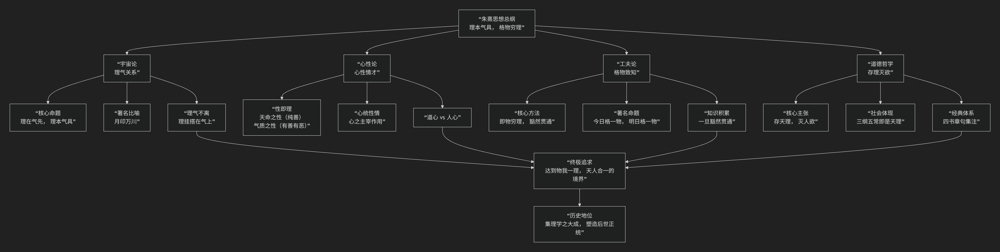

朱文公
======

基于朱熹核心哲学思想

---------------------------------

朱熹是宋代理学的集大成者，其哲学思想体系庞大而精密，对中国乃至东亚思想产生了深远影响。他的核心思想可以概括为：**一个以“理”为最高本体、以“气”为构成材料，通过“格物穷理”的工夫来认识“天理”、克服“人欲”，最终将“天理”内化为道德自觉的形而上学体系。**

为了直观把握朱熹思想的整体架构与内在逻辑，下图清晰地展示了他的核心理论框架：

以下，我们将沿此逻辑脉络，深入解析朱熹思想的核心要义。

一、宇宙论基石：理气关系

这是朱熹哲学的根基，用以解释世界的本质与构成。

*   **理（形而上之道）**：

    *   **本质**：是万物存在的 **所以然之故** （原理、规律、形式）和 **所当然之则** （道德准则）。它是抽象的、永恒的、完美的、唯一的。

    *   **地位**：**理在气先**。在逻辑上，“理”是先于、高于“气”的终极存在。万物产生之前，其“理”已然存在。

    *   **太极**：总天地万物之理，便是 **“太极”** 。太极包含万理，而万理又统一于太极。

*   **气（形而下之器）**：

    *   **本质**：是构成万物的 **物质性质料**，是具象的、运动的、有清浊偏正之分的。

    *   **作用**：**理本气具**。理是本体，但 **理必须挂搭在气上** 才能显现和构成具体事物。如同形式（理）必须通过材料（气）才能成为具体的器物。

*   **著名比喻**：**“月印万川”** 。天上只有一个月亮（太极、理），但江河湖海（万物）中都有月亮的影子。万物分享着同一个“理”，但因禀受的“气”的清浊不同，而呈现出千差万别的形态。

二、心性论核心：心、性、情

朱熹将理气论应用于人性，发展出一套精密的心性学说。

*   **性即理**：人性源于天理。纯粹至善的“天理”体现在人身上，就是人的 **“天命之性”** （或称“天地之性”），这是人本然纯善的根源。

*   **气质之性**：人由“气”构成，气有清浊昏明。天理落入具体的气中，就形成了 **“气质之性”** 。人的贤愚善恶，正是由于“气质”的遮蔽程度不同所致。

*   **心统性情**：“心”是人的知觉和意识的主宰，它能统摄和支配“性”（内在的道德理性）与“情”（外在的情感欲望）。

*   **道心 vs 人心**：

    *   **道心**：源于“天命之性”，符合天理的道德意识。

    *   **人心**：源于“气质之性”，源于生理欲望的日常意识。

    *   **修养目标**：用“道心”主宰“人心”，使“人心”不致偏离天理。

三、工夫论路径：格物致知

这是朱熹哲学中最为人知的修养和认知方法，即如何认识天理、成就德性的实践指南。

*   **核心**：**“格物致知”**。

    *   **格物**：**“即物而穷其理”** ，即接触具体事物，彻底探究其中蕴含的“理”。

    *   **致知**：通过不断格物，积累知识，最终达到对普遍“天理”的豁然贯通。

*   **著名论述**：**“今日格一物，明日格一物，积习既多，然后脱然自有贯通处。”** 这是一个从 **知识的逐渐积累** 到 **智慧的突然飞跃** 的过程。

*   **目的**：格物的最终目的不是成为科学家，而是通过认识万物之理，最终体认到那个统一的、作为道德本源的“天理”，从而自觉践履道德。

四、道德哲学目标：存天理，灭人欲

这是朱熹哲学的社会伦理指向，也是其最受争议的主张。

*   **核心主张**：**“存天理，灭人欲”**。

    *   **天理**：指普通的、正当的生理需求和道德准则。

    *   **人欲**：特指**过度的、违背道德的私欲**。

    *   **辨析**：朱熹并非要消灭人的一切欲望，而是反对那些 **逾越道德规范、损害他人利益的过度私欲**。例如，饮食是天理，追求美味是人欲；夫妻之伦是天理，纵欲无度是人欲。

*   **社会体现**：儒家 **“三纲五常”** 的伦理规范，被朱熹视为“天理”在人类社会中的具体体现，是必须遵守的永恒法则。

五、核心要义总结

.. list-table:: 
   :header-rows: 1
   :widths: 25 45 30
   :align: center

   * - **理论维度**
     - **核心命题**
     - **关键概念与贡献**
   * - **本体宇宙论**
     - **"理在气先"、"理本气具"：理是形上本体，气是形下材质。**
     - **理、气、太极、理一分殊、月印万川**
   * - **心性论**
     - **"性即理"：人性源于天理，有"天命之性"与"气质之性"之分。**
     - **天命之性、气质之性、心统性情、道心人心**
   * - **工夫认识论**
     - **"格物穷理"：通过今日格一物，明日格一物，最终豁然贯通天理。**
     - **格物致知、即物穷理、知行常相须**
   * - **道德社会论**
     - **"存天理，灭人欲"：克制过度私欲，使言行符合普遍天理（三纲五常）。**
     - **存理灭欲、三纲五常、四书集注**

六、思想特质与历史影响

*   **集大成者**：朱熹综合了周敦颐、二程、张载等北宋理学家的思想，构建了一个前所未有的宏大、精密的哲学体系。

*   **官学地位**：自元朝起，朱熹的《四书章句集注》成为科举考试的标准答案，其思想被奉为官方正统，支配中国思想界数百年，并深刻影响日、韩等东亚各国。

*   **争议与批评**：

    *   其“理在气先”的观点被批评为 **客观唯心主义**。

    *   “存天理，灭人欲”在后世被僵化利用，成为 **禁锢人性、压制欲求** 的思想工具。

    *   陆王心学（陆九渊、王阳明）批评其“格物”方法 **支离繁琐**，转向直指本心的“简易功夫”。

七、总结

总而言之，朱熹的核心思想在于，他是一位 **“体系的构建师”和“道德的形而上学家”** 。他教导我们，**宇宙间存在一个普适的、至善的道德秩序（天理），它既是自然运行的法则，也是人间伦理的根源。人生的最高意义，在于通过持续不断地学习、观察和反思（格物穷理），去认识这个天理，并克服自身的私欲，将外在的规范内化为自觉的道德律令，最终达到与天地合德的圣贤境界。**

他的全部工作是对 **儒家学说** 的一次空前系统化和哲学化的提升。他将儒家伦理建立在坚实的形而上学基础之上，为士人提供了一套完整的“内圣外王”的修养路径。尽管后世对其思想有诸多批判，但无可否认，朱熹哲学是中国思想史上的一座高峰，深刻塑造了传统中国的思维方式、价值观念和社会结构。

------------

 .. toctree::
    :maxdepth: 3

    grok
    copilot
    chatgpt
    deepseek
    gemini
    qwen
