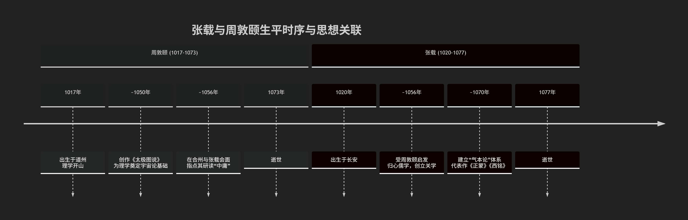

## 周敦颐与张载

这**周敦颐略早于张载，两人是同时代但思想路径不同的奠基者。**

为了更清晰地展示他们的生平时序、互动关系及思想传承，请参阅下图：

---

### 细节解析

从上图可以看出：

1.  **生卒年**
    *   **周敦颐**：生于公元1017年，卒于1073年。
    *   **张载**：生于公元1020年，卒于1077年。
    *   **结论**：周敦颐比张载年长3岁，但张载比周敦颐晚去世4年。因此，**周敦颐略早，两人生命大部分时间是重叠的同代人**。

2.  **关键的历史交集**
    *   根据史料记载，大约在公元1056年，当时三十多岁的张载在京城开封与周敦颐相见并讨论学问。
    *   这次会面对张载产生了重要影响。据记载，周敦颐指点张载深入研究 **《中庸》** 。这次交流是促使张载从泛览百家归心于儒学的一个重要外因。
    *   **关系**：因此，周敦颐在思想上可以看作是张载的 **“先驱”或“启发者”** ，但两人并非严格的师徒关系，而是各自开创了不同的思想体系。

3.  **历史地位与影响**
    *   **周敦颐**：被后世尊为 **“宋代理学开山鼻祖”**。他的《太极图说》用“无极而太极”的宇宙生成模式，首次为儒家学说建立了一个系统的宇宙论框架，奠定了理学的本体论基础。
    *   **张载**：是 **“关学”** 学派的创始人。他提出了“气本论”的宏大体系，其《西铭》中“民胞物与”的理想境界成为后世儒者的共同追求。他主要影响了后来的朱熹等理学家。

### 总结

可以这样理解他们的关系：

*   **从时间上看**：周敦颐是**起步更早的开拓者**。
*   **从思想上看**：二人是**并列的奠基人**。周敦颐的思想更侧重宇宙的本源（“太极”），开启了后来程朱理学“理本论”的方向；而张载的思想则更侧重宇宙的构成（“气”），建立了唯物倾向更强的“气本论”体系。

他们如同理学源头两条并行的溪流，共同汇入了后来由程颢、程颐、朱熹等人开创的理学大江大河中。

