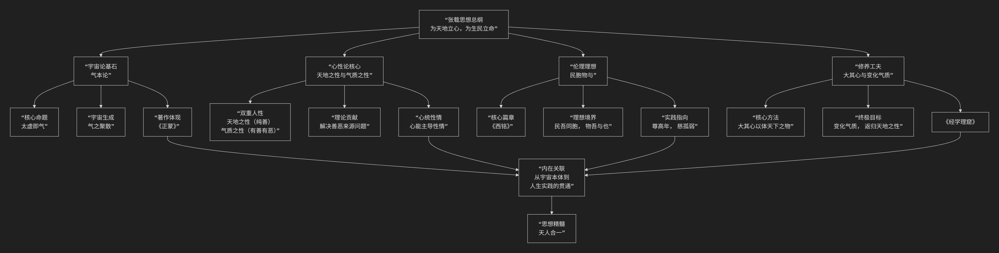

张横渠
======

基于张载核心哲学思想

---------------------------------

张载是北宋理学的奠基人之一，其思想深邃而富有开创性。核心思想可以概括为：**一个以“气本论”为哲学基石，以“民胞物与”为伦理理想，以“为天地立心”为使命，融宇宙论、心性论与人生境界于一体的宏大体系。**

张载的思想体系结构严谨，其核心架构与内在逻辑可以通过下图清晰地展现：

以下，我们将沿此逻辑脉络，深入解析张载思想的核心要义。

一、宇宙论基石：气本论

张载哲学最根本的贡献，在于确立了“气”作为宇宙本原的地位。

*   **核心命题：太虚即气**

    *   他提出 **“太虚无形，气之本体；其聚其散，变化之客形耳”**。

    *   这意味着：宇宙的终极本体（“太虚”）并非绝对的“无”，而是 **充满希微、不可见的“气”**。我们肉眼可见的万物（“客形”），只是“气” **聚合** 的暂时形态；万物消亡，则是“气” **消散** 回归本然状态。这有力地批判了佛家的“虚无”和道家的“有生于无”。

*   **宇宙生成论**：

    *   **“气”** 内部包含 **阴阳** 两种对立统一的势力，二者的相互作用（**“感”**）推动着宇宙万物的生生不息、变化无穷。

    *   这构成了一种 **唯物的、动态的** 宇宙观。

二、心性论核心：天地之性与气质之性

这是张载对儒家心性论的划时代贡献，为后世理学所继承和发展。

*   **双重人性论**：

    1.  **天地之性**：人禀受于“太虚”本然的、纯善的本性。这是人与万物共通的道德根源，是 **至善的**。
    
    2.  **气质之性**：人由于禀受的 **气有清浊、厚薄之别**，而形成的具体生理、心理素质和情感欲望。它有善有恶，是人性中 **恶的来源**。

*   **理论意义**：这一区分完美地解释了儒家长期争论的“善恶来源”问题。人为何会作恶？因为“气质”遮蔽了本然的“天地之性”。道德修养的目标就是 **改变浑浊的“气质”**，使纯善的“天地之性”得以彰显。

*   **心统性情**：张载还提出 **“心统性情”** 的命题，认为“心”具有主宰和统合“性”（道德理性）与“情”（情感欲望）的能力，为道德实践提供了主体基础。

三、伦理理想：民胞物与

这是张载思想中最富感染力和社会关怀的部分，集中体现在其不朽名篇《西铭》中。

- 《西铭》原名《订顽》，程颐改题为《西铭》，与《东铭》（原名《砭愚》）对应。朱熹曾将其收入《近思录》，并作《西铭解》阐释其理一分殊的思想。   
- 全文以“天人一体”为核心，阐发儒家伦理观，强调人与万物同源、仁爱及社会责任，被后世理学家奉为纲领性文献。 

.. note::
      
    《西铭》：乾称父，坤称母；予兹藐焉，乃混然中处。故天地之塞，吾其体；天地之帅，吾其性。民吾同胞，物吾与也。  
    大君者，吾父母宗子；其大臣，宗子之家相也。尊高年，所以长其长；慈孤弱，所以幼其幼。圣其合德，贤其秀也。  
    凡天下疲癃残疾、惸独鳏寡，皆吾兄弟之颠连而无告者也。于时保之，子之翼也；乐且不忧，纯乎孝者也。  
    违曰悖德，害仁曰贼；济恶者不才，其践形，惟肖者也。知化则善述其事，穷神则善继其志。不愧屋漏为无忝，存心养性为匪懈。  
    恶旨酒，崇伯子之顾养；育英才，颍封人之锡类。不弛劳而厎豫，舜其功也；无所逃而待烹，申生其恭也。体其受而归全者，参乎！勇于从而顺令者，伯奇也。  
    富贵福泽，将厚吾之生也；贫贱忧戚，庸玉汝于成也。存，吾顺事；没，吾宁也。
    

*   **核心境界**：

    *   **“民吾同胞，物吾与也。”** （百姓都是我的同胞，万物都是我的伙伴。）

    *   将宇宙视为一个大家庭：天地是父母，君主是嫡长子，大臣是管家，世间一切人都是我的兄弟姊妹，万物都是我的朋友。

*   **伦理要求**：

    *   **“尊高年，所以长其长；慈孤弱，所以幼其幼。”** 要尊敬世上的老人，慈爱世上的孤儿弱者。

    *   **“凡天下疲癃残疾、惸独鳏寡，皆吾兄弟之颠连而无告者也。”** 对所有社会弱势群体，都应抱有深切的同情与关怀。

*   **人生态度**：

    *   活着就顺应天道努力做事（**“存，吾顺事”**），死亡则安宁地回归本体（**“没，吾宁也”**），表现出一种将个人生命融入宇宙大化的豁达生死观。

四、修养工夫：大其心与变化气质

如何实现上述理想？张载提出了一套具体的修养方法。

*   **大其心**： **“大其心则能体天下之物。”** 要打破由“气质”和感官带来的小我局限，扩展自己的心胸，去体会、感知天下万物与我本是一体。

*   **变化气质**：通过 **“知礼成性”** （学习礼义以成就本性）和 **“穷神知化”** （穷究宇宙奥秘）的工夫，克服“气质之性”的偏蔽，使“天地之性”充分显现，最终达到 **“天人合一”** 的最高境界。

*   **知行观**：强调 **“知”** 必须落实到 **“行”** ，如学习礼义就要在日常生活中践行。

五、核心要义总结

.. list-table:: 
   :header-rows: 1
   :widths: 25 45 30
   :align: center

   * - **理论维度**
     - **核心命题**
     - **关键概念与贡献**
   * - **宇宙论（本体）**
     - **"太虚即气"：气是宇宙万物的本质，聚散变化构成世界。**
     - **气本论、太虚、气聚散、一物两体（阴阳）**
   * - **心性论（人生）**
     - **"合虚与气，有性之名"：人性有"天地之性"（善源）与"气质之性"（恶源）双重结构。**
     - **天地之性、气质之性、心统性情、善恶来源**
   * - **伦理学（理想）**
     - **"民胞物与"：将宇宙视为大家庭，涵摄博爱平等精神。**
     - **《西铭》、民吾同胞、物吾与也、仁孝原则**
   * - **工夫论（方法）**
     - **"大其心"、"变化气质"：通过修养克服气质局限，回归天地之性。**
     - **大其心、变化气质、知礼成性、穷神知化**

六、思想特质与历史影响

*   **体系性与开创性**：张载首次为儒学建立了一个完整的气本论哲学体系，其“天地之性”与“气质之性”的区分，被二程、朱熹等理学家奉为圭臬，奠定了理学心性论的基础。

*   **博大的胸怀**：其“民胞物与”的理想，将儒家的仁爱思想提升到宇宙论的高度，展现了极其博大的精神境界和深厚的人文关怀。

*   **关学宗师**：他开创的“关学”学派，强调学以致用、躬行实践，对后世实学思想产生了深远影响。

*   **横渠四句**：**“为天地立心，为生民立命，为往圣继绝学，为万世开太平。”** 这四句话虽非严格哲学命题，却集中体现了张载乃至整个宋明理学的宏大抱负与历史使命感，激励了无数后人。

七、总结

总而言之，张载的核心思想在于，他是一位 **“宇宙的诠释者”和“人生的指引者”** 。他教导我们，**人源于气，本性至善，虽为气质所拘，但可通过修养恢复与万物一体的本然状态。人生的最高意义，在于认识到自己是宇宙大家庭的一员，并为这个大家庭的和谐与福祉承担责任。**

他的全部工作是对 **儒家学说** 的一次哲学上的升华和体系化重建。在佛道挑战的背景下，他构建了一个既深邃又平实的儒家世界观，为宋明理学的蓬勃发展奠定了坚实的基础。在这个意义上，张载不仅是关学宗师，更是整个理学思潮的伟大奠基者之一。

------------

 .. toctree::
    :maxdepth: 3

    grok
    copilot
    chatgpt
    deepseek
    gemini
    qwen

---------------------------

[:doc:`周敦颐与张载 </chats/outlaw/analyse/chinese/person/middle/zz>`]

