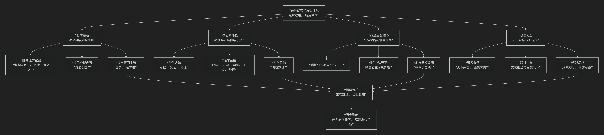

顾炎武
======

基于顾炎武核心思想

---------------------------------

顾炎武是明末清初一位极具批判精神和实践精神的思想家、学者，与黄宗羲、王夫之并称为明末清初三大儒。他的核心思想可以概括为：**一种以“经世致用”为根本宗旨，以“考据实证”为治学方法，以“天下兴亡，匹夫有责”为价值担当的实学思想体系。他深刻批判了宋明理学的空疏流弊，倡导学术必须服务于解决社会现实问题，并提出了具有早期民主色彩的政治反思。**

顾炎武的思想体系深刻且富于现实关怀，其核心架构与内在逻辑可以通过下图清晰地展现：

以下，我们将沿此逻辑脉络，深入解析顾炎武的核心要义。

---

一、哲学基石：对空疏学风的批判与“经世致用”的提出

顾炎武思想的起点是对明末空谈误国的深刻反思。

*   **批判宋明理学空疏**：他猛烈抨击当时理学家们“舍多学而识，以求一贯之方”，即抛弃具体学问，空谈性理，导致学问脱离实际，毫无用处。他认为这正是明朝灭亡的重要原因之一，提出 **“清谈误国”** 的著名论断。

*   **提出“经学即理学”**：为纠偏，他提出 **“理学，经学也”**。主张真正的“道”存在于古代的经典（经书）和具体的典章制度之中，而非空泛的心性之中。研究学问必须回归经典本身，通经以致用。

*   **根本宗旨：“经世致用”** 这是顾炎武全部思想的旗帜。学术研究必须以 **解决社会现实问题、有利于国计民生** 为最终目的。他宣称：“凡文之不关于六经之指、当世之务者，一切不为。”

二、核心方法论：考据实证与“博学于文”

为实现“经世致用”，顾炎武开创并实践了一套严谨的治学方法。

*   **考据实证**：他强调研究任何问题都必须有坚实的证据。为此，他一生“读万卷书，行万里路”，亲自考察各地地理、风俗、民生、制度，其巨著《天下郡国利病书》和《日知录》就是这一方法的典范。

*   **博学于文**：研究范围极其广泛，涵盖经学、史学、音韵学、金石学、典章制度、天文、地理等一切有裨实学的领域。他治学严谨，对资料 **“必探其源，必证其真”**，奠定了清代朴学（考据学）的基石。

*   **治学目的：“明道救世”** 考据并非为学术而学术，最终目的是为了 **阐明治国平天下之道，寻求挽救时弊的方案**。

三、政治思想核心：“天下”观与制度反思

顾炎武的政治思想极具深度和批判性，超越了简单的忠君观念。

*   **辨析“亡国”与“亡天下”**：这是他最富革命性的区分。

    *   **“亡国”**：指 **改朝换代**，一家一姓的政权覆灭。这是 **肉食者（官员）** 需要关心和负责的事。

    *   **“亡天下”**：指 **道德沦丧、文明衰败**，即整个社会文化秩序的崩溃。

    *   **著名论断**：**“保国者，其君其臣，肉食者谋之；保天下者，匹夫之贱与有责焉耳矣。”** 后世概括为 **“天下兴亡，匹夫有责”**。这将每个人的责任提升到保卫文化和道德的高度。

*   **批判君主专制**：他深刻揭露了君主专制的弊端，认为“尽天下一切之权而收之在上”，高度集权导致官僚系统僵化、地方无力、民生凋敝。

*   **制度设想：“寓封建之意于郡县之中”**：为矫治专制之弊，他提出改革设想。在保持中央集权（郡县制）框架下，**扩大地方官（县令）的自主权，提高其待遇和任期，使其能真正为民办事**，从而加强地方的活力与稳定性。这带有地方分权自治的萌芽色彩。

四、价值担当：身体力行与民族气节

顾炎武不仅是思想家，更是实践家和气节之士。

*   **身体力行**：他一生辗转南北，实地考察，结交志士，始终不忘复明抗清。他的学问是从脚底板走出来、关乎苍生冷暖的真学问。

*   **民族气节**：明亡后，他始终不仕清廷，坚守遗民气节，体现了儒家士大夫“富贵不能淫，贫贱不能移，威武不能屈”的人格风骨。

---

五、核心要义总结

.. list-table:: 
   :header-rows: 1
   :widths: 25 45 30
   :align: center

   * - **理论维度**
     - **核心命题**
     - **关键概念与贡献**
   * - **学术批判与宗旨**
     - **批判理学空疏，倡导"经世致用"，学术须服务于现实。**
     - **清谈误国、经世致用、实学**
   * - **方法论**
     - **治学需"考据实证"，回归经典，博学求真以"明道救世"。**
     - **考据、实证、博学于文、朴学先驱**
   * - **政治思想**
     - **区分"亡国"与"亡天下"，提出"天下兴亡，匹夫有责"，批判专制，主张地方分权。**
     - **天下观、匹夫有责、寓封建于郡县、批判专制**
   * - **人格与实践**
     - **学问与气节并重，身体力行，坚守民族大义。**
     - **行万里路、民族气节、明道救世**

六、思想特质与历史影响

*   **崇实黜虚**：彻底扭转了明末空疏的学风，将学术引向实事求是、关注现实的道路。

*   **承前启后**：上承东林学派“家事国事天下事，事事关心”的精神，下启清代朴学（乾嘉考据学）的兴盛，并对后世的维新派（如梁启超）和革命者产生了深远影响。

*   **局限性**：其思想仍局限于传统框架内，旨在“复古”以“救世”，未能提出全新的社会蓝图。

七、总结

总而言之，顾炎武的核心思想在于，他是一位 **“空想学风的掘墓人”和“实事求是学风的奠基者”** 。他教导我们，**真正的学问不在于辞藻的华丽与思辨的精妙，而在于能否直面时代的痛楚，扎根于坚实的大地，并最终转化为利国利民的行动力量。**

他的全部工作是对 **儒家知识分子责任**的一次深刻重申与升华。在国破家亡的背景下，他将“忠”的对象从一家一姓的君王，提升到了整个民族的文化与道德共同体（“天下”），从而喊出了“匹夫有责”的时代最强音。在这个意义上，他不仅是清代学术的开山宗师，更是一座象征著知识人风骨与担当的精神丰碑。

------------

 .. toctree::
    :maxdepth: 3

    grok
    copilot
    chatgpt
    deepseek
    gemini
    qwen
