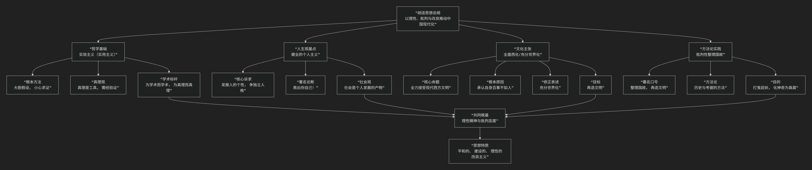

胡适之
======

基于胡适之核心思想

---------------------------------

胡适是中国近代思想史上一位开风气之先的关键人物。他的核心思想可以概括为：**一套以“实验主义”为哲学基础，以“健全的个人主义”为出发点，以“批判性整理国故”和“全盘西化（充分世界化）”为路径，致力于推动中国思想、学术和社会现代化的理性改良主义体系。**

胡适的思想清晰、务实且一以贯之，其核心架构与内在逻辑可以通过下图清晰地展现：

以下，我们将沿此逻辑脉络，深入解析胡适思想的核心要义。

一、哲学基础：实验主义

胡适在美国哥伦比亚大学师从杜威，所接受的 **实验主义** 是其全部思想的哲学基石。

*   **核心方法**：**“大胆的假设，小心的求证”**。他认为这是科学方法的精髓，也应应用于一切人文和社会研究。假设要勇敢，但验证必须严格基于证据。

*   **真理观**：真理并非一成不变的教条，而是 **一种有用的假设**，需要在实际运用中不断检验和修正。“真理不过是对付环境的一种工具。”

*   **学术精神**：提倡 **“为学术而学术”、“为真理而真理”** 的纯粹研究态度，反对学术为政治或道德做奴仆。

二、人生观基点：健全的个人主义

针对中国传统的家族本位，胡适提出了“健全的个人主义”作为现代人格的基石。

*   **核心主张**：社会进步的基础在于 **一个个独立的、自由的、健全的个人**。首先要“救出你自己！”（易卜生主义），发展自己的个性，拥有独立判断的能力。

*   **著名论断**：**“争你们个人的自由，便是为国家争自由！争你们自己的人格，便是为国家争人格！自由平等的国家不是一群奴才建造得起来的！”**

*   **社会观**：社会是个人发展的产物，**“小我”** （个人）应对其言行负责，并汇入 **“大我”** （社会历史）的洪流中，从而获得不朽的意义。

三、文化主张：全盘西化 / 充分世界化

这是胡适最受争议也最核心的文化观，其本质是激进的现代化主张。

*   **核心命题**：中国要摆脱落后挨打的局面，必须 **“死心塌地的去学人家”**，即全力接受现代的西洋文明。

*   **著名口号与修正**：他最初提出 **“全盘西化”** ，意在矫枉过正，打破“中体西用”的折衷幻想。后因批评过多，修正为更准确的 **“充分世界化”**。

*   **根本原因**：基于深刻的 **文化自省**。他承认中国在 **“物质机械、政治制度、道德、文学、音乐、艺术、体育”** 等几乎所有方面都不如人，故需虚心学习。

*   **最终目标**：**“再造文明”**。学习西方不是目的，而是手段，最终目标是吸收新知，批判传统，创造一种属于现代中国的新文明。

四、方法论实践：批判性整理国故

与“全盘西化”看似矛盾实则互补的，是他对传统文化的“整理国故”运动。

*   **目的**：**“整理国故，再造文明”**。不是盲目标榜国学，而是用 **批判的眼光** 和 **科学的方法** （实验主义与考据学结合）去重新研究传统。

*   **方法**：**“用历史的方法来尽量扩大研究的范围”**，即考据版本、辨明真伪、理清脉络。

*   **著名比喻**：整理国故是为了 **“打鬼”、“捉妖”** ，即 **“化神奇为臭腐”**，揭开传统文化的神秘面纱，用理性态度看清其本来面目，有价值的发扬，无价值的抛弃。

五、核心要义总结

.. list-table:: 
   :header-rows: 1
   :widths: 25 45 30
   :align: center

   * - **理论维度**
     - **核心命题**
     - **关键概念与贡献**
   * - **哲学方法论**
     - **以"实验主义"为指导，倡导"大胆假设，小心求证"的科学精神。**
     - **实验主义、实用主义、科学方法、拿证据来**
   * - **社会人生观**
     - **提倡"健全的个人主义"，认为自由国家非奴才所能建成。**
     - **救出你自己、易卜生主义、小我与大我**
   * - **文化观**
     - **主张"充分世界化"，认为中国应全力学习现代西方文明。**
     - **全盘西化、充分世界化、百事不如人、再造文明**
   * - **学术实践**
     - **以"批判态度整理国故"，目的是"打鬼捉妖，再造文明"。**
     - **整理国故、疑古、考据学、再造文明**

六、思想特质与历史影响

*   **理性与平和**：他一生秉持理性、宽容、怀疑和批判的态度，反对任何形式的激进主义、盲从和武断。

*   **改良主义**：他坚信“一点一滴的改造”、“一尺一步的进步”，反对根本性的革命，主张通过教育、文化和制度的渐进改革来塑造新中国。

*   **深远影响**：

    *   **新文化运动旗手**：提倡白话文，推动文学革命，其《文学改良刍议》是标志性文献。

    *   **思想启蒙导师**：影响了一代又一代中国知识分子，塑造了现代中国的理性精神。

    *   **自由主义的代表人物**：终生坚持自由、民主、人权的普世价值。

*   **争议与批评**：

    *   其改良主义被批评为无法应对中国的紧迫危机。

    *   “全盘西化”论被指责为 **民族虚无主义**。

    *   在阶级斗争激烈的年代，其自由主义立场显得“不合时宜”。

七、总结

总而言之，胡适的核心思想在于，他是一位 **“理性的播种者”和“现代的工程师”** 。他教导我们，**面对积贫积弱的祖国，最需要的不是激情的呐喊，而是冷静的思考；不是笼统的主义，而是具体的办法；不是固守传统的“光荣”，而是承认落后的勇气和虚心学习的胸怀。**

他的全部工作是对 **中国如何实现现代化** 的一次全面而系统的思想启蒙。在充满激荡与革命的20世纪，他始终坚守理性、自由和渐进的改良道路，试图为中国打造一个坚实的“现代性”基础。尽管他的方案常被视为“迂缓”，但他所倡导的怀疑精神、批判态度、科学方法和个人尊严，已成为中国现代思想宝库中不可或缺的遗产。在这个意义上，胡适不仅是历史人物，更是一种永恒的理性声音。

------------

 .. toctree::
    :maxdepth: 3

    grok
    copilot
    chatgpt
    deepseek
    gemini
    qwen
