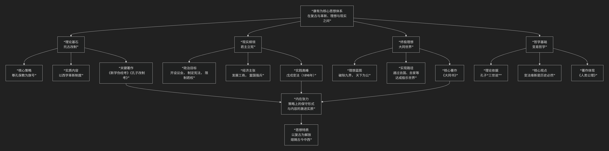

康有为
======

基于康有为核心思想

---------------------------------

康有为是中国近代史上一位极其复杂且重要的人物，他是清末维新变法的思想导师和主要策划者。他的核心思想可以概括为：**一套以“托古改制”为策略、以“大同世界”为终极理想、以“君主立宪”为现实路径的激进改良主义体系。其根本目标是通过吸收西方文明来改造中国，从而在弱肉强食的帝国主义的时代挽救民族危亡，并最终实现全球范围的平等与和平。**

康有为的思想体系宏大且具有内在张力，其核心架构与演变脉络可以通过下图清晰地展现：

以下，我们将沿此逻辑脉络，深入解析康有为思想的核心要义。

一、理论基石与策略：“托古改制”

这是康有为最独特也最具争议性的思想策略，旨在为其改革主张披上合法性的外衣，减少来自保守派的阻力。

*   **核心内容**：康有为宣称，孔子并非保守的“述而不作”者，而是一位伟大的 **改革家**。孔子撰写“六经”的真正目的，是 **“托（借）古圣先王之言”来“改制”（改革制度）** ，为未来社会制定蓝图。

*   **具体操作**：

    1.  **《新学伪经考》**： 断言东汉以来的儒家经典（古文经）是刘歆为王莽篡汉而伪造的，是“伪经”，从而动摇了当时官方学术（汉学）的根基。

    2.  **《孔子改制考》**： 论证孔子本人就是一位改制者，先秦诸子都是为了实现自己的政治理想而“托古改制”。因此，他康有为效法孔子进行变法，是真正继承了孔子的真精神。

*   **目的**：将西方资产阶级的议会、民主、平等思想，说成是中国古代“圣人之意”中早已有之的东西，为变法维新提供**“中国特色”的理论依据**，即 **“复古”是为了“革新”**。

二、现实政治纲领：“君主立宪”与维新变法

这是康有为在19世纪末全力推动的现实政治实践。

*   **目标**：在中国建立 **君主立宪制**。保留皇帝作为国家的象征，但通过设立议会、制定宪法来限制君权，建立责任政府，实现自上而下的政治现代化。

*   **主要内容**：在1898年的“戊戌变法”（百日维新）中，他通过光绪皇帝颁布了一系列诏令，内容包括：

    *   **政治**：裁撤冗官、鼓励言论、开放政权。

    *   **经济**：发展工商业、修铁路、开矿山。

    *   **文教**：废八股、办新式学堂（如京师大学堂，北大前身）、派留学生。

    *   **军事**：训练新式陆军海军。

*   **失败与意义**：变法因保守势力（以慈禧太后为首）的反对而迅速失败，但它是一次全面的、试图将中国改造为现代国家的伟大尝试，起到了巨大的思想启蒙作用。

三、终极社会理想：“大同世界”

康有为的思想并未止于现实改革，他怀有极其宏大的乌托邦理想，集中体现在其秘不示人的著作 **《大同书》** 中。

*   **哲学基础**：发展儒家“公羊三世说”，认为人类社会演进分为三个阶段：

    *   **据乱世**：君主专制时代。

    *   **升平世**：君主立宪时代（即他当时奋斗的目标）。

    *   **太平世**：民主共和的“大同世界”。

*   **“大同”蓝图**：一个消灭了所有界限和痛苦的极致理想社会：

    *   **去国界**：消灭国家，建立一个全球统一的“公政府”。

    *   **去级界**：废除阶级，人人平等。

    *   **去种界**：种族融合，美化人种。

    *   **去形界**：男女完全平等。

    *   **去家界**：取消家庭，儿童由社会公育，老人由社会公养。

    *   **去产界**：废除私有制，实行计划经济。

    *   **去乱界**：警察、监狱等都将废除。

    *   **去类界**：众生平等，爱护万物。

    *   **去苦界**：高度发达的科学技术让人享受极乐。

*   **矛盾性**：康有为认为“大同”理想极其崇高，不可一蹴而就，且若在条件不成熟时宣扬会引发混乱，因此他生前并未公开《大同书》，而是致力于现实的“升平世”改革。这体现了他理想主义与现实主义之间的矛盾。

四、哲学基础：“变易”的哲学

康有为的所有主张都建立在一个核心观点上：**“变”是宇宙的普遍法则**。

*   **理论来源**：他利用中国传统哲学经典《周易》和《春秋公羊传》中的“变易”思想。

*   **核心论点**： “**穷则变，变则通，通则久。**” 认为清朝已到了非变不可的“穷途”。变法维新不是背离传统，而是顺应天理和历史潮流的必然要求。

五、核心要义总结

.. list-table:: 
   :header-rows: 1
   :widths: 25 45 30
   :align: center

   * - **理论维度**
     - **核心命题**
     - **关键概念与贡献**
   * - **变法策略**
     - **"托古改制"：借孔子之名，行维新之实，为改革披上合法外衣。**
     - **托古改制、孔子改制考、新学伪经考**
   * - **政治纲领**
     - **实行"君主立宪"，通过自上而下的维新变法挽救民族危亡。**
     - **君主立宪、戊戌变法、废八股、练新军**
   * - **社会理想**
     - **人类最终将进入消灭一切界限的"大同世界"。**
     - **大同书、太平世、去九界、乌托邦**
   * - **哲学基础**
     - **"变者，天道也"：变法维新是顺应历史发展规律的必然要求。**
     - **变易哲学、三世说、进化史观**

六、思想特质与历史评价

*   **激进与保守并存**：其思想体系内存在深刻矛盾，策略上是保守的（尊孔保教），内容却是激进的（全面学习西方）。

*   **承前启后**：他是 **近代中国启蒙思想的先驱**，其变法理论打破了“祖宗之法不可变”的僵化思维，为后来的革命思潮开辟了道路。

*   **历史局限**：随着清朝的覆灭，其“君主立宪”主张失去现实基础，他本人后期沦为“保皇派”，趋于保守。其“大同”理想也带有空想色彩。

七、总结

总而言之，康有为的核心思想在于，他是一位 **“旧时代的掘墓人”与“新时代的预言家”的奇特混合体**。他试图 **用最传统的外衣包裹最激进的内核**，在古老帝国的肌体上嫁接现代文明的枝条。

他的全部工作是对 **中国如何应对“三千年未有之大变局”** 的一次极其勇敢而系统的回答。尽管其政治实践失败了，但他所倡导的变革精神、世界眼光和对理想社会的执着追求，深刻地影响了梁启超、孙中山等后来者，并至今仍在启迪我们思考传统与现代化、理想与现实之间的复杂关系。

------------

 .. toctree::
    :maxdepth: 3

    grok
    copilot
    chatgpt
    deepseek
    gemini
    qwen
