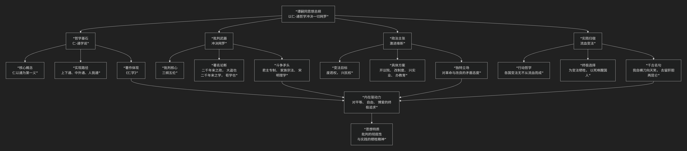

谭嗣同
======

基于谭嗣同核心思想。

---------------------------------

谭嗣同是中国近代维新变法运动中一位极具震撼力的思想家和革命烈士。他的核心思想可以概括为：**一种以“冲决网罗”的彻底批判精神为旗帜，以“仁-通”的平等哲学为基石，猛烈抨击封建专制和纲常伦理，并最终以“流血变法”的壮烈实践为其思想画上血染句号的激进维新学说。**

谭嗣同的思想极具战斗性和牺牲精神，其核心架构与内在逻辑可以通过下图清晰地展现：

以下，我们将沿此逻辑脉络，深入解析谭嗣同思想的核心要义。

一、哲学基石：“仁-通”学说

谭嗣同的思想体系构建在其哲学著作 **《仁学》** 之上。他对传统的“仁”概念进行了革命性的改造。

*   **核心命题**：**“仁以通为第一义”**。他认为，“仁”的根本内涵不是差等之爱，而是“通”——即 **打破隔阂，实现完全的沟通、平等与融合**。

*   **“通”的四个维度**：

    1.  **上下通**：打破君臣、贵贱之间的等级壁垒，实现政治平等。

    2.  **中外通**：打破中国与外国之间的文化隔阂，积极学习西方长处。

    3.  **人我通**：打破人与人之间的自私界限，实现“众生平等”的博爱。

    4.  **内外通**：打破身心、物质与精神的界限（受佛学影响）。

*   **目标**：“通”的最终状态是达到 **“以太即性，仁为灵魂”** 的宇宙大同境界，万物融为一体，无有隔阂。

二、批判武器：“冲决网罗”的彻底精神

基于“仁-通”哲学，谭嗣同对旧制度发起了中国思想史上空前猛烈的批判。**“冲决网罗”** 是他最著名的口号。

*   **批判核心：三纲五伦**

    *   他痛斥“三纲”（君为臣纲、父为子纲、夫为妻纲）是 **统治者用以桎梏人民的工具**，是“惨祸烈毒”。

    *   他尤其猛烈地抨击 **“君为臣纲”** ，提出 **“二千年来之政，秦政也，皆大盗也”** 的著名论断，认为历代帝王都是窃国大盗，而腐儒们用纲常名教为其服务。

    *   他同情妇女，批判“夫为妻纲”，主张男女平等。

*   **批判理学**：他认为宋明理学是 **维护专制的帮凶**，批评其“妄分上下”，禁锢人心。

三、政治主张：激进的维新变法

在实践层面，谭嗣同是变法的坚定倡导者，但其思想远比康有为、梁启超更为激进。

*   **变法目标**：**“废君权，兴民权”**，建立君主立宪制度。但他对君主的批判如此激烈，以至于其思想已经触及了 **反专制、反满的革命边缘**。

*   **变法内容**：主张全面学习西方，包括开设议院、发展资本主义工商业、改革教育、练新军等。

*   **矛盾性**：他一方面参与康有为领导的、保留光绪帝的维新运动；另一方面又在思想上极度接近革命，这种矛盾体现了那个时代过渡人物的特征。

四、实践归宿：“流血变法”的壮烈牺牲

谭嗣同思想的最终完成，不是在他的著作里，而是在他的鲜血中。

*   **行动哲学**：他认为变法必然伴随牺牲。其名言：**“各国变法，无不从流血而成。今日中国未闻有因变法而流血者，此国之所以不昌也。有之，请自嗣同始。”**

*   **舍生取义**：戊戌变法失败后，他完全有机会逃走，但他毅然选择留下，以死殉道。目的是 **用鲜血唤醒沉睡的国人**，证明变法的必要与维新的真诚。

*   **精神升华**：他在狱中写下“我自横刀向天笑，去留肝胆两昆仑”的绝笔，其壮烈牺牲使其思想获得了超越理论的力量，成为激励后来革命者（如孙中山、邹容）的精神火炬。

五、核心要义总结

.. list-table:: 
   :header-rows: 1
   :widths: 25 45 30
   :align: center

   * - **理论维度**
     - **核心命题**
     - **关键概念与贡献**
   * - **哲学基础**
     - **"仁以通为第一义"，追求万物平等、沟通无碍的大同境界。**
     - **《仁学》、仁-通学说、上下通、中外通**
   * - **社会批判**
     - **"冲决网罗"，对三纲五伦和专制制度进行空前猛烈的批判。**
     - **冲决网罗、三纲之毒、君主大盗说**
   * - **政治思想**
     - **主张激进的维新变法，其思想已触及革命边缘。**
     - **废君权、兴民权、君主立宪**
   * - **实践精神**
     - **"流血变法"，以壮烈牺牲完成其思想的最终论证。**
     - **变法流血说、自我牺牲、唤醒国人**

六、思想特质与历史影响

*   **彻底的批判性**：其批判的深度和力度，在同时代无人能及，直接为后来的民主革命作了思想启蒙。

*   **强烈的牺牲精神**：他将思想与生命融为一体，实现了“知行合一”的最高境界。

*   **复杂的思想来源**：其思想融汇了儒家仁学、佛家慈悲、基督教博爱、西方自然科学（以太说）和民主思想，呈现出庞杂而富有张力的特点。

*   **深远影响**：梁启超称其思想为“彗星般的光芒”，虽然短暂但极其耀眼。他的《仁学》和就义壮举，深刻影响了辛亥革命一代人。

七、总结

总而言之，谭嗣同的核心思想在于，他是一位 **“旧世界的爆破手”和“以血荐轩辕的先行者”** 。他教导我们，**真正的变革不仅需要新的蓝图，更需要与旧世界彻底决裂的勇气，甚至需要献祭自身的生命来照亮前路。**

他的全部工作是对 **封建专制意识形态** 的一次总清算。在近代中国黎明前最黑暗的时刻，他以其深邃的哲学思考、无畏的批判精神和悲壮的自我牺牲，如同一道划破夜空的闪电，宣告了一个旧时代的必然灭亡，并用自己的鲜血，为下一个时代的革命者铺就了道路。在这个意义上，谭嗣同不仅是思想家，更是一座精神的丰碑。

-------------------

 .. toctree::
    :maxdepth: 3

    grok
    copilot
    chatgpt
    deepseek
    gemini
    qwen
