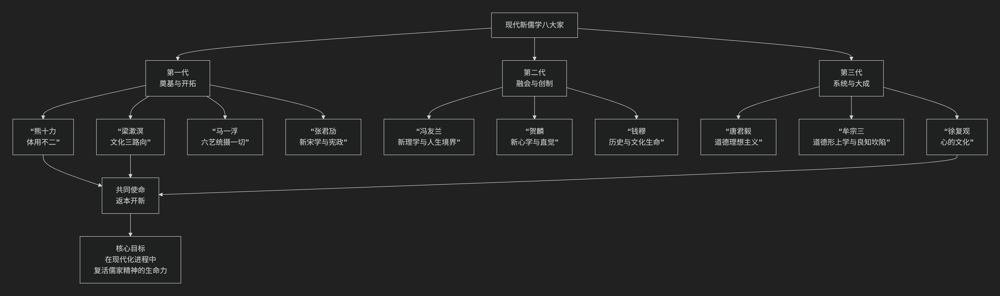

# 现代新儒学

---

现代新儒学“八大家”通常指20世纪以来，为回应西方文化冲击、致力于儒学现代化与世界化的一代哲学大家。他们具有深厚的传统学养，又融会西方哲学，共同目标是实现儒家的“返本开新”。

由于具体名单有细微出入，一种广泛认可的划分包括：**第一代：熊十力、梁漱溟、马一浮、张君劢；第二代：冯友兰、贺麟、钱穆；第三代：唐君毅、牟宗三、徐复观**（共十位，但习惯称“八大家”，常择其核心八位）。以下为您简明介绍其中最具代表性的八位大家的**核心思想标识与独特贡献**。

其整体思想脉络与定位，可通过下图概览：

---

### **第一代：奠基与开拓**

这一代学者在五四运动后“反传统”的浪潮中，率先肯定儒学的现代价值，为其复兴开辟了道路。

| 代表人物 | 核心思想标识 | 主要贡献与特点 |
| :--- | :--- | :--- |
| **熊十力** | **体用不翕辟成变** | **新儒学的哲学奠基人**。创立了“体用不二”的宇宙论，认为宇宙本体（仁心）与现象万有相即不离。其“翕辟成变”说揭示了宇宙生生不息的动力，代表作《新唯识论》。 |
| **梁漱溟** | **文化三路向** | **文化保守主义的先驱**。在《东西文化及其哲学》中提出中、西、印文化代表三种不同人生路向：西方向前奋斗，印度向后解脱，中国调和持中。认为儒家“直觉”智慧最能解决现代人的精神危机。 |
| **马一浮** | **六艺统摄一切学术** | **古典儒学的现代守护者**。主张儒家“六经”（诗、书、礼、乐、易、春秋）是人类一切学术的根源和归宿。其学博雅精深，强调“读书穷理，反躬实践”。 |
| **张君劢** | **新宋学与宪政民主** | **儒学与民主宪政的沟通者**。在“科玄论战”中力主科学不能解决人生观问题，强调精神自由。致力于将儒家道德理想与西方民主宪政制度相结合，主张“内圣”开出“新外王”。 |

---

### **第二代：融会与创制**

这一代学者系统接受西方学术训练，尝试将儒学与西方哲学体系进行创造性结合。

| 代表人物 | 核心思想标识 | 主要贡献与特点 |
| :--- | :--- | :--- |
| **冯友兰** | **新理学与人生境界** | **用逻辑分析重建儒学**。其“新理学”体系接续宋明理学，用西方新实在论的逻辑方法，重新阐释“理”、“气”等概念。提出著名的“人生四境界”说：自然、功利、道德、天地境界。 |
| **贺麟** | **新心学与直觉** | **引入黑格尔哲学的新心学**。主张从“心”出发，融会陆王心学与黑格尔精神哲学。提出“直觉”是理性的高级形式，而非反理性。强调儒家思想与民主精神的相通性。 |
| **钱穆** | **历史与文化生命** | **以史学彰显民族精神**。通过巨著《国史大纲》等，揭示中国历史内在的“温情与敬意”，强调儒学是中华民族的“文化生命”，其价值体现在具体的历史进程之中。 |

---

### **第三代：系统与大成**

这一代学者构建了最为系统化的哲学体系，使现代新儒学在理论上趋于成熟，并将其推广至国际学界。

| 代表人物 | 核心思想标识 | 主要贡献与特点 |
| :--- | :--- | :--- |
| **唐君毅** | **道德理想主义** | **文化哲学的巨擘**。构建了宏大的“心灵九境”系统，描绘人类精神从客观到主观、最终通达天德的上升历程。强调一切文化活动的根源在于人的道德理性。 |
| **牟宗三** | **道德形上学与良知坎陷** | **新儒学的体系化高峰**。创立了“道德形上学”，认为人内在的“良知”即是宇宙本体。其核心创见“良知自我坎陷”说，试图从儒家“内圣”之学中开出民主与科学（新外王）。 |
| **徐复观** | **心的文化** | **将思想史与社会现实结合**。反对将儒学玄学化，主张儒学是扎根于日常生活的“心的文化”。通过对中国思想史（特别是艺术精神、政治思想）的深刻剖析，揭示儒家思想在现代社会中的实践意义。 |

### **总结**

现代新儒学八大家的共同使命是 **“返本开新”** ：一方面回到先秦儒学和宋明理学的根本智慧（返本），另一方面融会西方哲学，回应民主、科学的时代课题（开新）。他们不再是简单地捍卫传统，而是通过创造性的哲学转化，使儒学成为能够参与全球文明对话的现代思想体系。他们的工作，奠定了儒学在当代世界继续发展的坚实基础。

