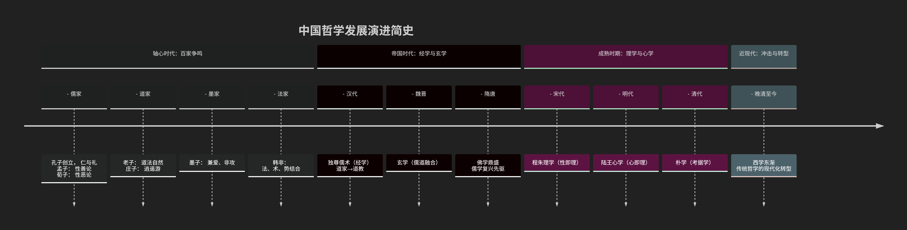

# 中国哲学简史

---

中国哲学史是一部围绕 **“人”** 这一核心，在不同历史时期对**宇宙秩序、社会伦理、生命意义**等根本问题进行深刻追问与回答的历史。其发展脉络波澜壮阔，思想流派迭起，共同塑造了中华文明的精神内核。

下图以时间线形式，直观展示了中国哲学发展的主要阶段与流派演进，帮助您先建立一个宏观的历史框架：

以下，我们将沿此时间线，深入探索每一阶段的哲学风貌与思想精髓。

---

### **第一部分：奠基与争鸣——先秦“百家争鸣”（公元前6世纪-公元前3世纪）**

这是中国哲学的“轴心时代”，思想空前活跃，奠定了整个中国哲学的基本议题和走向。

* **儒家**：

  * **创始人**：孔子。
  * **核心思想**：**“仁”**（核心道德）与 **“礼”**（社会规范）。主张通过道德修养和伦理实践来建立和谐的社会秩序。目标是通过“修身、齐家、治国、平天下”实现“内圣外王”。
  * **发展**：孟子发展“性善论”，提出“仁政”；荀子主张“性恶论”，强调礼法教化。
* **道家**：

  * **创始人**：老子、庄子。
  * **核心思想**：**“道”** 是宇宙本源和规律。主张 **“道法自然”**、“无为而治”，强调顺应自然、清静无为，追求精神自由（逍遥游）。是对儒家积极入世思想的补充与反思。
* **墨家**：

  * **创始人**：墨子。
  * **核心思想**：**“兼爱”**（无差等的爱）、**“非攻”**（反对不义战争）、**“尚贤”**（选贤任能）。强调功利实效，逻辑学（名学）成就突出。
* **法家**：

  * **集大成者**：韩非子。
  * **核心思想**：主张以 **“法”**（成文法）、**“术”**（权术）、**“势”**（权势）来统治国家，强调中央集权和绝对君权，为秦朝统一提供了理论基础。

---

### **第二部分：统一与融合——汉唐时期（公元前3世纪-公元10世纪）**

秦汉统一后，思想界从争鸣走向整合与新的探索。

* **两汉经学**：

  * **独尊儒术**：汉武帝采纳董仲舒建议，“罢黜百家，独尊儒术”，儒家经学成为官方意识形态，并与阴阳五行学说结合，带有神秘色彩。
  * **道家演变**：道家思想与民间方术结合，逐渐宗教化，形成**道教**。
* **魏晋玄学**：

  * 魏晋时期，士人不满僵化的经学，转而研究《老子》《庄子》《周易》（合称“三玄”），探讨“有与无”、“名教与自然”等抽象哲学问题，是儒道思想的深刻融合。
* **隋唐佛学**：

  * **佛教的鼎盛**：佛教自印度传入后，经长期本土化，在隋唐时期达到鼎盛，形成天台宗、华严宗、禅宗等多个具有中国特色的宗派。
  * **禅宗**：尤其重要，提出“不立文字，直指人心，见性成佛”，极大地影响了后世的哲学和艺术。

---

### **第三部分：高峰与转型——宋明清时期（公元10世纪-19世纪）**

这一时期，中国哲学达到了系统化的形而上学高峰。

* **宋明理学**：

  * 这是儒学对佛教、道教挑战的回应，是儒学发展的新形态，将儒家伦理提升到宇宙本体的高度。
  * **程朱理学**（程颐、程颢、朱熹）：提出 **“性即理”** ，认为万物背后有统一的“天理”，追求通过“格物穷理”来认识天理。朱熹是集大成者。
  * **陆王心学**（陆九渊、王阳明）：提出 **“心即理”** ，认为“理”不在心外，而在人本心的“良知”中，主张“致良知”和“知行合一”。心学在明代影响巨大。
* **清代朴学**：

  * 明清鼎革后，学者批判理学空谈，转向扎实的经典考据和文献研究，称为“朴学”或“汉学”，哲学创造力相对减弱。

---

### **第四部分：冲击与新生——近现代（19世纪中期至今）**

* **西学东渐**：近代以来，中国在西方武力与文化的冲击下，传统哲学体系面临严峻挑战。知识分子开始大量引进西方哲学（如民主、科学、马克思主义），并试图重新审视和改造传统哲学。
* **现代转型**：出现了“新儒家”等思潮，试图在现代化背景下，重新诠释和激活儒家思想，使其与民主、科学等现代价值相协调。中国哲学仍在探索其现代形态。

---

### **中国哲学的整体特征**

1. **内在超越性**：不追求外在的上帝，而是强调通过内在的道德修养（儒家）或心灵觉悟（道家、佛家）来实现生命的超越。
2. **强烈的实践理性**：关注现世人生和社会政治，哲学思考与伦理实践、治国平天下紧密相连。
3. **有机整体观**：强调“天人合一”，将自然、社会和人视为一个有机联系的整体。
4. **辩证思维**：阴阳、有无、体用等对立统一的范畴是基本的思维方式。

### **总结**

总而言之，中国哲学简史是一部从**先秦的百家争鸣**，到**汉唐的融合吸收**，再到**宋明的形而上学高峰**，直至**近现代的挑战与转型**的宏大叙事。它以独特的视角，对“人何以为人”、“理想社会如何可能”、“生命的意义何在”等永恒问题给出了深刻而富有启示的答案，不仅是中国的精神瑰宝，也是世界哲学宝库中不可或缺的组成部分。
