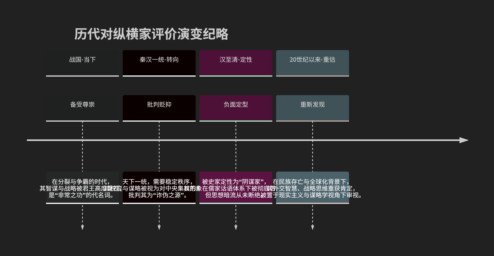

## 历代对纵横家的评价

历代对纵横家的评价充满了矛盾、反复和深刻的张力，可以说是**中国历史上评价最为两极分化的思想流派之一**。其评价变迁恰如一面镜子，映照出不同时代政治生态、主流价值观和现实需求的变化。

历代对纵横家的评价演变，可以通过下图清晰地概览：

以下，我们将沿此脉络，深入解析历代对纵横家的复杂评价。

---

### 一、战国至汉初：毁誉参半的“救急”之才

纵横家活跃的战国时代及其稍后，人们对他们的评价是**务实且相对客观的**，既惊叹其才能，也警惕其弊端。

* **正面评价：尊崇其才识与功效**

  * **“一人之辩，重于九鼎之宝；三寸之舌，强于百万之师。”**（刘向《战国策序》）。这句话高度概括了当时人对纵横家巨大现实影响力的惊叹。他们被看作是在危难之际挽救国家于水火的不世出之才。
  * **“救急”之功**：在各国生死存亡的关头，纵横家的合纵连横策略能迅速扭转局势，其**实效性**得到普遍承认。他们的才能被视为一种可以安邦定国的、极其珍贵的政治资源。
* **负面评价：诟病其权变与无行**

  * **“诈伪”与“无特操”**：以儒家为代表的学者批评纵横家缺乏固定的道德准则和政治理想，朝秦暮楚，唯利是图。孟子斥张仪等为“以顺为正者，妾妇之道也”，认为他们曲意逢迎君主，毫无原则。
  * **“权变”过度**：其策略过于依赖权谋机变，被视为“阴谋”而非“阳谋”，虽能收一时之效，但难以建立长久的信任与秩序。

### 二、汉武帝“独尊儒术”后：主流评价的彻底贬抑

随着大一统帝国的巩固和儒家思想成为官方意识形态，对纵横家的评价发生了**根本性、压倒性的转向负面**。

* **被钉上“阴谋家”的耻辱柱**：

  * **史学定调**：司马迁在《史记》中虽客观记述其事迹，但也评价他们“此辈倾危之士”，手段阴险。班固在《汉书·艺文志》中将纵横家列为“十家”之一，但定性为 **“乃邪人为之，则上诈谖而弃其信”** ，认为心术不正者用之，则会崇尚欺诈、背弃信义。这一定调影响了后世近两千年。
  * **儒家视角**：在儒家“仁义”、“王道”、“忠信”的价值观下，纵横家的“权变”、“谋略”完全站在了对立面，被批判为**道德败坏、破坏纲常、唯利是图的典型**。
* **“贬义化”与“污名化”**：

  * “纵横家”一词本身逐渐带有贬义，与“诡计多端”、“搬弄是非”、“挑拨离间”划上等号。
  * 他们的智慧被矮化为“术”而非“道”，是等而下之的“小聪明”或“阴谋诡计”，登不上大雅之堂。

### 三、暗流与潜流：实用领域的秘密传承

尽管在公开的、主流的意识形态中被贬抑，但纵横家的思想作为一种**高度实用的政治智慧和技术**，从未真正消失，而是以各种形式潜藏下来。

* 所谓 **“阳儒阴法”或“外儒内纵横”**：历代许多政治家、权臣在实际的政治、军事、外交斗争中，无不暗中运用纵横家的思想（如分化瓦解、拉拢打击、情报与反间等），但表面上仍要高举儒家道德的旗帜。
* **融入其他学派**：其辩术融入名家，其谋略融入兵家（如《孙子兵法》）、法家，成为帝王术、权谋术的一部分。
* **文学形象**：在《三国演义》等小说中，诸葛亮、鲁肃等说客、谋士的形象，其核心智慧来源之一就是纵横家，他们在文学作品中获得了在正史中不曾有的光彩。

### 四、近现代至今：重新发现与理性重估

进入20世纪，尤其在西方思想传入和民族危机深重的背景下，对纵横家的评价开始了**理性的重估和积极的再发现**。

* **民族主义视角**：在抗战时期，苏秦、张仪等被视为 **“合纵”抗强** 的先驱，他们的外交战略被用来激励联合抗日，其爱国主义色彩被重新挖掘和肯定。
* **现实主义与谋略学视角**：人们开始摆脱单纯的道德批判，从**国际关系（现实主义学派）、政治学、战略学、谋略学、公关谈判学**等角度，重新审视纵横家的智慧。
  * 肯定其对中国古代地缘政治的深刻理解。
  * 将其视为世界最早的**战略家、外交家和博弈论实践者**。
  * 他们的著作（如《鬼谷子》、《战国策》）被当作**口才学、心理学、谈判术的经典**来研究。
* **与马基雅维利主义的比较**：常有人将纵横家与意大利文艺复兴时期的马基雅维利（《君主论》作者）相提并论，认为他们都是**剥离道德、直面政治现实**的思想家，从而在比较视野中获得了一种“现代性”的解读。

---

### 评价总结

| 时代                         | 主流评价                       | 核心缘由                                                         |
| :--------------------------- | :----------------------------- | :--------------------------------------------------------------- |
| **战国秦汉**           | **毁誉参半，重其才用**   | 乱世求存，实用主义至上，惊叹其卓绝成效。                         |
| **帝制时代（汉以后）** | **彻底贬抑，斥为阴谋**   | 天下一统，儒家独尊，需稳定秩序，斥其权变诈伪。                   |
| **潜流传承**           | **暗中运用，秘而不宣**   | 作为实用政治技术，融入权谋与帝王术。                             |
| **近现代以来**         | **理性重估，价值再发现** | 民族危机、国际视野、学科分化，使其战略、外交、谋略价值重现光芒。 |

### 总结

总而言之，历代对纵横家的评价，是一部从 **“尊其才”到“斥其德”再到“析其术”** 的演变史。

* 在**需要裂变和竞争**的时代（如战国、乱世、近代民族危亡时），他们的价值被重新拾起，因其智慧能带来生存与胜利。
* 在**追求统一和稳定**的时代（如大一统王朝），他们则被主流意识形态抛弃，因其思想可能解构秩序、挑战权威。

这种评价的两极摆动，恰恰揭示了纵横家思想的**核心特质**：它是一种在**高度竞争和不确定性环境中求存求胜的极致智慧**。它剥离了温情脉脉的道德面纱，直指权力、利益和策略的冷酷核心。因此，对它的评价，永远取决于评价者自身所处的**时代语境、现实需求以及所持的价值观立场**。在今天这个充满竞争与博弈的全球化时代，我们或许能更少一些道德审判，更多一份理性分析，去审视这份独特、复杂而锐利的文化遗产。
