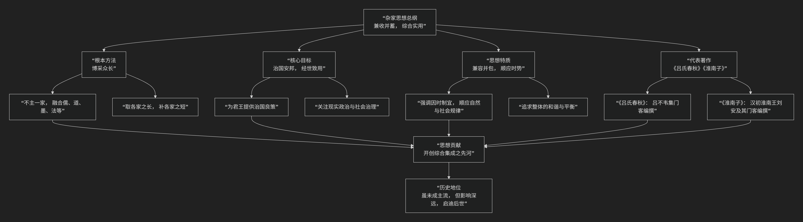

杂家
======

基于诸子百家之杂家哲学思想

---------------------------------

诸子百家中的 **杂家**，顾名思义，其核心特质在于一个“**杂**”字，但此“杂”非杂乱无章，而是 **博采众长、兼收并蓄**。它没有提出一套完全独创、排他性的理论体系，而是试图 **融合儒、墨、道、法等各家之长，以实用为导向，为治国理政和现实人生提供综合性的智慧与策略。** 其最著名的代表著作是《吕氏春秋》和《淮南子》。

我们可以将杂家的核心思想概括为：**一个以“兼收并蓄、综合实用”为根本方法，以“治国安邦、经世致用”为核心目标，融合各家学说精华，强调顺应时势与整体和谐的综合性思想体系。**

为了更清晰地展现杂家思想的特质与结构，下图以简洁方式勾勒其核心要义：

下面，我们将沿此逻辑脉络，深入解析杂家的核心要义。

一、根本方法：博采众长

这是杂家最显著的标签和最根本的方法论。

*   **核心特质**： **“兼儒墨，合名法”** （司马谈《论六家要旨》），即融合儒家、墨家、名家、法家等各家学说。
*   **实践表现**：杂家不固执于一家之言，而是广泛汲取各家思想中的合理成分，**以问题为导向，择善而从**。例如，可能采纳儒家的礼乐教化、道家的自然无为、法家的法治严明、墨家的兼爱非攻等，根据实际需要进行综合。
*   **目的**：旨在构建一个更为全面、灵活且实用的智识与行动框架，以应对复杂多变的现实挑战。

二、核心目标：治国安邦，经世致用

杂家思想的出发点和归宿，都紧密围绕着现实政治和社会治理。

*   **核心诉求**：为 **君王、统治者** 提供一套 **综合性的治国方略**，以实现国家的长治久安与社会的和谐稳定。
*   **关注焦点**：如何有效地治理国家、管理人民、处理各种社会关系和矛盾，以达到“**治大国若烹小鲜**”的理想境界。
*   **《吕氏春秋》** 和 **《淮南子》** 都是典型的“**帝王之书**”，意图为未来的“圣王”或统治阶层提供一套完整的治国蓝图和人生指南。

三、思想特质：兼容并包，顺应时势

这是杂家思想的灵魂和风格体现。

*   **兼容并包**：它承认各家学说都有其合理性和局限性，主张在坚持基本原则的同时，灵活变通，不拘泥于门户之见。
*   **顺应时势**：强调政策和思想应根据时代的变化、环境的不同而进行调整，即 **“因时制宜”**、 **“随时而变”**。这与道家顺应自然的理念有相通之处，但更侧重于社会政治层面的灵活应对。
*   **整体和谐**：追求政治、经济、文化、自然等各个方面的整体协调与平衡，而非片面强调某一方面。

四、代表著作：《吕氏春秋》与《淮南子》

1.  **《吕氏春秋》**：

    *   **编撰者**：战国末期秦国丞相吕不韦组织其众多门客集体编纂。

    *   **成书时间**：约公元前239年左右。

    *   **特点**：内容包罗万象，结构上尝试融合各家，有“**十二纪**”、“**八览**”、“**六论**”等，旨在为即将统一的秦帝国提供全面的治国理念。

    *   **思想倾向**：既有儒家的德治、墨家的节用、道家的无为，也有法家的赏罚分明，体现了明显的综合倾向。

2.  **《淮南子》** （又称《淮南鸿烈》）：

    *   **编撰者**：西汉初年淮南王刘安及其门客集体创作。

    *   **成书时间**：约公元前139年前后。

    *   **特点**：以道家思想为基调，但广泛吸收了阴阳家、儒家、法家等各家学说，内容涉及哲学、政治、伦理、天文、地理、养生等众多领域。

    *   **思想倾向**：在崇尚自然、无为而治的道家框架下，融合了各家对于社会治理、人性修养等方面的见解，同样体现了综合与包容。

---

五、核心要义总结

.. list-table:: 
   :header-rows: 1
   :widths: 25 45 30
   :align: center

   * - **理论维度**
     - **核心命题**
     - **关键概念与贡献**
   * - **方法论**
     - **"兼收并蓄，博采众长"：融合儒、道、墨、法等各家思想精华。**
     - **兼儒墨，合名法、择善而从、综合集成**
   * - **目标论**
     - **"治国安邦，经世致用"：为现实政治提供综合性治国方略。**
     - **治国良策、经世致用、服务现实**
   * - **特质论**
     - **"兼容并包，顺应时势"：强调灵活性、整体性与时代适应性。**
     - **因时制宜、整体和谐、不拘门户**
   * - **代表典籍**
     - **《吕氏春秋》、《淮南子》：集体智慧编纂的百科全书式著作。**
     - **帝王之学、综合蓝图、知识总汇**

六、思想特质与历史影响

*   **综合创新的先驱**：杂家是先秦时期尝试 **系统性综合各家思想** 的先锋，为后世的思想融合与理论创新提供了宝贵的经验和启示。
*   **实用理性的体现**：其强烈的 **现实关怀和实用取向**，与儒家、法家等共同构成了中国传统文化中注重实际问题解决的理性传统。
*   **虽非主流，影响深远**：杂家在先秦时期并未成为显赫一时的主流学派，但其 **兼容并包的精神和综合集成的方法**，对后世的学术思想、政治策略乃至日常生活中的智慧运用都产生了潜移默化的影响。
*   **百科全书式的贡献**：《吕氏春秋》和《淮南子》等著作，内容广博，涉及领域众多，本身就是珍贵的古代知识总汇和文化宝库。

七、总结

总而言之，杂家的核心思想在于，它是一位 **“智慧的集成者”和“实用的调和者”** 。它教导我们，**面对复杂多变的世界和层出不穷的问题，最有效的解决之道往往不是固守一端，而是开放包容，广泛学习各家之长，灵活应变，综合施策，以达到最佳的治理效果和人生境界。**

它的全部工作是对 **先秦诸子百家争鸣成果** 的一次系统性梳理与综合性集成。在那个思想激荡的时代，杂家以其独特的“杂”而“精”、“博”而“用”的特质，为后世留下了一笔宝贵的思想财富，其兼容并包的精神至今仍具有重要的启发意义。

------------

 .. toctree::
    :maxdepth: 3

    grok
    copilot
    chatgpt
    deepseek
    gemini
    qwen

----------------------------------------------------------

**学术比较与批判摘录**

.. important::   

  诸子十家，其可观者九家而已。皆起于王道既微，诸侯力政，时君世主，好恶殊方，是以九家之术蜂出并作，各引一端，崇其所善，以此驰说，取合诸侯。其言虽殊，辟犹水火，相灭亦相生也。仁之与义，敬之与和，相反而皆相成也。《易》曰：“天下同归而殊涂，一致而百虑。”今异家者各推所长，穷知究虑，以明其指，虽有蔽短，合其要归，亦《六经》之支与流裔。使其人遭明王圣主，得其所折中，皆股肱之材已。仲尼有言：“礼失而求诸野。”方今去圣久远，道术缺废，无所更索，彼九家者，不犹愈于野乎？若能修六艺之术，而观此九家之言，舍短取长，则可以通万方之略矣……
  杂家者流​，盖出于议官。兼儒、墨，合名、法，知国体之有此，见王治之无不贯，此其所长也。及荡者为之，则漫羡而无所归心。

  --- 摘引自《汉书·艺文志·诸子略序》

---------------------------

[:doc:`科学杂道 </chats/outlaw/analyse/chinese/school/zj/scitao/index>`]
[:doc:`系统哲学 </chats/outlaw/analyse/foreign/branch/science/system/index>`]
[:doc:`复杂性杂 </chats/outlaw/analyse/chinese/school/zj/compare>`]

