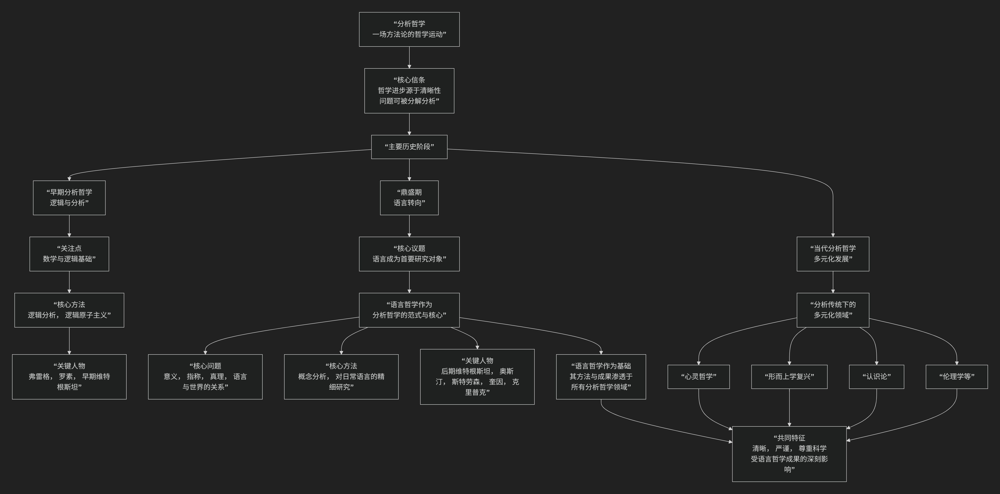

## 语言哲学和分析哲学关系

语言哲学和分析哲学的关系可以概括为：**语言哲学是分析哲学传统内部最重要、最核心的领域，甚至可以说是分析哲学鼎盛时期的“范式”和“引擎”。但分析哲学的范围比语言哲学更广。** 它们不是并列关系，而是**部分与整体、焦点与传统**的关系。

我们可以用一个简单的比喻来理解：

> **分析哲学是一个“大家族”，而语言哲学是这个家族中最有影响力、最核心的“族长”，它定义了整个家族的风格和基调，但家族里还有其他重要的成员。**

为了更直观地理解这种关系，我们可以通过下图来展示其演变脉络与核心构成：

以下，我们将沿此脉络，详细解析这种关系。

---

### 一、什么是分析哲学？

分析哲学是20世纪主要在英美世界主导的一种**哲学运动或传统**，是一场**方法论上的哲学运动**，其核心信条是：

* **哲学的主要任务（乃至全部任务）是“分析”**：通过逻辑和概念分析，将复杂的、模糊的哲学问题分解为更简单、更清晰的组成部分，从而解决或消解它们。
* **清晰性和严谨性至上**：哲学论证应该像逻辑推导和科学说明一样清晰、严谨。它极度重视语言，因为模糊的语言被认为是哲学混乱的主要根源。
* **历史背景**：它起源于20世纪初，是对传统思辨形而上学（尤其是黑格尔式的唯心论）的反叛。其早期代表人物如**弗雷格、罗素、早期维特根斯坦**，关注的是**数学和逻辑的基础**。

**分析哲学关注的主题非常广泛**，不仅包括语言，还包括：

* 心灵哲学（心身问题、意识）
* 科学哲学（科学方法、科学解释）
* 认识论（知识、信念、证明）
* 形而上学（存在、因果、属性）
* 道德哲学与政治哲学（用分析的方法研究伦理与正义）

### 二、什么是语言哲学？

语言哲学是哲学的一个**分支领域**，研究语言的本质，以及语言如何与世界和心智相关联。其核心问题是：

* **语言如何与世界关联？**（指称理论：名称和描述词如何指代物体？）
* **语言的意义是什么？**（意义理论：一个词或句子的意义在于什么？）
* **什么是真理？**（真理理论：一个陈述为真的条件是什么？）
* **我们如何通过语言进行交流和行为？**（言语行为理论）

### 三、关系的演变：从工具到核心

两者关系的关键在于分析哲学发展史上的一次决定性转折——**“语言学转向”**。

#### 1. 早期：语言作为工具

* 在分析哲学初期，逻辑语言主要被看作一种**分析工具**，用于揭示世界的逻辑结构。例如，罗素用逻辑分析处理“存在”问题，认为传统哲学问题很多是由于**语言的表面语法误导**了我们。
* **早期维特根斯坦**在《逻辑哲学论》中的名言：“哲学的全部就是语言批判。” 他认为，一旦我们用完美的逻辑语言澄清了思想，大部分哲学问题就会自行消失。

#### 2. 鼎盛期：语言成为核心（语言学转向）

* 大约从1930年代到1960年代，分析哲学家的共识发生了转变：**哲学问题不在于世界本身，而在于我们用来描述和思考世界的语言。** 因此，在解决传统的形而上学、认识论问题**之前**，必须首先理解我们所使用的语言是如何工作的。
* **语言哲学不再只是分析哲学的一个分支，而是成为了进行分析哲学研究的“范式”或“必经之路”。** 要研究“心身问题”，先要分析“疼痛”、“信念”等心理词汇的意义；要研究“自由意志”，先要分析“能够”、“选择”等词的含义。
* **后期维特根斯坦**和**牛津日常语言学派**（如奥斯汀、斯特劳森）是这一时期的旗手。他们强调对日常语言的精细研究，认为许多哲学难题源于对语言用法的误解。

#### 3. 当代：语言哲学作为基础

* 1970年代以后，分析哲学的研究范围重新扩大，心灵哲学、形而上学等传统领域强势回归。
* 但此时的研究方式已经**彻底被语言哲学所塑造**。当代分析哲学家在讨论意识、因果关系、可能世界时，依然会极其精细地分析相关概念，并充分借鉴语言哲学关于指称、意义和真理的成果。
* **语言哲学成为了分析哲学的“基础学科”**，其方法和结论深深渗透在所有其他分支中。

---

### 核心关系总结

| 方面           | 分析哲学                                                           | 语言哲学                                                                   |
| :------------- | :----------------------------------------------------------------- | :------------------------------------------------------------------------- |
| **性质** | **一场宏大的哲学运动或传统**，强调方法（分析、清晰、论证）。 | **哲学的一个核心分支领域**，有特定的研究对象（语言、意义、指称）。   |
| **范围** | **非常广泛**，包括语言、心灵、知识、科学、道德、形而上学等。 | **相对聚焦**，专门研究语言本身及其相关现象。                         |
| **关系** | **整体**。包含语言哲学、心灵哲学、科学哲学等多个领域。       | **部分**。是分析哲学传统内部最辉煌、最核心的部分。                   |
| **历史** | 起源于逻辑分析，经历了“语言学转向”，现已多元化发展。             | 是“语言学转向”时期的**主导范式**，为整个分析哲学奠定了方法论基础。 |
| **比喻** | **一个大家族**                                               | **这个家族的族长和奠基人**，其家规（分析方法）影响了所有家庭成员。   |

### 总结

* **分析哲学 > 语言哲学**：分析哲学的范围更大，语言哲学是它的一个子集。
* **没有语言哲学，就没有分析哲学**：语言哲学是分析哲学的历史起点和方法论基石。
* **分析哲学的其他分支都渗透着语言哲学的精神**：它们共享着对概念清晰和逻辑严谨的追求，这种追求正是在语言分析中得以确立和锤炼的。

可以这样说：**在20世纪的大部分时间里，从事分析哲学在很大程度上就是从事语言哲学。** 虽然今天分析哲学的研究议题已远超语言本身，但其**研究方法、论证风格和理论底色**，依然深深地打着语言哲学的烙印。

因此，不理解语言哲学的基本问题和成果，就无法真正理解分析哲学。
