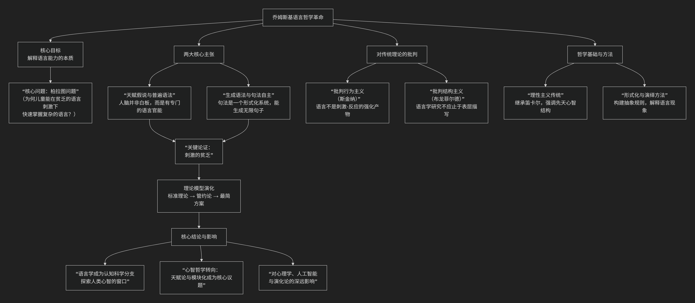

Noam Chomsky
=======================

基于诺姆·乔姆斯基（Noam Chomsky）语言学与心智哲学的核心思想

----------------

诺姆·乔姆斯基的语言哲学思想是20世纪语言学与心智哲学的一场革命，其核心可概括为：**人类的语言能力根植于一种与生俱来的、普遍的、形式化的心智结构（即“普遍语法”）**。这一思想从根本上挑战了当时占主导地位的行为主义语言观和结构主义语言学的经验论基础。

其核心主张与发展脉络，可以通过下图清晰地概览：

以下，我们将沿此逻辑脉络，深入解析其核心要义。

一、核心命题：从“语言行为”到“语言能力”

乔姆斯基区分了 **“语言能力”** （说话者-听话者内在的语言知识）和 **“语言运用”** （语言能力在实际情境中的具体使用）。他认为，语言学的核心任务是揭示并解释这种内化的、潜意识的 **“语言能力”** ，而不是仅仅收集和分类外部的 **“语言行为”** 数据。

二、核心主张

1.  **“天赋假说”与“普遍语法”**

    *   **核心论证：“刺激的贫乏”**。儿童接触到的语言输入（听到的话）是有限、零碎且包含错误的，但他们却能在极短时间内，无意识地掌握一套极其复杂、能生成无限新句子的语法规则。这无法用经验学习（如模仿、强化）充分解释。

    *   **结论**：人类大脑中天生具备一个 **专门的、生物性的语言官能**，其初始状态就是 **“普遍语法”** 。它不是一套具体的语言规则，而是所有人类语言都必须遵守的 **一套抽象原则、参数和限制**。学习一门具体语言，就是根据有限的经验证据，为这些先天参数“设定开关”。

2.  **“生成语法”与“句法自主性”**

    *   **核心观点**：语言的本质是一个 **形式化的、递归的生成系统**。有限的核心句法规则，可以通过递归操作，生成无限多的、复杂的合格句子。

    *   **句法自主**：句法是一个自足的模块，其运作独立于语义（意义）和语用（使用）。句子是否合乎语法，有独立的形式化判断标准，不完全取决于它是否“有意义”或“常用”。

三、哲学基础：理性主义转向

乔姆斯基的思想使语言学从经验主义（强调后天经验）转向 **理性主义** （强调先天结构），并与心智哲学深度融合。

*   **继承笛卡尔**：认为人的语言创造力（能理解并说出从未听过的话）是区别于动物机械反应的根本特征，指向一种独特的、天赋的“心智实体”。

*   **反对行为主义**：猛烈批判斯金纳的理论，认为其无法解释语言的 **创造性、规则性和抽象性**。

四、对传统语言观的颠覆

.. list-table:: 传统/行为主义语言观与乔姆斯基语言观对比
   :header-rows: 1
   :widths: 25 35 40
   :align: center

   * - **对比维度**
     - **传统/行为主义语言观**
     - **乔姆斯基的语言观**
   * - **语言本质**
     - 一套 **后天习得** 的习惯或行为系统。
     - 人类心智/大脑中一个 **与生俱来** 的、专门化的生物模块。
   * - **研究重点**
     - 可观察的、外部的 **言语行为**。
     - 内隐的、潜意识的 **语法知识** （语言能力）。
   * - **学习机制**
     - **模仿、强化、概括** （依赖环境输入）。
     - **参数设定** （利用先天框架，在关键经验触发下激活）。
   * - **语言共性**
     - 表面特征的相似，源于经验或认知的普遍性。
     - 源于 **普遍语法** 这一先天心智结构的深层限制。

五、理论模型演化

*   **标准理论**：提出“深层结构”（表达意义）和“表层结构”（表达语音/文字）的转换。

*   **管约论**：发展出一套复杂而精密的模块化理论，解释不同层面的语法现象。

*   **最简方案**：试图将语言官能归结为最精简、最优美的计算设计，探寻语言与一般认知和计算效率的关系。

六、**总结**

乔姆斯基语言哲学的核心，可以归结为一场深刻的 **“内在革命”**。它将语言学的根本问题从 **“语言是什么样的？”** 转向了 **“人为何能拥有语言？”**。其核心结论是：

> **语言不是文化的产物或经验的堆砌，而是人类心智/大脑中一门天赋的、形式化的“心理器官”。** 研究语言，就是研究人类心智的本质。

这一思想不仅彻底重塑了语言学，将其带入认知科学的轨道，更深刻影响了哲学、心理学、计算机科学乃至生物学对人类独特性的理解。他开启的“天赋论”与“经验论”之争，至今仍是心智哲学的核心议题。

-------------------

 .. toctree::
    :maxdepth: 3

    grok
    gemini
    chatgpt
    deepseek
    qwen

---------------------------

[:doc:`语言学和语言哲学 </chats/outlaw/analyse/foreign/branch/langu/languge>`]
