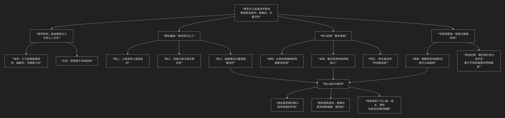

George Lakoff
================

基于乔治·莱考夫（George Lakoff）认知语言学核心思想

----------------

乔治·莱考夫是认知语言学的奠基人和核心思想家之一。他的核心思想可以用一个根本性的哲学命题来概括：**人类的思维本质上是隐喻性的、基于身体的，并且无意识地塑造着我们的全部概念系统和现实体验。**

他与马克·约翰逊合著的《我们赖以生存的隐喻》是该领域的革命性著作。其思想体系的核心主张与关联，可以通过下图清晰地概览：

以下，我们将沿此逻辑脉络，深入解析其核心要义。

**一、核心思想的三大基石**

莱考夫的思想建立在三个相互关联的、对传统观念的颠覆之上：

1.  **心智本质上是具身的**

    *   **核心主张**：我们的概念、范畴、推理能力并非来自一个抽象的、与身体分离的理性，而是 **源于我们的身体与物理、社会环境互动的经验**。例如，“上”与“下”（空间方位）的概念源于我们直立身体的重力体验，并进而通过隐喻构建了“情绪高涨”（快乐是上）、“地位低下”（地位是下）等抽象概念。

    *   **对立面**：直接挑战了笛卡尔以来的身心二元论和乔姆斯基语言学中的“离身心智”观。

2.  **思维大部分是无意识的**

    *   **核心主张**：支配我们思考和语言的 **概念系统是潜意识层面运作的**。我们无法有意识地访问构成我们基本概念（如时间、因果、自我）的复杂神经结构。我们只能意识到思考的结果，而非思考的过程。

    *   **对立面**：挑战了理性主义认为思维是纯粹意识活动的观点。

3.  **抽象概念主要是隐喻性的**

    *   **核心主张**：这是莱考夫最著名的贡献。我们理解抽象概念（如爱情、时间、道德、政治）的方式，**并非通过直接定义，而是通过一个或多个来自具体身体经验的“概念隐喻”系统性地进行映射**。

**二、核心机制：概念隐喻**

这是理解其思想的关键工具。概念隐喻不是修辞上的语言装饰，而是**我们赖以思考和理解抽象事物的根本认知机制**。

*   **结构**：一个概念隐喻由 **源域** 和 **目标域** 构成。

    *   **源域**：通常是具体的、基于身体经验的领域（如 **旅程、战争、建筑、容器** ）。

    *   **目标域**：通常是抽象的、需要被理解的领域（如 **爱情、争论、理论、人生** ）。

*   **运作方式**：我们将源域的结构、逻辑和知识，系统地 **映射** 到目标域上，从而理解后者。

莱考夫概念隐喻经典实例：

.. list-table:: 概念隐喻示例
   :header-rows: 1
   :widths: 20 25 55
   :align: center

   * - **经典隐喻**
     - **源域（具体） → 目标域（抽象）**
     - **语言表现举例**
   * - **“争论是战争”**
     - 战争 → 争论
     - “他的观点 **不堪一击**。” “我 **驳倒** 了他的论点。” “我们 **守住** 了立场。”
   * - **“时间是金钱”**
     - 金钱/资源 → 时间
     - “ **花** 时间”、“ **节省** 时间”、“ **投入** 时间”、“时间很 **宝贵** ”。
   * - **“理论是建筑”**
     - 建筑 → 理论
     - “这个理论 **根基** 扎实。” “他的论点 **垮掉** 了。” “我们需要 **构建** 一个框架。”
     
这些隐喻不是孤立的，它们构成了一个 **系统**，深刻地塑造了我们思考、言说乃至行动的方式。

**三、哲学立场：体验现实主义**

基于以上，莱考夫提出了 **“体验现实主义”** 的哲学观，以取代传统的 **客观主义** （认为存在一个绝对客观、独立于人类心智的现实）和 **主观主义** （认为现实完全是个体的心理建构）。

*   **核心观点**：现实是存在的，但我们只能通过我们 **具身的心智** 来理解和认识它。我们的概念系统源自身体经验，因此我们的“真理”总是相对于我们的认知结构和概念隐喻的。但这并不意味着真理是任意的，因为它受到身体经验和现实世界的约束。

**四、延伸应用：框架与政治**

莱考夫后期将认知语言学应用于政治话语分析，提出了 **“框架”** 理论。

*   **框架**：指我们无意识地组织和理解特定经验领域（如“家庭”、“战争”、“税收”）的 **心理结构**。框架由概念隐喻、意象图式和价值观构成。

*   **政治启示**：他指出，政治争论本质上是 **框架之争**。例如，关于“减税”，保守派可能激活 **“政府是严厉的父亲”** 框架（强调纪律和自力更生），而进步派可能激活 **“国家是互爱的家庭”** 框架（强调保护和互助）。单纯的事实争论若无法撼动对方深层的概念框架，往往是无效的。

---

五、**总结与影响**

莱考夫的核心思想彻底改变了我们对 **语言、思维和理性** 的看法：

1.  **语言不是思维的牢笼，而是思维的窗口**：通过分析日常语言中无处不在的隐喻，我们可以窥见人类无意识的概念系统。

2.  **理性是具身的、想象的**：我们的理性推理能力并非纯粹抽象的逻辑演算，而是深深植根于我们的身体经验和想象力（尤其是隐喻映射能力）。

3.  **哲学是经验科学**：传统哲学中的许多抽象概念（如时间、因果、道德、自我）都可以通过认知科学的方法，追溯到其身体经验和隐喻基础。

他的工作不仅奠定了认知语言学的哲学基础，也对心理学、神经科学、人工智能、政治学和传播学产生了深远影响，为我们理解“人何以为人”提供了一个全新的、以身体和经验为中心的视角。

-------------------

 .. toctree::
    :maxdepth: 3

    grok
    gemini
    chatgpt
    deepseek
    qwen

---------------------------

[:doc:`语言学和语言哲学 </chats/outlaw/analyse/foreign/branch/langu/languge>`]
