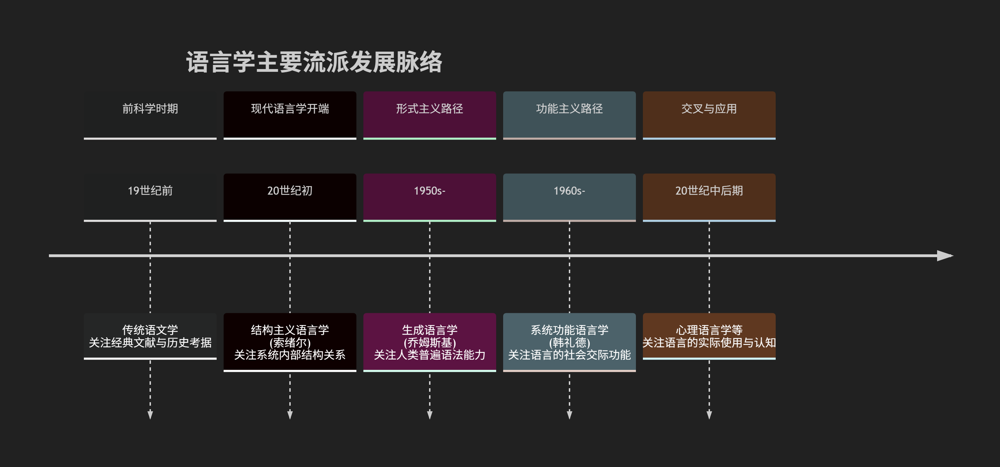
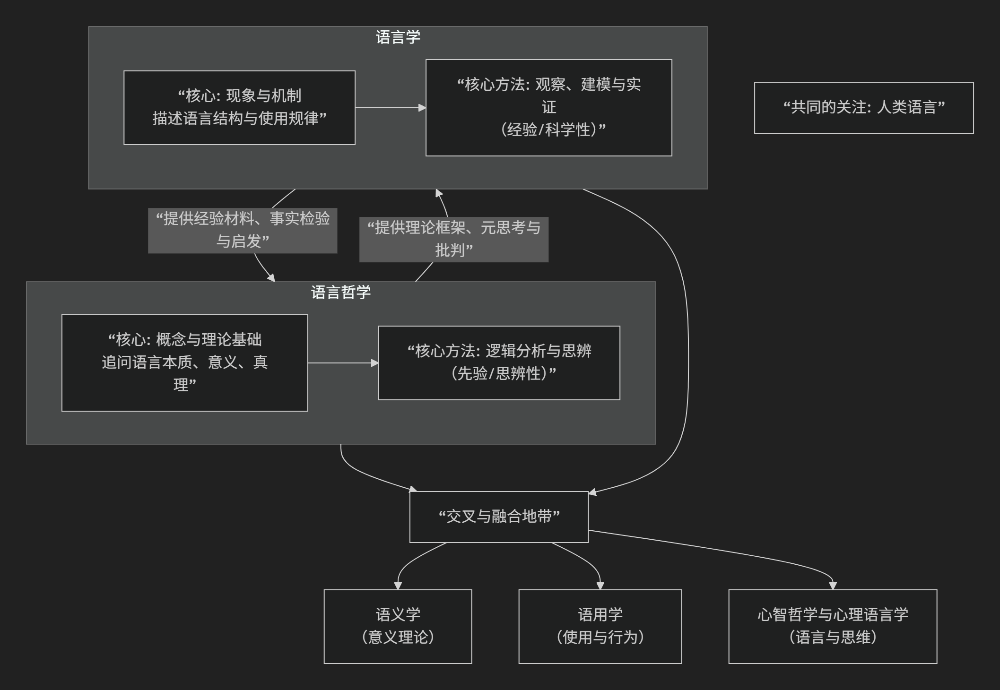

# 语言学和语言哲学

## 语言学及其主要流派

语言学是一门研究人类语言的科学。它系统地探索语言的本质、结构、功能、演变以及语言与思维、社会、文化之间的关系。其核心目标不是学习某种具体语言，而是**揭示所有人类语言背后的普遍规律与机制**。

语言学的演变与主要流派，可以通过下图清晰地概览其发展脉络与核心焦点：

以下，我们将沿此脉络，深入解析其核心领域与主要流派。

---

### **一、核心研究领域**

语言学的研究范围广泛，主要包括以下几个核心分支：

1. **语言学核心分支**

   * **语音学**：研究语言的物理属性，即语音的产生、传递和感知过程。
   * **音系学**：研究特定语言中语音的模式、组合规则及功能，关注哪些语音差异能区别意义（如汉语的声调）。
   * **形态学**：研究词语的内部结构和构词规则（如前缀、后缀、词根）。
   * **句法学**：研究词语如何组合成合法的句子，即句子的结构规则。
   * **语义学**：研究语言单位（词、短语、句子）的意义。
   * **语用学**：研究语言在具体语境中的使用及其言外之意（如“能关下窗吗？”实际是请求）。
2. **交叉与应用领域**

   * **社会语言学**：研究语言与社会因素（如阶级、性别、地域）的相互关系。
   * **心理语言学**：研究语言的心理和神经基础，即人如何习得、理解和产出语言。
   * **历史语言学**：研究语言的演变历史及亲缘关系。
   * **计算语言学**：利用计算机技术处理自然语言，是人工智能的核心领域之一。

---

### **二、主要流派及其思想**

语言学的发展史也是不同理论范式交替演进的历史，主要可分为两大路径：**形式主义**与**功能主义**。

#### **1. 结构主义语言学**

* **代表人物**：费尔迪南·德·索绪尔（奠基人）。
* **核心思想**：将语言视为一个**自足的形式系统**，意义来源于系统内部要素之间的**差异和关系**。区分了 **“语言”** （社会共有的系统）与 **“言语”** （个人具体的使用），并强调**共时研究**（某一时间点的系统状态）优先于**历时研究**（历史演变）。
* **影响**：奠定了现代语言学的基础，使语言学成为一门独立的科学。

#### **2. 生成语言学（形式主义代表）**

* **代表人物**：诺姆·乔姆斯基。
* **核心思想**：关注人类的**语言能力**。认为所有人类大脑中都先天存在一个 **“普遍语法”** ，它是一套有限的抽象规则，可以生成和理解无限多的句子。语言学的目标是描述这套内在的心理机制。
* **焦点**：高度抽象化、形式化，侧重句法的核心地位，探索语言的**心智属性**。

#### **3. 系统功能语言学（功能主义代表）**

* **代表人物**：M.A.K. 韩礼德。
* **核心思想**：关注语言的**社会功能**。认为语言结构是由其需要实现的社会功能所塑造的。语言并非一个封闭的系统，而是一个**意义潜势系统**，人们从中选择以适应不同的交际语境。
* **焦点**：强调语言在具体语境中的使用，分析语篇和话语，探索语言如何构建社会现实和人际关系。

#### **4. 认知语言学**

* **代表人物**：乔治·莱考夫、罗纳德·兰艾克。
* **核心思想**：语言能力是人类一般认知能力的一部分，语言结构直接反映概念结构。强调**隐喻、意象图式、范畴化**等认知方式对语言形成的决定性作用。
* **焦点**：反对生成语言学的“天赋论”和“自治论”，主张从体验和认知的角度解释语言现象。

#### **5. 其他重要流派**

* **历史比较语言学**（19世纪）：通过比较不同语言的词汇和语法，确定它们之间的亲缘关系，构拟原始母语（如印欧语系研究）。
* **美国描写主义语言学**（20世纪上半叶）：强调对语言（尤其是美洲土著语言）进行客观、精密的共时描写，有一套严格的分析程序。
* **社会语言学与语用学**（20世纪中后期）：将语言研究从理想化的“均质”系统转向真实、多元的社会使用，关注语言的变异和实际交际功能。

---

### **三、总结：语言学的图景**

总而言之，现代语言学如同一幅多元的地图：

* **形式主义**（以生成语言学为代表）试图描绘语言内在的、先天的 **“生物蓝图”**。
* **功能主义**（以系统功能语言学为代表）则考察语言在社会互动中如何被用作 **“交际工具”**。
* **认知语言学**探索语言背后的 **“心智地图”**。
* **社会语言学**观察语言在现实生活中的 **“社会分布图”**。

这些流派并非彼此取代，而是从不同视角、运用不同方法，共同深化我们对人类最本质属性——语言——的理解。从探索抽象规则到关注实际使用，从研究内在机制到考察外部功能，语言学的发展正是人类不断追问“我们如何言说，何以理解”的思想历程。

--------------------

## 语言学和语言哲学间关系

语言学和语言哲学虽然都聚焦于“语言”，但它们的**出发点、核心问题和研究方法**有根本区别，同时又深度交织、相互滋养。

简单来说：

* **语言学** 是一门**实证科学**，主要研究 **“语言如何运作？”**。
* **语言哲学** 是哲学的一个分支，主要探究 **“语言是什么？”以及“语言与世界、思想和知识的关系是什么？”**。

为了更清晰地展示两者错综复杂的关系，可以通过下图理解它们的定位、焦点与互动：

以下从几个维度具体阐释二者的关系：

---

### **一、核心区别：科学 vs. 哲学**

| 维度               | **语言学**                                                                                         | **语言哲学**                                                                                             |
| :----------------- | :------------------------------------------------------------------------------------------------------- | :------------------------------------------------------------------------------------------------------------- |
| **学科性质** | **经验科学**。旨在客观描述、解释和预测语言现象。                                                   | **哲学分支**。旨在进行概念分析、逻辑论证和理论奠基。                                                     |
| **核心问题** | 语言的具体结构和规律是什么？ （如：汉语的声调系统如何运作？英语疑问句如何构成？儿童如何习得语法？） | 语言的本质是什么？意义如何产生？语言如何表征世界和思想？ （如：“意义”本身是什么？语言与真理有何关系？） |
| **研究方法** | **实证与归纳**。通过观察、实验、田野调查、 语料库分析等方法收集数据，建立可检验的理论模型。   | **概念分析与思辨**。 通过逻辑推理、思想实验、对基本概念的澄清和论证来推进思考。                     |
| **目标**     | 构建描述和解释人类语言能力的科学理论。                                                                   | 深化我们对语言、心智和世界之间根本关系的理解。                                                                 |

**一个经典比喻**：

* 研究“水”，**语言学**如同化学，分析水的分子结构（H₂O）、物理性质、循环规律。
* 研究“水”，**语言哲学**则如同形而上学，追问“什么是水？”“我们关于水的概念从何而来？”“‘水’这个指称是固定的吗？”

---

### **二、相互影响与互动：理论供给与经验反馈**

二者并非平行线，而是形成了深刻的“**理论-实践**”互动循环。

1. **语言哲学为语言学提供理论框架和元思考**

   * **奠基性问题**：语言哲学提出的问题，往往是语言学研究的起点和基石。例如，没有对“意义”的哲学思考（指称论、使用论等），现代语义学就缺乏理论深度。
   * **澄清概念**：语言学使用的许多核心概念（如“规则”、“理解”、“语法”、“可能性”），需要语言哲学来澄清其内涵和外延。乔姆斯基的“普遍语法”和“语言能力”概念，就有深刻的笛卡尔理性主义哲学背景。
   * **设定界限**：哲学思考帮助厘清语言学研究的范围和可能性。例如，维特根斯坦关于“私人语言不可能”的论证，就影响了我们对语言社会性和公共性的根本认识。
2. **语言学为语言哲学提供经验材料和检验场**

   * **提供事实依据**：语言学的具体发现（如语言类型的多样性、语法的复杂性、习得的关键期）为哲学讨论提供了坚实的经验基础，迫使哲学理论必须与语言事实相符。
   * **挑战哲学假设**：语言学的实证研究常常挑战哲学的直觉或思辨结论。例如，不同语言对颜色、空间、时间的编码方式差异，就对关于“概念普遍性”的哲学论点提出了挑战。
   * **开辟新问题**：语言学的进展（如对手势语、语言病理学、动物交际的研究）会催生新的哲学问题（如语言与思维关系的边界何在？）。

---

### **三、交叉领域：彼此融合的“灰色地带”**

在以下领域，语言学和语言哲学的界限变得模糊，学者需要同时具备两种素养：

1. **语义学**：这是最核心的交叉地带。哲学家（如弗雷格、克里普克）提出了关于意义、指称、真值条件的核心理论，而语言学家则致力于将这些理论形式化，并应用于解释具体语言中词句意义的组合与变化。
2. **语用学**：哲学家奥斯汀和塞尔的“言语行为理论”直接开创了这一语言学分支。格赖斯的“会话含义”理论也是哲学思辨的产物，如今已成为语用学的基石。
3. **心智哲学与心理语言学**：关于“语言如何表征思想”、“是否存在思想语言”的哲学争论，与心理语言学关于“语言加工机制”、“语言与认知关系”的实证研究紧密结合。

### **总结**

可以将二者的关系类比为 **“物理学与科学哲学”** 或 **“生物学与生命哲学”** 的关系。

* **语言学**是**前线科学家**，在实验室和田野中解剖语言的“机体”，绘制其“地图”。
* **语言哲学**是**战略思想家**，在后方追问我们为什么要绘制地图、地图与领土的关系是什么、以及我们绘制地图的工具有何局限。

**没有语言哲学的语言学**可能迷失在细节中，缺乏深度和方向；**没有语言学的语言哲学**则容易陷入空想，脱离人类语言实践的丰富现实。二者共同构成了我们理解“人类为何以及如何拥有语言”这一奇迹的完整智识拼图。

---------------------------

## 各种流派间有什么关系？

这是一个非常深刻的问题，揭示了20世纪思想史的一条核心脉络。语言学和语言哲学的各流派之间并非平行发展，而是构成了一个**相互竞争、相互启发、时而融合、时而分道扬镳的复杂网络**。

我们可以从**两条主线**和**三个交叉点**来梳理它们的关系：

### **一、两条主线：内部结构 vs. 外部功能**

这两条主线分别代表了研究语言的两种根本取向，它们贯穿了语言学和语言哲学。

1. **形式主义/内在论路径**：关注语言的**内部结构、形式规则和心智基础**。

   * **语言学代表**：**结构主义语言学**（索绪尔） → **生成语言学**（乔姆斯基）。
   * **语言哲学代表**：**早期分析哲学/理想语言学派**（弗雷格、罗素、早期维特根斯坦的图像论），关注语言的逻辑形式、意义与真理。
2. **功能主义/外在论路径**：关注语言的**社会功能、实际使用和外部关联**。

   * **语言学代表**：**系统功能语言学**（韩礼德） → **认知语言学、社会语言学**。
   * **语言哲学代表**：**日常语言学派**（后期维特根斯坦、奥斯汀、塞尔）、**言语行为理论**，以及后来的**语用学转向**。

---

### **二、三个关键的交叉与互动节点**

#### **节点一：结构主义的共同根源**

* **索绪尔的结构主义语言学**与**20世纪初的哲学思潮**（尤其是强调系统和关系的思潮）同步诞生。它不仅是语言学的革命，也为后来的**哲学结构主义**（如人类学、文学批评中的结构主义）提供了方法论模型。索绪尔关于“语言/言语”、“能指/所指”的区分，本身就是深刻的哲学思考，直接影响了哲学对符号和意义的看法。

#### **节点二：哲学为语言学提供“理论发动机”**

* **乔姆斯基的生成语言学**的哲学根基是**笛卡尔理性主义**和**康德哲学**。他关于“普遍语法”和“语言能力”的假设，是对哲学上“先天知识”和“心智结构”问题的直接回应。他的理论旨在回答柏拉图问题（知识的来源），这是一个经典的哲学认识论问题。
* **认知语言学**的哲学基础则是**体验哲学**和**现象学**，反对乔姆斯基的心智内在主义和天赋论。它主张语言源于身体与世界的互动，这受到了哲学上（如梅洛-庞蒂的具身哲学）和心理学上（如皮亚杰的发生认识论）思想的深刻影响。

#### **节点三：语言学为哲学提供“事实检验场”**

* **日常语言学派**的哲学家（如奥斯汀）通过对语言细微用法的分析，来解决传统的哲学困惑（如“知道”和“相信”的区别）。这促使哲学从建构理想语言转向分析实际语言，并直接催生了**语用学**这一语言学分支。
* **言语行为理论**（哲学提出）成为语用学的基石。哲学家塞尔进一步将其系统化，探讨“语言如何做事”，这与社会语言学、话语分析产生了强烈共鸣。
* **语义学的争论**：语言哲学家（如克里普克、普特南）关于**指称**（名称如何指向对象）和**意义**的理论（如历史因果理论、语义外在主义），为语言学的语义研究提供了核心的理论框架和持续的辩论话题。

---

### **三、具体关系网络图景**

| 领域               | 流派/代表人物                                          | 核心关切                           | 与另一领域的主要互动关系                                                                                                             |
| :----------------- | :----------------------------------------------------- | :--------------------------------- | :----------------------------------------------------------------------------------------------------------------------------------- |
| **语言哲学** | **理想语言学派**（弗雷格、罗素、早期维特根斯坦） | 语言的逻辑结构、意义与真理的关系   | 为形式语义学提供了逻辑工具； 启发了对语言精确性的追求，与生成语言学的形式化精神相通。                                           |
|                    | **日常语言学派**（后期维特根斯坦、奥斯汀）       | 语言的实际用法、言语即行动         | **直接催生了语用学**； 其“意义即使用”的思想深刻影响了功能主义语言学和社会语言学。                                       |
|                    | **言语行为理论**（奥斯汀、塞尔）                 | 说话即是做事（以言行事）           | 成为**语用学、社会语言学、话语分析**的核心理论之一。                                                                           |
|                    | **指称与意义理论**（克里普克、普特南）           | 名称如何指向世界、意义的确定       | 为**语义学**提供了核心哲学争论（描述论 vs. 直接指称论）， 并与**心智哲学**结合，产生了“语言外在主义”。            |
| **语言学**   | **结构主义语言学**（索绪尔）                     | 语言作为一个自足的关系系统         | 为哲学的结构主义运动提供了范式； 其符号学思想影响了哲学对意义系统的思考。                                                       |
|                    | **生成语言学**（乔姆斯基）                       | 人类先天的语言能力、句法的形式规则 | 其哲学预设（理性主义、心智内在主义）引发与哲学家的持续对话与争论； 试图解答哲学的“心智-身体”问题。                            |
|                    | **系统功能语言学**（韩礼德）                     | 语言的社会功能、语篇与语境         | 其系统思想与哲学的系统论有呼应； 其对社会功能的强调与哲学中对“实践”和“生活形式”的关注（如马克思、哈贝马斯）有潜在联系。     |
|                    | **认知语言学**（莱考夫、兰艾克）                 | 语言是认知的体现，基于体验和隐喻   | **直接挑战了分析哲学和乔姆斯基哲学的核心假设**； 与哲学的**体验主义、具身认知**思潮深度融合，是当代交叉研究的典范。 |

### **总结：一种共生与博弈的关系**

一言以蔽之，**语言哲学为语言学提供“问题意识”和“概念工具”，而语言学为语言哲学提供“经验事实”和“理论检验”**。

* **哲学提出问题，语言学尝试解答**（如“什么是意义？”→ 催生了语义学）。
* **语言学发现新事实，哲学反思其含义**（如“所有语言都有递归性吗？”→ 引发关于人类心智独特性的哲学讨论）。
* **二者在“语义学”和“语用学”领域深度融合**，难分彼此。
* **在“语言与心智”的根本问题上，它们正面交锋**（如乔姆斯基 vs. 莱考夫，本质上是哲学上的理性主义 vs. 经验主义在语言学战场上的对决）。

因此，理解语言学流派必须了解其背后的哲学预设；而理解语言哲学流派，也必须看其是否与人类语言的实际复杂性和多样性相符。它们共同编织了一张探索“人类何以拥有语言”这一根本谜题的智慧之网。
