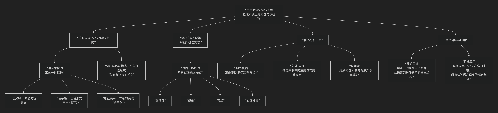

Ronald Langacker
================

基于罗纳德·兰艾克（Ronald Langacker）认知语言学核心思想

----------------

罗纳德·兰艾克是认知语言学的另一位联合奠基人，与乔治·莱考夫共同创立了这一学派，但两人研究侧重点不同。如果说莱考夫聚焦于 **概念系统和隐喻** 的宏观哲学层面，那么兰艾克则致力于构建一套 **精密、系统的语言学理论**，以彻底取代主流的生成语法。其核心思想可概括为：**语法本质上是象征性的，是概念内容以特定方式被“识解”的结构化表征。**

兰艾克的理论体系高度系统化，其核心思想、关键概念与理论目标，可以通过下图清晰地概览：

以下，我们将沿此逻辑脉络，深入解析其核心要义。

**一、核心公理：语法是象征性的**

这是对主流形式语言学最根本的挑战。兰艾克认为：

1.  **语言只有三种基本要素**：**语义结构** （ 意义）、**音系结构**  （声音/形式）以及两者之间的 **象征关系**。一个语言单位（如词、词缀、语法结构）就是这三者的结合体。

2.  **词汇与语法构成一个连续统**：传统上被严格区分的“词汇”和“语法”，在认知语法中并无本质区别，只有 **具体性与复杂性的差异**。一个语素（如“-ed”）、一个语法结构（如“主谓宾”），和一个单词（如“猫”）一样，都是 **象征单位**，都关联着特定的意义（尽管语法意义更抽象）。例如，英语复数“-s”象征“数量多于一个”，过去时“-ed”象征“事件时间先于说话时间”。

**二、核心方法：“识解”**

这是兰艾克理论中最核心、最富创造力的概念。**“识解”指我们以不同方式感知和描述同一场景或概念内容的能力。** 语法结构的不同，本质上反映了我们对场景“识解”方式的不同。

主要的识解维度包括：

.. list-table:: 识解维度及其语言实例
   :header-rows: 1
   :widths: 20 30 50
   :align: center

   * - **识解维度**
     - **核心问题**
     - **语言实例**
   * - **详略度**
     - 描述的精细程度如何？
     - “动物” > “狗” > “柯基犬” > “那只棕白色的柯基犬”
   * - **视角**
     - 从哪个视点观察？
     - “车开到了山前”（外在视角） vs. “山移到了车前”（驾驶者内在视角）
   * - **突显**
     - 哪些部分被置于前台？
     - 
         * **“基底-侧面”**： “弧” vs. “圆”（“弧”以前者为基底，突显其轮廓；“圆”以后者为基底，突显其整体形状）。
         * **“射体-界标”**： 在“猫在沙发上”中，“猫”是主要焦点（射体），“沙发”是参照点（界标）。
   * - **心理扫描**
     - 如何在心理上构建场景？
     - “路穿过沙漠”（总括扫描，整体静态意象） vs. “我们开车穿过沙漠”（序列扫描，动态过程体验）。

**三、核心分析工具**

为了精确描述识解，兰艾克发展了一系列分析工具：

1.  **基底 vs. 侧面**：描述词义。 **基底** 是理解一个表达所需激活的全部概念内容，而 **侧面** 是在基底中被特别突显或侧重的部分。例如，“斜边”的基底是一个“直角三角形”，侧面是“直角所对的那条边”。
2.  **射体 vs. 界标**：描述关系。在一个关系性表述中，**射体** 是被突显的主要参与者（图形），**界标** 是作为参照的次要参与者（背景）。例如，在“书架上的书”中，“书”是射体，“书架”是界标。
3.  **认知域**：理解任何一个概念都需要一个或多个 **认知域** （即知识背景）。例如，“弧”的认知域是“二维空间”；“下午三点”的认知域是“一天的时间周期”；“价值”的认知域是“商业交易或社会评价”。

**四、对传统语法观念的根本性革新**

1.  **词类**：名词被定义为 **“标示事物”**，动词被定义为 **“标示过程”** 。这里的“事物”和“过程”是高度抽象的概念化方式，并非现实世界的实体。

2.  **语法关系**：主语和宾语等语法关系不是原始的句法概念，而是源于 **概念上的突显**。**主语通常是主要焦点（射体），宾语是次要焦点（界标）**。

3.  **语言能力**：语言知识不是一个自洽的形式规则系统，而是一个由 **约定俗成的象征单位** 组成的、有组织的“清单”。语言使用是 **从这份清单中选取合适的单位，并按照允准的方式将它们组合起来**。

**五、思想总结**

总而言之，兰艾克的认知语法是一场 **“语法概念化”** 的革命。其核心在于：

> 语法不是任意的、自主的形式游戏，而是概念内容的结构化象征表征。每一种语法结构都对应于一种特定的概念化（识解）方式。

他的工作将 **语法从形式主义的抽象规则中解放出来，将其重新锚定在人类普遍的概念能力和认知过程中**。他提供了大量精细的分析，展示了诸如名词、动词、主语、宾语、所有格、时态等看似“纯粹语法”的现象，背后都有着深刻的概念动因和体验基础。他的理论以其 **系统性、严谨性和解释力**，成为认知语言学中与莱考夫的隐喻理论并驾齐驱、且相互补充的支柱。

-------------------

 .. toctree::
    :maxdepth: 3

    grok
    gemini
    chatgpt
    deepseek
    qwen

---------------------------

[:doc:`语言学和语言哲学 </chats/outlaw/analyse/foreign/branch/langu/languge>`]
