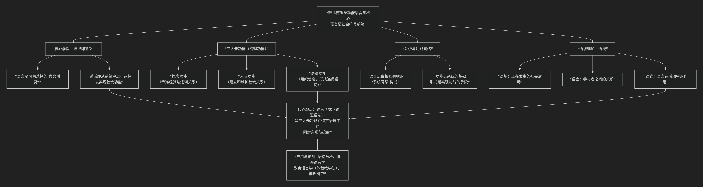

M.A.K Halliday
=======================

基于M.A.K. 韩礼德（Michael Alexander Kirkwood Halliday，常称 Michael Halliday）系统功能语言学核心思想

----------------

M.A.K. 韩礼德的 **系统功能语言学** 是现代语言学中 **功能主义** 学派最全面、最具影响力的理论体系。其核心思想可以概括为：**语言本质上是一个“社会符号”系统，其结构和形式是由其在社会交流中所需要实现的功能所塑造的。**

与乔姆斯基关注“语言能力”（理想化的、内在的语法知识）不同，韩礼德关注 **“语言行为”** 在实际社会语境中的使用。其思想可总结为三大核心理念：

为了更直观地理解系统功能语言学的理论架构，下图概括了其核心思想与功能系统：

以下，我们将沿此逻辑脉络，深入解析其核心要义。

**一、核心前提：选择即意义**

韩礼德认为，语言不是一套固定的规则，而是一个 **“意义潜势”** 系统——即说话人所能调用的、可供选择的意义资源的总和。每一次具体的语言使用，都是说话者从这个庞大的系统中做出 **选择** 的结果。**意义就产生于对特定选项的选择之中**，而未被选择的选项则构成了当下意义的背景。

**二、核心支柱：语言的三大“元功能”**

这是系统功能语言学最著名的理论。韩礼德认为，所有人类语言在同时完成三种最基本的抽象功能（即“元功能”），它们共同塑造了语言的具体形式。

.. list-table:: 系统功能语言学三大元功能解析
   :header-rows: 1
   :widths: 15 20 30 35
   :align: center

   * - **元功能**
     - **核心问题**
     - **主要体现方式**
     - **简单例子** （以“**你昨天提交报告了吗？**”为例）
   * - **概念功能**
     - **语言如何表征世界（包括外部与内心世界）？**
     - **及物性系统**：通过 **过程** （动词）、**参与者** （名词）、**环境成分** （状语）来构建经验。
     - 过程：**提交** （物质过程）；参与者：**你** （动作者）、**报告** （目标）；环境：**昨天** （时间）。
   * - **人际功能**
     - **语言如何建立和维护社会关系？**
     - **语气系统** （陈述、疑问、祈使）、**情态系统** （可能、必须等）、**评价系统**。
     - **疑问语气** （“了吗？”）体现询问功能，建构了“询问者-被询问者”的人际关系。
   * - **语篇功能**
     - **语言如何将自身组织成在特定语境中连贯、相关的语篇？**
     - **主位结构** （信息的起点）、**信息系统** （新旧信息分布）、**衔接**。
     - “你”是主位（谈论的起点）；整个句子作为信息单位，在对话中推进语篇。

**关键在于**：任何一个语言片段（小句）都 **同时** 是这三种功能的“综合体”。例如，上例的句子同时 **表征了一个事件** （概念功能）、**实施了一次询问** （人际功能）、并 **在对话中承前启后** （语篇功能）。语法结构是这三种功能在语言形式上的同步实现。

**三、核心方法：“系统”与“功能”**

*   **系统**：语言被描述为一个巨大的、多层级的 **“系统网络”**。在每个选择点上，都有若干选项。例如，在“语气”系统中，可以选择“陈述”、“疑问”或“祈使”；选择了“疑问”后，可能又面临“是非问”或“特指问”的进一步选择。语言描述就是厘清这些选项之间的依赖关系。

*   **功能**：这些系统之所以存在，是因为它们要服务于上述的 **元功能**。形式不是自足的，而是功能的体现。因此，分析语言必须从功能出发，解释形式的选择。

**四、核心应用：语境理论（语域）**

语言选择并非任意，而是由 **社会语境** 所驱动。韩礼德提出了 **“语域”** 理论，用三个变量来描述语境如何影响语言选择：

1.  **语场**：正在发生的社会活动及其主题。它主要影响 **概念功能** 的选择（使用何种词汇、过程来表征经验）。

2.  **语言**：参与者之间的社会角色关系。它主要影响 **人际功能** 的选择（语气、情态、称呼语等）。

3.  **语式**：语言在活动中所起的作用（是书面还是口语？是辅助性的还是构成活动本身？）。它主要影响 **语篇功能** 的选择（信息的组织方式、衔接手段）。

例如，一场学术讲座（语场正式、专业）、演讲者与听众的关系（语言：专家-学习者）、使用正式的独白式演讲（语式：书面化的口语），这三个语境变量共同决定了演讲者会大量选择专业术语、完整的陈述句、逻辑清晰的语篇结构。

**五、思想总结与影响**

总而言之，韩礼德的系统功能语言学实现了一次彻底的 **“视角转换”**：

*   从研究 **作为心理对象的语言**，转向研究 **作为社会行为的语言**。

*   从追问 **“什么句子合乎语法？”** ，转向追问 **“人们为何在特定情境下这样说？这样的选择产生了什么社会意义？”**

其影响深远：

*   **语篇分析**：提供了最强大的分析工具，用于解读新闻、广告、法律文书等各种语篇背后的意识形态和权力关系。

*   **批评话语分析**：是CDA的重要理论基础。

*   **教育语言学**：发展出 **“体裁教学法”** ，帮助学习者掌握不同社会语境（如学术写作、商务信函）所需的语言资源。

*   **翻译研究**：强调翻译是“在目标语境中寻找功能对等项的选择过程”。

韩礼德的理论告诉我们：**语言不仅仅是我们描述世界的工具，它更是我们建构社会现实、协商社会关系、组织社会活动的核心手段。** 研究语言，就是研究社会本身。

-------------------

 .. toctree::
    :maxdepth: 3

    grok
    gemini
    chatgpt
    deepseek
    qwen

---------------------------

[:doc:`语言学和语言哲学 </chats/outlaw/analyse/foreign/branch/langu/languge>`]
