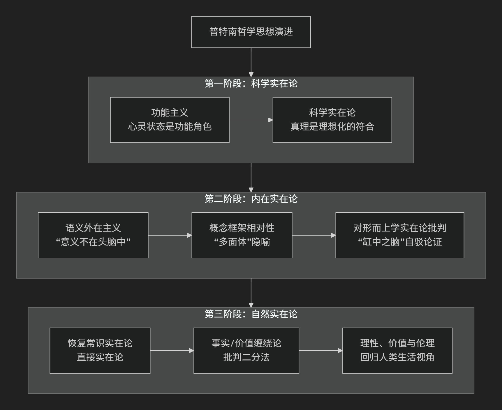

Hilary Putnam
======

基于希拉里·普特南（Hilary Putnam）哲学核心思想。

----------------

希拉里·普特南是20世纪下半叶最具原创性和影响力的哲学家之一。他的思想以其 **惊人的广度、深刻的自我批判精神和不断演变的特质** 而著称。他的一生在哲学上经历了多次重大的"转向"，但其核心思想可以概括为：**对传统哲学中根深蒂固的二分法（如事实/价值、主观/客观、心灵/世界）进行持续而有力的批判，并致力于揭示心灵、语言与世界之间的内在联系。**

一、思想演进阶段

普特南的哲学之旅像一条不断自我修正的河流，其思想精髓可以通过他留下的几个里程碑式的“路标”来把握。下图梳理了他思想演进的几个关键阶段与核心贡献：

思想演进三个关键阶段如下：

第一阶段：科学实在论与功能主义

早期，普特南是一位坚定的科学实在论者和功能主义的奠基人之一。

*   **功能主义**：

    *   心理状态（如"疼痛"）不是由特定的物理构成定义，而是由其 **在认知系统中所扮演的"功能角色"** 定义

    *   心理状态可以"多重实现"于不同的物理系统（人脑、外星生物、电脑）

    *   为认知科学和人工智能提供了重要的哲学基础

*   **科学实在论**：

    *   科学理论是关于真实世界的描述

    *   **成熟科学理论中的术语真实地指称外部世界中的实体**

    *   科学进步是不断逼近真理的过程

第二阶段：内在实在论与语义外在主义

这是他最著名、影响最广泛的阶段，他对自已早期的观点进行了深刻的批判。

*   **语义外在主义** （"意义不在头脑中"）：

    *   **核心思想**：语言的意义依赖于 **说话者所处的环境和社会分工**

    *   **著名思想实验："孪生地球"**

        *   地球人奥斯卡说"水"指H₂O

        *   孪生地球上的"奥斯卡"说"水"指XYZ

        *   尽管心理状态相同， **意义由外部世界决定**

    *   **影响**：挑战传统意义理论，开辟内容外在主义道路

*   **对形而上学实在论的批判："缸中之脑"论证**：

    *   **思想实验**：如何证明自己不是"缸中之脑"？

    *   **结论**： **"我不是缸中之脑"可能是逻辑上必然为真**

    *   **论证**：如果我是缸中之脑，"脑"、"缸"等词指称模拟影像而非真实对象

    *   **意义**：表明语言和思想 **必然与外部世界联系**，彻底的怀疑论自相矛盾

*   **内在实在论**：

    *   反对"上帝之眼"式的形而上学实在论

    *   反对相对主义

    *   **实在只有在某个概念框架或描述中才能被谈论**

    *   "多面体"隐喻：同一对象可从不同视角描述

第三阶段：自然实在论与对二分法的批判

晚年，普特南的思想再次发生重大转变，称为"自然实在论"或"常识实在论"。

*   **恢复直接实在论**：

    *   批判"感官材料"等中介物

    *   主张 **直接感知世界**，消除心灵与世界间的鸿沟

*   **事实与价值的缠绕**：

    *   批判"事实判断"与"价值判断"的严格二分

    *   **事实描述本身就渗透着价值** （如"残忍"、"优雅"等"厚伦理概念"）

    *   价值判断依赖于对事实的认知

    *   合理的价值判断具有客观性

*   **回归生活世界**：

    *   呼吁哲学回归 **人类在生活世界中形成的常识和理性实践**

    *   放弃脱离经验的形而上学体系

二、核心要义总结

.. list-table:: 普特南哲学核心要义
   :header-rows: 1
   :widths: 25 45 30
   :align: center

   * - **思想阶段**
     - **核心命题**
     - **关键概念与贡献**
   * - **科学实在论阶段**
     - 心理状态由 **功能角色** 定义；科学理论 **指称真实实体**
     - **功能主义、多重实现、科学实在论**
   * - **内在实在论阶段**
     - **"意义不在头脑中"**，反对"上帝之眼"式的形而上学实在论
     - **语义外在主义、孪生地球、缸中之脑论证、概念框架**
   * - **自然实在论阶段**
     - 批判事实/价值二分，主张 **直接感知世界**，回归常识
     - **自然实在论、事实/价值缠绕、厚伦理概念、直接感知**

三、思想特质与影响

普特南的思想具有深远影响和独特特质：

*   **自我批判的典范**：

    *   敢于公开否定自己过去的观点

    *   **对真理的真诚追求高于对体系一致性的维护**

*   **问题导向**：

    *   关注哲学史根本问题

    *   用清晰分析和富有想象力的思想实验推进讨论

*   **跨领域影响**：

    *   推动语言哲学、心灵哲学、科学哲学和伦理学发展

    *   为认知科学、人工智能提供理论基础

四、总结

希拉里·普特南的核心思想在于他是一位 **不懈的"二分法拆解者"**：

*   **批判目标**：与将世界割裂开的僵化范畴作战

*   **核心洞见**：揭示心灵与身体、语言与世界、事实与价值间的 **内在联系**

*   **哲学方法**：认识到对立范畴在 **人类实践的整体中相互缠绕**

*   **终极贡献**：提供理解人类自身和世界的辩证视角

他的哲学告诉我们，理解的关键不在于选择极端，而在于把握范畴间的辩证统一。

-------------------

 .. toctree::
    :maxdepth: 3

    grok
    gemini
    copilot
    chatgpt
    deepseek
    qwen

