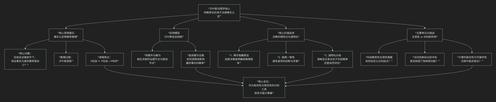

Bayesian
=========

基于贝叶斯法理学（Bayesian Legal Theory / Bayesian Jurisprudence）核心思想

---------------------------------

**贝叶斯法理学（Bayesian Legal Theory / Bayesian Jurisprudence）** 是一个新兴的、将概率论（特别是贝叶斯定理）系统应用于法律推理，尤其是 **证据评价与事实认定** 领域的理论框架。其核心目标是用严谨的数学逻辑来理解和规范法律决策中的不确定性。

其核心思想、应用与争议，可以通过下图清晰地概览：

以下，我们将沿此脉络，深入解析贝叶斯法理学的核心要义。

一、核心思想：法律事实认定即概率推理

贝叶斯法理学认为，司法中的 **事实认定本质上是基于不完整、模糊和相互矛盾的证据，对过去事件发生的可能性进行评估**。这与科学中评估假说相似。其核心主张是：

1.  **信念的量化**：对案件事实（如“被告是否实施了犯罪行为”）的信念，不应是“全信”或“全不信”的二元判断，而应是一个 **概率值** （如0到1之间）。这代表了理性决策者在现有证据下对事实为真的合理置信度。
2.  **动态更新**：随着证据（E）的呈现，事实裁决者（法官或陪审员）对事实主张（H）的信念应遵循 **贝叶斯定理** 进行更新：

.. math::

   P(H|E) = \frac{P(E|H) \times P(H)}{P(E)}

其中：

* **\\(P(H)\\) 先验概率**：在看到新证据E之前，对假说H的初始合理置信度
* **\\(P(E|H)\\) 似然度**：如果假说H为真，观察到证据E的可能性大小
* **\\(P(E)\\) 证据的边际概率**：在所有可能假说下，观察到证据E的整体可能性
* **\\(P(H|E)\\) 后验概率**：在看到证据E之后，对假说H更新后的合理置信度

3.  **“排除合理怀疑”的概率化诠释**：虽然不要求精确的数字标准，但贝叶斯框架可以将“排除合理怀疑”理解为 **后验概率必须超过一个极高的阈值（如0.95或0.99）**。

二、核心模型：贝叶斯信念网络

为了处理复杂的证据链条，贝叶斯法理学常借助 **“贝叶斯信念网络”** 模型。该模型将案件分解为一系列相互关联的命题节点（如动机、机会、DNA匹配、证人证言等），并图形化地展示它们如何逻辑地影响最终事实节点的概率。这迫使裁判者明确所有推理中的隐含假设和依赖关系。

三、核心价值与影响

1.  **作为批判性分析工具**：

    *   **揭示隐藏假设**：迫使事实认定者明确其推理中的每一步假设（尤其是先验概率和似然评估），使其接受检视和辩论。
    *   **提高一致性**：帮助识别和避免直觉推理中常见的逻辑谬误（如检察官谬误、辩护人谬误、基础比率忽视等）。
    *   **透明化分歧**：当各方对结论有争议时，贝叶斯分析能清晰定位分歧所在——是初始假设（先验）不同，还是对证据强度的评估（似然）不同。

2.  **作为规范性理想**：

    *   它为理性的证据评价提供了一个 **理想化的数学标准**，用以衡量和改进现实中的法律决策过程。
    *   在法律教育和证据法研究中，它已成为一个强大的教学和分析框架。

四、主要争议与批评

1.  **先验概率的主观性**：这是最激烈的批评。如何设定一个公平、客观的 **先验概率**？使用一般统计基础率（如某类犯罪的发生率）可能涉及歧视和不公；完全主观化则可能破坏法律的确定性和平等性。
2.  **与对抗制诉讼的张力**：普通法系的对抗制依赖于陪审团的集体直觉和“故事叙述”。贝叶斯的高度形式化、量化路径可能削弱陪审团的核心功能，也与“全有或全无”的二元裁决传统不符。
3.  **计算的复杂性与可操作性**：要求法官、律师和陪审员在紧张的审判中进行贝叶斯计算是不现实的。复杂的模型也可能产生“数学伪装下的偏见”。
4.  **对证据价值的简化**：许多法律证据（如证人的可信度、行为证据）难以可靠地量化为概率。

五、总结

**贝叶斯法理学的核心，不在于要求法庭进行精确的数学计算，而在于倡导一种“贝叶斯式思维”——即承认事实认定的概率性、重视基础信息（先验）、并系统性地思考证据在多大程度上支持或削弱了某项主张。**

其最大的贡献是 **为法律中的证据推理提供了一种严谨的逻辑语言和清晰的思维框架**，使得原本模糊的司法证明过程变得可分析、可辩论和可改进。它主要作为一种强大的 **批判工具、教学工具和研究范式** 存在，不断挑战传统证据法中的模糊之处，推动司法决策向更理性、更透明的方向发展。目前，它更多地被应用于分析上诉判决、评估科学证据的证明力，以及指导法律改革，而非直接用于日常的陪审团裁决。

------------

 .. toctree::
    :maxdepth: 3

    grok
    copilot
    chatgpt
    deepseek
    gemini
    qwen

