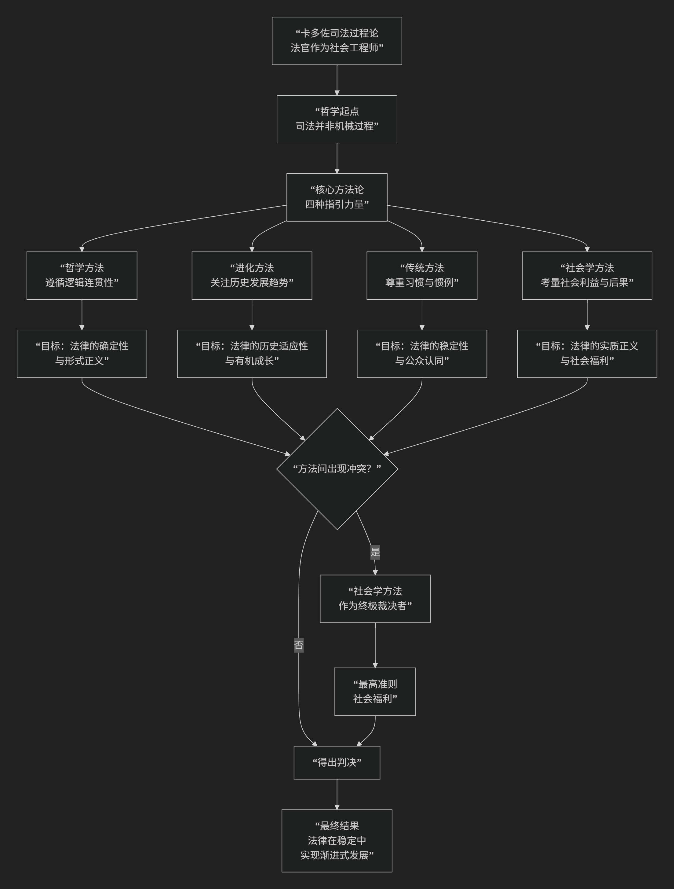

Benjamin N. Cardozo
====================

基于本杰明·内森·卡多佐（Benjamin Nathan Cardozo）司法过程论核心思想

---------------------------------

本杰明·N·卡多佐是美国历史上最具影响力的法学家之一，其司法过程论的核心思想可以概括为：**一种坦诚、精细且富有社会责任感的法官裁判方法论。它坚决反对将司法视为机械适用法律的“自动售货机”，转而主张法官在遵循先例的前提下，应通过一种多元、动态的方法，有意识地考量判决的社会后果，使法律的发展能够适应社会生活的需要，最终实现“社会福利”这一终极目标。**

卡多佐的思想精髓在于揭示了法官裁判过程中的创造性维度，其核心方法论体系可以通过下图清晰地展现其内在逻辑与动态过程：

以下，我们将沿此逻辑脉络，深入解析卡多佐司法过程论的核心要义。

一、哲学起点：司法不是发现而是创造的过程

卡多佐的理论始于对传统形式主义司法观的批判。他反对那种认为法官只是“法律宣示者”的被动角色。

*   **核心洞见**：在大量的案件中，法律规则是清晰的，法官只需通过逻辑演绎即可裁判（他称之为“分析法”或“哲学方法”）。然而，在那些 **真正重要的、开创先例的案件中**，法律存在空白、模糊或冲突。此时，法官 **无法避免地行使着创造性的选择权**。

*   **著名比喻**：法官不是在 **发现** 早已存在的法律路径，而是在 **塑造** 和 **建造**这 条路径。司法过程是一种有意识的、负责任的立法活动。

二、核心方法论：法官裁判的四种指引力量

卡多佐在其代表作《司法过程的性质》中，系统阐述了法官作出一项判决时所依循的四种方法，它们构成一个有机的、有优先次序的体系：

1.  **哲学方法（逻辑方法）**

    *   **内容**：遵循先例，通过 **逻辑上的类比、演绎**，保证法律原则的统一性、连续性和确定性。这是最常用、最基本的方法。

    *   **价值**：满足社会对 **稳定性和可预测性** 的渴望。

    *   **局限**：当逻辑推理导致明显不公正或过时的结论时，就不能盲目遵循。

2.  **进化方法（历史方法）**

    *   **内容**：考察某一法律原则的 **历史起源和发展轨迹**，使其演变符合历史的趋势。

    *   **价值**：确保法律能够 **有机地成长**，而非僵化不变。

3.  **传统方法（习惯方法）**

    *   **内容**：尊重和采纳 **社会通行的习惯、商业惯例和普遍的道德观念**。

    *   **价值**：使法律规则建立在坚实的 **社会共识** 基础上，增强其生命力和可接受度。

4.  **社会学方法（目的方法）——最具卡多佐特色**

    *   **内容**：**有意识地考量判决可能带来的社会后果**，评估不同判决方案对社会利益、社会需求和社会进步的影响。

    *   **价值**：这是实现 **司法正义最直接、最有效的工具**。当其他方法指向不同结论时，社会学方法通常具有 **优先地位**。

三、终极准则：社会福利

卡多佐理论中最著名的，是他将“社会福利”确立为司法过程的终极目标和最高准则。

*   **社会福利的内涵**：它并非狭义的物质利益，而是一个宽泛的概念，指 **社会的和谐、有序、进步以及共同体成员的福祉**。它包括了社会道德、公共政策、经济需求等。

*   **核心作用**：当逻辑、历史、习惯等方法无法提供明确指引或相互冲突时，“社会福利”就成为 **最终的裁决者**。法官应选择那个最能促进社会福利的判决方案。

四、法官的角色：有意识的社会工程师

基于上述方法论，卡多佐重新定义了法官的角色。

*   **从“自动售货机”到“社会工程师”**：法官不应掩饰自己的创造性角色，而应 **坦诚地承认并负责任地行使** 这种权力。他是一位“社会工程师”，其职责是运用法律工具来调整社会关系，促进社会福祉。

*   **自由裁量的界限**：这种创造性权力并非恣意妄为。它受到 **先例、法律原则、职业传统和社会共识** 的严格约束。法官的“造法”是“填补缝隙”式的、渐进式的，而非推倒重来。

五、核心要义总结

.. list-table:: 
   :header-rows: 1
   :widths: 25 45 30
   :align: center

   * - **理论维度**
     - **核心命题**
     - **关键概念与贡献**
   * - **司法性质论**
     - **司法过程，尤其在疑难案件中，是法官有意识地塑造法律的创造性活动。**
     - **司法创造性、反对机械法学、法官造法**
   * - **方法论体系**
     - **法官应综合运用哲学、进化、传统和社会学四种方法进行裁判。**
     - **四种方法、方法的优先次序、动态平衡**
   * - **终极准则**
     - **"社会福利"是司法过程的最高目标，是解决方法冲突的最终依据。**
     - **社会福利、社会利益、后果考量**
   * - **法官角色论**
     - **法官是负责任的"社会工程师"，其自由裁量权受法律传统约束。**
     - **社会工程师、受约束的创造力、渐进式发展**

六、思想特质与影响

*   **坦诚与精细**：卡多佐毫不掩饰司法的创造性本质，但又为这种创造性提供了一套精细、可操作的方法论约束，避免了主观臆断的批评。

*   **平衡与务实**：他的理论在 **法律的确定性与灵活性、稳定性与进步性、逻辑与正义** 之间取得了极佳的平衡。

*   **深远影响**：卡多佐的司法过程论深刻影响了美国的司法实践，为司法能动主义提供了有力的理论支持，同时也设定了理性的边界。他让法官们意识到，一个伟大的判决，不仅是逻辑的胜利，更是对社会福祉的深刻关怀。

七、总结

总而言之，卡多佐司法过程论的核心思想在于，他是一位 **“司法坦诚的倡导者”和“裁判艺术的提炼者”** 。他教导我们，**司法的伟大不在于隐藏其创造性的本质，而在于为这种创造性活动找到一套负责任、有原则且致力于社会福祉的方法论体系。**

他的全部工作是对 **司法决策本质** 的一次深刻揭示与升华。在法治传统中，他成功地将法官从“法律奴仆”的被动形象，提升为“社会工程师”的积极角色，为法律在稳定中实现与时俱进的发展指明了道路。在这个意义上，他不仅是美国法学的瑰宝，更是世界法律思想史上一位里程碑式的人物。

------------

 .. toctree::
    :maxdepth: 3

    grok
    copilot
    deepseek
    chatgpt
    gemini
    qwen
