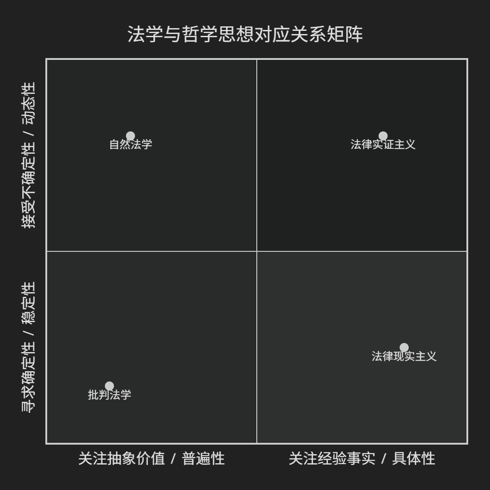

## 法学和哲学思想的対应关系

**哲学为法学提供根本的世界观、认识论与方法论**，法学则成为哲学思想在人类社会规范性秩序中的**检验场与具现化**。以下是一个系统性的比较框架，从宏观历史脉络到微观理论对应进行梳理。

---

### **一、 宏观脉络：三次法学“哲学化”浪潮及其对应**

法学思想的几次根本性转向，均伴随着哲学范式的革命。

| 哲学范式阶段                                     | 核心哲学关切                                                                             | 对应的主流法学思潮                                       | 法学的核心问题转换                                                                                                                |
| :----------------------------------------------- | :--------------------------------------------------------------------------------------- | :------------------------------------------------------- | :-------------------------------------------------------------------------------------------------------------------------------- |
| **古典本体论**  （古希腊至中世纪）    | **世界的本质与目的**  （形而上学、目的论）                                    | **古典自然法学**  （亚里士多德、阿奎那）      | **法律应追求何种终极善？**  法律是发现（而非制定）的， 旨在实现人的本性或神定的目的。                             |
| **近代认识论**  （17-19世纪）         | **知识的来源与确定性**  （理性主义 vs. 经验主义）                             | **法律实证主义**与**历史法学**的兴起         | **法律如何被确知与体系化？** 焦点从“应然”转向“实然”：法律是主权者命令（奥斯丁） 还是民族精神的历史产物（萨维尼）？ |
| **现代语言/批判转向**  （20世纪至今） | **语言的意义、权力的结构、主体的消亡**  （分析哲学、现象学、结构/后结构主义） | **分析法学、批判法学、 后现代法学**等多元并存 | **法律语言如何运作？法律掩盖了何种权力？**  法学从“寻求真理”转向“分析话语”和“揭露意识形态”。                     |

---

### **二、 系统性对应：四大核心关系矩阵**

以下矩阵揭示了哲学与法学在具体问题上的深层互动。

#### **1. 本体论对应：法律是什么？**

| 哲学立场                        | 核心主张                       | 对应的法学流派                           | 法学核心主张                                                                     |
| :------------------------------ | :----------------------------- | :--------------------------------------- | :------------------------------------------------------------------------------- |
| **道德实在论/古典目的论** | 存在客观的道德真理或自然目的。 | **古典自然法学**                   | 存在普世、客观的“高级法”（自然法），违背它的实在法无效。                       |
| **实证主义/经验主义**     | 知识源于可观察的经验事实。     | **法律实证主义**（奥斯丁、哈特）   | 法律是社会事实，是**主权者命令**或**社会规则**，与道德分离。         |
| **结构主义/系统论**       | 实在由深层结构或系统关系构成。 | **系统论法学**（卢曼）             | 法律是**自创生的社会子系统**，依据合法/非法二元代码封闭运作。              |
| **实用主义**              | 真理/意义在于其实际效果。      | **法律实用主义**（霍姆斯、波斯纳） | 法律是**对社会需求的预测工具**或**实现社会目标的工具**，应关注后果。 |

#### **2. 认识论对应：如何认识/解释法律？**

| 哲学立场                       | 核心主张                                     | 对应的法学流派/方法              | 法学核心主张                                                                 |
| :----------------------------- | :------------------------------------------- | :------------------------------- | :--------------------------------------------------------------------------- |
| **分析哲学**（语言分析） | 通过分析语言的意义和逻辑来解决问题。         | **分析法学**（哈特、拉兹） | 厘清法律概念的**逻辑与用法**（如权利、义务、规则），进行概念分析。     |
| **诠释学**               | 理解是通过与文本的对话和“视域融合”达成的。 | **法律诠释学**（德沃金）   | 法律解释是**建构性诠释**，旨在为法律实践提供“最佳证立”，追求整全性。 |
| **历史主义**             | 观念和制度必须在历史语境中理解。             | **历史法学**（萨维尼）     | 法律是**“民族精神”** 在历史中的有机生长，非理性刻意设计。            |
| **心理学/行为主义**      | 关注可观察的行为及心理机制。                 | **法律现实主义**（弗兰克） | 关注法官/官员的**实际行为与心理过程**，法律是对其行为的预测。          |

#### **3. 价值论对应：法律的价值基础是什么？**

| 哲学立场                                   | 核心主张                                                 | 对应的法学价值取向                                          | 法学核心主张                                                                     |
| :----------------------------------------- | :------------------------------------------------------- | :---------------------------------------------------------- | :------------------------------------------------------------------------------- |
| **功利主义**（边沁、密尔）           | 道德上正确的行动是能**最大化总体幸福**的行动。     | **功利主义法学** （法律经济学基础）                   | 法律规则和判决应追求**“社会福利最大化”** 或 **“成本收益分析”**。 |
| **康德道义论**                       | 道德源于理性的**绝对命令**，人应作为目的而非手段。 | **权利本位法学** （德沃金、权利理论家）               | 法律必须认真对待**个人权利**，权利是抵御功利计算的“王牌”。               |
| **社群主义/美德伦理学**              | 善存在于共同体的传统与个体的品德中。                     | **社群主义法学** （批判权利话语的原子化）             | 法律应促进**共同善、社会纽带与公民美德**，而非仅保护个人权利。             |
| **批判理论**（马克思、法兰克福学派） | 意识形态批判，揭露权力对解放的束缚。                     | **批判法学**及衍生流派 （批判种族理论、女权主义法学） | 法律是**政治与意识形态的延续**，掩盖并再生产了阶级、种族、性别的不平等。   |

#### **4. 方法论对应：如何批判与解构法律？**

| 哲学立场                     | 核心主张                                                     | 对应的法学批判路径                    | 法学核心主张                                                                 |
| :--------------------------- | :----------------------------------------------------------- | :------------------------------------ | :--------------------------------------------------------------------------- |
| **解构主义**（德里达） | 文本内部存在无法弥合的**矛盾与延迟**，意义永远不稳定。 | **后现代法学** （解构法律文本） | 法律文本的意义是**不确定的、流动的**，法律宣称的确定性和正义是延迟的。 |
| **权力谱系学**（福柯） | 权力是生产性的、弥散的，通过知识/话语塑造主体。              | **规训与权力分析法学**          | 法律是**微观权力技术与规训手段**，参与生产“驯顺的身体”和合格的主体。 |
| **存在主义/现象学**    | 关注个体在具体情境中的生存体验与选择。                       | **存在主义法学**（较少成派）    | 强调司法裁决中**法官的个人责任、焦虑与具体情境**，反对机械适用规则。   |

---

### **三、 核心对应案例详解**

1. **哈特 vs. 维特根斯坦（后期）**：

   * **哲学**：维特根斯坦提出“**语言游戏**”和“**家族相似**”，认为词的意义在于其在特定生活形式中的使用。
   * **法学**：哈特用“**规则的开放性结构**”和“**内在观点**”来建构其法律实证主义。法律规则存在核心明确与边缘模糊的地带，人们对规则的态度（接受其为行动理由）构成了规则存在的关键。这直接借鉴了语言游戏和生活形式的概念。
2. **德沃金 vs. 伽达默尔（诠释学）**：

   * **哲学**：伽达默尔认为理解是诠释者与文本在历史中的“**视域融合**”，是创造性的。
   * **法学**：德沃金将法律实践比作“**连环小说**”，每位法官（作者）都必须对法律传统进行**建构性诠释**，力求提出能最好地证立既有法律材料的那个“**唯一正解**”（尽管在理论上），这深深打上了哲学诠释学的烙印。
3. **批判种族理论 vs. 后结构主义/叙事哲学**：

   * **哲学**：利奥塔质疑“**宏大叙事**”，福柯分析话语与权力。
   * **法学**：批判种族理论学者（如德里克·贝尔、帕特里夏·威廉姆斯）通过讲述“**反叙事**”来揭露主流法律话语如何系统性地边缘化和压制少数族裔的经验，解构“色盲”、“机会平等”等自由主义法律宏大叙事。

### **总结：一种共生与镜鉴的关系**

法学与哲学的对应，展现的是一种**深层的共生关系**：

* **哲学为法学提供“元工具”**：它提供思考法律之本质、认识、价值和方法的根本框架。
* **法学为哲学提供“试验场”**：它将抽象的哲学观念置于**制度、权力与人类冲突的复杂现实**中加以检验和具体化。

理解这种对应关系，不仅有助于把握法学流派的思想根源，更能让我们洞察：**每一次重大的法律思想变革，其背后都是一次深刻的哲学转向。** 法律之争，往往是世界图景之争的延伸。
