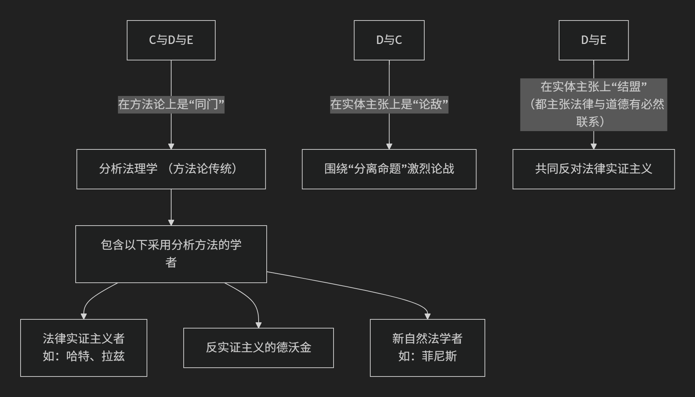

Ronald Dworkin
=================

基于罗纳德·德沃金（Ronald Dworkin）的法律哲学核心思想。

--------

德沃金是20世纪下半叶最具影响力的法学家之一，他的法律哲学核心思想可以概括为：**对法律实证主义发起根本性挑战，主张法律并非一套中立的规则，而是一个融合了原则、政治道德和整体性解释的“解释性概念”，其目的在于通过“建构性解释”为政府行为提供最佳的道德正当性。**

他的思想体系宏大而深刻，主要建立在以下四个核心支柱上：

一、核心批判：反对“规则模式”与“自由裁量权”

德沃金的整个理论建立在对以哈特为代表的法律实证主义的批判之上。

1.  **批判一：法律不止有规则**：实证主义认为法律是一个由“规则”构成的体系。德沃金指出，法律体系中还存在一种更重要的标准——**“原则”**。

    *   **规则**：以“全有或全无”的方式适用（如“车辆不得进入公园”）。

    *   **原则**：是“应予遵守的准则”，并非必然决定结果，但具有 **分量** 和 **重要性** （如“任何人不得从自己的错误行为中获利”）。在疑难案件中，往往是原则而非规则起着决定性作用。

2.  **批判二：反对强自由裁量权**：实证主义认为，当法律规则用尽时（即存在“法律漏洞”），法官拥有 **强自由裁量权**，可以像立法者一样造法。德沃金激烈反对此观点，他认为即使在最疑难的案件中，也 **总有一个唯一正确的答案** 等待着法官去“发现”，而非“创造”。法官的任务是寻找法律体系内蕴藏的最佳解释，而非行使个人偏好。

二、法律是一个“解释性概念”

德沃金认为，法律实践的本质不是机械地适用规则，而是一种 **“解释性”** 的努力。

*   **核心问题**：法律实践要求我们回答“法律是什么？”但这并非一个事实问题，而是一个解释问题。其目的在于 **将当下的法律实践呈现为其所能呈现的最佳形态**。

*   **建构性解释**：法官的解释活动，类似于文学评论家解读一部连环小说。他必须将法律实践（包括法规、先例、宪法、道德原则）视为一个 **连贯的整体**，并为其赋予最佳的政治道德意义。这种解释既要“符合”过去的法律实践（拟合度），又要为其提供“最佳的道德证立”（正当性）。

三、法律的“整体性”理想

这是德沃金理论的核心规范性主张，也是法官进行建构性解释时所追求的目标。

*   **整体性的要求**：国家必须以一个 **融贯一致的声音** 行事，其行为必须立足于一套 **原则一致** 的整体性方案。这意味着，法律不应是彼此矛盾、专断的命令集合。

*   **作为整合的法律**：法律应被理解为一种 **整合**，它要求政府对所有公民给予 **平等的关切与尊重**。整体性确保了公民在法律面前被当作道德人格体来对待，而不是被任意、反复无常的权力所支配。

四、赫拉克勒斯：理想法官的模型

为了说明他的理论，德沃金构想了一位具有超凡人智慧、耐心和洞察力的 **理想法官——“赫拉克勒斯”**。

*   **赫拉克勒斯的任务**：在审理疑难案件时，赫拉克勒斯会建构一个关于权利与义务的 **宏大理论**。这个理论能完美地整合整个法律体系的历史与实践（包括法规、先例、宪法结构和道德原则），并为其提供最佳的道德正当性。

*   **唯一正确答案**：通过这种艰苦的建构性解释，赫拉克勒斯总能找到那个在政治道德上最站得住脚的“**唯一正确答案**”。这个答案并非主观意见，而是客观存在于法律实践的最佳解释之中。

五、权利命题：法律是权利的平台

德沃金的理论被称为“**权利论**”。他认为，法律的最终目的在于 **界定和保障个人基于正义的“权利”**。

*   **权利作为王牌**：个人权利（特别是反对政府的权利）在政治决策中扮演着“王牌”的角色，除非在非常特殊的情况下，否则不能被集体福利的简单考量所压倒。

*   **认真对待权利**：政府必须“认真对待权利”，这意味着必须将个人视为拥有尊严的道德主体，而不是实现社会整体目标的工具。

核心要义总结

.. list-table:: 罗纳德·德沃金法律哲学核心要义
   :header-rows: 1
   :widths: 25 45 30
   :align: center

   * - **理论维度**
     - **核心命题**
     - **关键概念与贡献**
   * - **对实证主义的批判**
     - 法律不仅包含 **规则**，更包含具有分量的 **原则**；法官在疑难案件中并非造法，而是寻找 **唯一正确答案**。
     - **原则 vs. 规则、反对强自由裁量权**
   * - **法律的性质**
     - 法律是一个 **解释性概念**，其内容通过 **建构性解释** 来确定，旨在为整体实践提供最佳道德证立。
     - **解释性概念、建构性解释**
   * - **法律的理想**
     - 法律应追求 **整体性**，要求国家权力保持原则上的融贯一致，并对所有公民给予 **平等的关切与尊重**。
     - **整体性、平等的关切与尊重**
   * - **司法方法论**
     - 理想的法官 **赫拉克勒斯** 通过建构一个整合性的宏大理论来发现法律中的唯一正确答案。
     - **赫拉克勒斯、唯一正确答案**
   * - **法律的目的**
     - 法律的根基在于 **权利**，其核心功能是界定和保障个人对抗集体意志的权利。
     - **权利论、认真对待权利**

总而言之，德沃金的核心思想是将法律从一套僵硬的规则体系中解放出来，将其重塑为一个充满道德理想的、动态的解释事业。他坚信，法律与道德不可分割，法官的职责在于通过哲学性的思考，从既有法律资源中发掘出最能捍卫人类尊严与平等的原则。他的理论极大地丰富了法学方法论，并深刻影响了宪法解释、权利理论和司法实践领域。

-------------------

 .. toctree::
    :maxdepth: 3

    grok
    gemini
    copilot
    chatgpt
    ds
    qw

-------------------------

**许多教科书和文献会将罗纳德·德沃金归类为“自然法学派”或至少是“新自然法学派”的代表人物之一**。这是一个在学术上既合理又存在细微争议的归类，其背后反映了法哲学流派划分的复杂性。

一、为什么人们常将德沃金归入自然法学派？

将德沃金与自然法学派联系起来的核心原因在于，他 **坚决反对法律实证主义的核心主张——“法律与道德的分离”**。具体表现在：

1.  **对“法律是什么”的解答中包含道德判断**：

    *   法律实证主义（如哈特）认为，法律的存在和内容是一个 **社会事实** 问题（例如，某规则是否由议会通过），可以通过不诉诸道德价值的标准（如“承认规则”）来识别。

    *   德沃金则认为，要回答“本案中法律是什么”，法官（和法学家）必须进行 **建构性解释**。这不仅是在描述规则，更是在为当前的法律实践（包括先例、法规、宪法）找到一个能使其呈现“最佳道德面貌”的原则。因此，法律本身就包含了原则，而这些原则（如“任何人不得从自己的错误行为中获利”）本质上是道德原则。

2.  **坚持“正确答案”命题**：

    *   德沃金认为，在大多数（即使不是全部）疑难案件中，通过其提出的“作为整体的法律”的解释方法，可以找到一个在道德上和法理上都最佳的、**唯一正确的答案**。这与自然法学追求法律与客观道德真理相统一的倾向是一致的。

3.  **主张法律与道德的必然联系**：

    *   他最有名的批评之一是驳斥哈特的“规则模式”。他认为法律不仅包括规则，还包括 **原则**，而原则的本质是道德诉求。因此，道德并非外在于法律，而是 **内嵌于法律实践之中**。这实质上捍卫了“法律与道德存在必然联系”这一自然法的核心立场。

基于以上强有力的理由，将德沃金视为 **20世纪下半叶以来复兴自然法思想的最重要旗手**，是完全恰当的。他让自然法的核心关切——法律与道德的关系——在现代法哲学辩论中重新占据了中心地位。

二、为什么这一定位又存在争议或需加限定？

然而，将德沃金简单地贴上“自然法学派”的标签，有时会模糊他思想的独特性和革命性。他与 **古典或传统自然法理论** 有显著区别：

1.  **拒绝“高级法”或“自然法”作为独立标准**：

    *   古典自然法认为，存在一套独立于人类制定法的、普世的道德法则（自然法）。当实证法与自然法冲突时，自然法具有更高的权威，甚至可以否定实证法的效力（“恶法非法”）。

    *   德沃金 **并不诉诸于一个外在于现行法律体系的、先验的自然法标准**。他的解释起点始终是 **特定政治共同体（如美国）既有的、整体的法律实践**。法官的任务是从这个传统内部，为其找到最佳的道德证成。法律的标准是“内在”于实践传统的，而非“外在”的。

2.  **方法论不同：解释学 vs. 本体论/认识论**：

    *   传统自然法更多地探讨法律的 **本体论基础** （法律基于理性或神意）和 **认识论** （我们如何认识自然法）。

    *   德沃金的核心贡献是 **解释学方法**。他把法律实践看作一种“解释性概念”，法官如同连环小说的续作者，必须在尊重传统文本和追求最佳叙事之间进行建构。这是一种关于 **如何理解和使用法律** 的理论，而不仅仅是关于“法律是什么”的理论。

三、更精确的定位与学术共识

鉴于上述复杂性，更精确的学术定位是：

*   **他是自然法传统在当代最杰出的继承者与发展者**，因为他致命地打击了实证主义的分离命题，并雄辩地论证了法律推理中道德论证的核心地位。

*   **他开创了一个独特的、以“解释”为核心的法学理论**，可称为“**解释性法理学**”或“**作为整体的法律理论**”。这个理论虽然与自然法结盟，但其方法论是全新的。

*   许多学者采取一种折中但准确的描述：**德沃金是自然法阵营中反对法律实证主义的主要代表，但他的理论本身构成了一个独立的、极具影响力的体系**。

四、总结

**文献中将德沃金归入自然法学派，主要是基于其理论结论——法律与道德不可分——与自然法传统的深刻亲和性。** 这种归类在思想脉络对抗（vs. 实证主义）的意义上非常有效且被广泛接受。

但同时需要明白，他的理论路径（解释学方法、基于共同体的实践）又与传统自然法有所区别，显示了他作为一位原创思想家的独特性。因此，更完整的理解是：**德沃金复兴并重塑了自然法的核心关切，将其置于一个全新的解释框架之中，从而成为当代法哲学中一个里程碑式的人物。**

---------------------

许多文献（尤其是英美法哲学传统下的文献）将罗纳德·德沃金归入 **分析法理学** 的范畴，甚至视其为这个传统中最重要的人物之一。但这与“德沃金是自然法学家”或“德沃金是实证主义的主要对手”这些标签并不矛盾，而是源于不同的分类标准。

下面我们来厘清这其中的逻辑：

一、 什么是“分析法理学”？

“分析法理学”或“分析法学”主要是一个 **方法论传统**，而非一个具有统一实体主张的学派。其核心特征是：

1.  **关注概念分析**：致力于清晰、精确地分析“法律”、“权利”、“义务”、“权威”等核心法律概念的含义、逻辑结构和相互关系。

2.  **追求一般性与描述性**：旨在提供关于“法律”本身的一般性理论，描述其本质特征，而非为某个特定法律体系辩护或提出改革方案。

3.  **逻辑与语言分析工具**：大量运用现代逻辑哲学、语言哲学和认识论的工具进行分析。

在这个意义上， **霍布斯、边沁、奥斯丁、凯尔森、哈特、拉兹、菲尼斯、德沃金** 等风格迥异的思想家，都可以被归入广义的“分析法理学”传统。他们都试图用清晰、严谨的论证来回答“法律是什么”这个一般法理学问题。

二、 德沃金如何符合“分析法理学”？

1.  **方法论上的一致性**：德沃金的整个理论大厦建立在极其精细的概念分析之上。他对“规则”、“原则”、“政策”、“权利”、“解释”、“完整性”等概念的辨析，是分析哲学的典范。他像分析哲学家一样，通过辨析语词和概念的细微差别来推进理论。

2.  **议题的承继性**：他的工作直接切入并主导了由哈特所确立的现代分析法理学的核心议程——即围绕“法律与道德的关系”、“法律效力的基础”、“法官裁量的性质”等问题的论战。他是在这个“语言游戏”内部进行最卓越的参与和颠覆。

3.  **追求一般理论**：尽管他经常以美国宪法和普通法为素材，但《法律帝国》等著作的目标是提出一个关于“法律根据”和“法律推理”的普遍性理论，这正是分析法理学的目标。

**因此，将德沃金归入“分析法理学”，主要是基于其方法论风格和论辩场域。**

三、 为何这与其“反实证主义”和“自然法倾向”不矛盾？

这里的分类是在不同层面上进行的，可以理解为一种 **“方法论 vs. 实体主张”** 的区分：

*   **方法论层面（如何做哲学）**：**分析法学**。他使用分析哲学的工具。

*   **实体主张层面（法律是什么）**：**反实证主义 / 解释性法理学**。他反对法律与道德的分离命题，主张法律实践必然包含价值判断。

这就像一个哲学家可以同时是：

*   **方法论上**：分析哲学家（用概念和逻辑分析）。

*   **领域上**：政治哲学家（研究正义、权利）。

*   **立场上**：自由平等主义者（主张特定的正义观）。

四、 核心关系图解

五、 总结

1.  **文献归类正确**：许多文献将德沃金归入“分析法理学”是 **正确的**，这是基于其高度分析性、概念性的哲学方法。

2.  **标签不冲突**：这与他作为 **法律实证主义最强大的批评者** 以及 **具有自然法倾向的解释理论开创者** 的身份 **不冲突**。前者是“怎么想/怎么写”，后者是“想什么/写什么”。

3.  **理解的关键**：理解这一点，就能明白为何德沃金与哈特、拉兹等人的辩论如此精深——因为他们共享一套哲学话语和分析工具，却在最根本的实体问题上分道扬镳。他们的论战是“家族内部”最高水平的决斗。

4.  **意义**：德沃金的地位正在于此：他运用分析哲学最犀利的武器，深刻地动摇了分析法学内部最主流的理论（法律实证主义），从而将分析法学传统推向了一个新的高度，并极大地丰富了自然法思想的现代表达。

所以，德沃金是分析法理学传统孕育出的、反过来又重塑了这一传统的巨人。