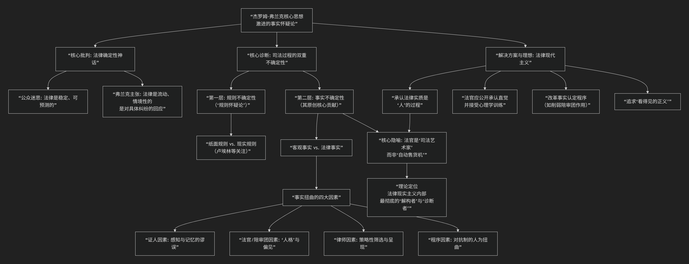

Jerome Frank
=========

基于杰罗姆·弗兰克（Jerome Frank）法律现实主义（Legal Realism）法哲学核心思想

---------------------------------

杰罗姆·弗兰克是 **美国法律现实主义运动中最激进、最具代表性的思想家之一**，其核心思想可以概括为 **“事实怀疑论”**。他比其同侪（如卡尔·卢埃林）走得更远，认为法律不确定性的根源不仅在于规则的模糊，更在于 **司法过程中“事实认定”的极端不可靠性**。

其核心思想体系，可以通过下图清晰地概览：

以下，我们将沿此逻辑脉络，深入解析其核心要义。

---

**一、核心命题：解构“法律确定性神话”**

弗兰克在其代表作《法律与现代心智》中，首先抨击了主流社会所信奉的 **“法律确定性神话”** ——即认为法律是稳定、精确、可预测的，法官只是机械地适用规则。他认为，这种对确定性的渴求，源于一种孩子对父亲般权威的 **“幼稚期依赖”** ，而成熟的法律人应当拥抱现实世界的 **不确定性**。

**二、核心诊断：“事实怀疑论”**

弗兰克认为，法律不确定性的关键在于 **“事实”** ，而非“规则”。他将司法过程的不确定性分为两层：

1.  **第一层：规则的不确定性** （“规则怀疑论”）：

    *   这是其现实主义同僚（如卢埃林）关注的重点，即 **法律规则本身是模糊、可被多种解释的**。

    *   弗兰克承认这一点，但他认为这还不是最根本的问题。

2.  **第二层：事实的不确定性** （其原创核心贡献）：

    *   这是弗兰克思想的核心。他认为，**法庭上认定的“法律事实”，与真实的“客观事实”之间存在着巨大、且无法消除的差距**。

    *   判决是基于法官或陪审团 **“确信”发生了的事实** 作出的，而这种确信极可能出错。

**三、事实为何不可靠？——扭曲事实的四大因素**

弗兰克详细分析了司法过程中导致事实被扭曲的根源：

1.  **证人因素**：证人的感知、记忆和叙述都不可靠。他们可能无意中歪曲事实，也可能故意作伪证。

2.  **法官与陪审团的“人格”因素**：这是弗兰克最强调的一点。法官/陪审员的个人经历、性格特质、潜意识偏见、情绪甚至 **消化状况**，都会影响其对证人可信度和证据份量的判断。判决往往是 **直觉先行，法律理由后补**。

3.  **律师因素**：律师是“有偏见的筛选者”，他们只呈现对己方有利的证据，并通过技巧影响法庭对事实的认知。

4.  **程序因素**：对抗制诉讼程序本身就像一场 **人为安排的战斗**，其规则（如证据排除规则）可能阻碍真相的发现。

**四、核心隐喻与解决方案**

*   **法官是“司法艺术家”，而非“自动售货机”**：弗兰克认为，理想的法官不应掩饰其直觉和个性在判决中的作用，而应公开承认这一点，并努力通过 **自我认知和心理学训练**，来减少个人偏见的影响，成为更敏锐、更公正的“事实判断者”。

*   **改革方向**：

    *   **承认法律的“人”性**：法律是法官在具体案件中的行为，必须直面人性因素。

    *   **改革事实认定程序**：例如，他主张削弱传统陪审团的作用，认为其容易受情绪和偏见左右，建议由专业法官或专家小组负责事实认定。

    *   **追求“看得见的正义”**：尽管确定性是神话，但应通过制度设计，使司法过程尽可能透明、公正，让当事人感受到程序正义。

**五、与卢埃林“规则怀疑论”的对比**

.. list-table:: 法律现实主义两大分支思想对比
   :header-rows: 1
   :widths: 20 40 40
   :align: center

   * - **维度**
     - **卡尔·卢埃林 （规则怀疑论）**
     - **杰罗姆·弗兰克 （事实怀疑论）**
   * - **怀疑焦点**
     - **法律规则** 的确定性和预测价值。
     - **事实认定过程** 的可靠性。
   * - **核心问题**
     - “纸面规则”与“现实规则”是否一致？官员（尤其是法官）的行为模式是什么？
     - 法官/陪审团如何“认定”事实？这些“法律事实”为何与真相相去甚远？
   * - **改革重点**
     - 使法律规则更贴近商业实践等现实，倡导“情境感”法律方法。
     - 改革司法程序和事实认定机制，提升法官的心理素养。
   * - **比喻**
     - 法律是社会工程师的 **工具**。
     - 法律是一场由人主演的、结果难测的 **戏剧**。

**总结**

杰罗姆·弗兰克将法律现实主义推向了逻辑极致：**如果连案件“事实”本身都是法庭主观建构的、极不稳定的产物，那么建立在“事实”之上的法律规则适用，其确定性和客观性更是无从谈起。** 他的思想彻底揭开了司法过程“理性化”的外衣，暴露出其深处根植于人类心理弱点和程序缺陷的 **偶然性与不确定性**。

尽管其观点因其极端性和对司法信心的潜在破坏而备受争议，但他的“事实怀疑论”留下了不可磨灭的遗产：

1.  **深刻影响了证据法学**，促使人们更科学地研究证人心理学、陪审团行为。

2.  **强化了程序正义的重要性**，既然实体结果难以绝对确定，那么公平的程序本身就成为正义的核心。

3.  **作为一面永恒的警示镜**，提醒所有法律人：在追求正义的道路上，最大的挑战或许不是理解法律，而是 **看清事实的真相**。

------------

 .. toctree::
    :maxdepth: 3

    grok
    copilot
    chatgpt
    deepseek
    gemini
    qwen

