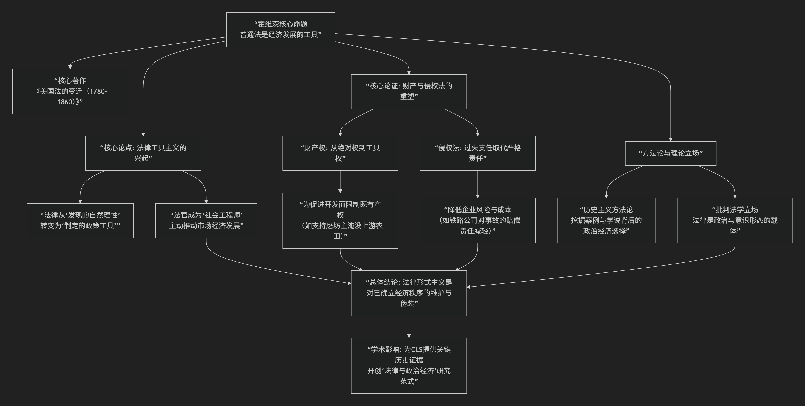

Morton Horwitz
=========

基于莫顿·霍维茨法学核心思想

---------------------------------

莫顿·霍维茨是美国批判法学运动的核心奠基人之一，其核心思想可概括为：**运用历史分析揭示，美国普通法并非中立、客观的规则演进，而是法官有意识地将法律规则改造为服务于新兴工商业资本利益、促进资本积累与经济发展的强大工具。** 他的工作彻底颠覆了关于法律“中立性”和“演进理性”的传统叙事。

为了系统理解其思想，以下框架梳理了其核心命题、方法论与影响：

**一、核心命题：法律是经济变革的引擎**

霍维茨在其里程碑著作《美国法的变迁（1780-1860）》中，提出了一个革命性观点：

在19世纪美国经济转型的关键时期，法官并非被动地适用古老原则，而是 **主动地、有目的地重塑普通法规则**，以补贴和鼓励新兴的工商业活动，特别是运输、制造和金融业。

**核心转变**：法律思想从 **“法律作为发现”（发现永恒的自然法原则）** 转向 **“法律作为工具”（将法律视为实现社会政策的可塑性工具）**。法官从“宣告者”变成了“立法者”和社会工程师。

**二、核心论证：财产法与侵权法的重构**

他通过详实的案例史分析，展示了普通法核心领域如何被系统性改造：

1.  **财产权的“相对化”与重新分配**

    *   **传统原则**：财产权是绝对的、排他的。

    *   **霍维茨的发现**：为促进水力磨坊、运河、铁路等基础设施建设，法院通过“妨害法”、“优先占用”等 doctrine，**牺牲了上游农民、小土地所有者的传统财产权利**，以支持下游工商业主的开发利益。

    *   **典型案例**：磨坊主为筑坝而淹没上游农田，法院倾向于支持磨坊主，认为其带来的社会效益（经济发展）高于农民的个体损失。

2.  **侵权法向“过失责任”的转向**

    *   **传统原则**：严格责任（只要你造成了损害，通常就需赔偿）。

    *   **霍维茨的发现**：法院逐渐确立 **“过失责任”** 为一般原则。原告必须证明被告存在“过失”，方能获得赔偿。这 **极大降低了新兴工业（如铁路、工厂）的经营风险和事故成本**。

    *   **影响**：工业事故的损失被转移到更弱势的工人和公众身上，实质上是法律对资本积累的一种隐蔽补贴。

3.  **合同法的“客观化”**

    *   合同法从关注当事人的真实合意与公平对价，转向强调 **合同的表面形式与促进交易安全**，这同样服务于商业活动的可预测性和资本流动。

**三、方法论与理论立场**

1.  **历史主义与还原论**：霍维茨将法律学说史置于广阔的社会经济变迁史中考察，揭示所谓“法律技术性演进”背后真实的 **利益冲突与政治选择**。

2.  **法律工具主义**：他认为这一时期的法律成为了 **有意推动资本主义发展的工具**。法律规则的变化不是中立的，而是带有明确的价值取向和分配后果。

3.  **批判法学的奠基**：他的工作为批判法学运动提供了最坚实的历史弹药。他证明了：

    *   法律远非中立。

    *   法律发展与经济权力结构的变迁紧密相连。

    *   “法律形式主义”（即相信法律是自洽、中立、科学的体系）在19世纪末的兴起，其功能是 **掩盖和合法化一套已然偏向资本利益的规则**，并阻止进一步的激进再分配。

**四、影响与争议**

*   **开创性贡献**：

    *   开创了 **“法律与政治经济”** 研究的新范式。

    *   为“法律是政治”这一CLS核心信条提供了无可辩驳的历史实证。

    *   促使学界重新审视法律“客观性”的神话，将关注点引向法律的分配效应。

*   **主要批评**：

    1.  **过度决定论**：批评者认为他过于强调经济利益对法律的决定作用，低估了法律内在逻辑、意识形态多元性以及法官个人信念的独立性。

    2.  **史料选择与解释**：有历史学家对其案例选择的代表性和解释提出异议，认为他忽略了同时期保护弱势群体的判决。

    3.  **功能主义倾向**：将法律规则的变化几乎完全归因于其服务于经济发展的“功能”，可能简化了历史的复杂性。

**总结**

莫顿·霍维茨的核心思想，在于 **将法律从“超越政治”的神坛上拉下，并将其置于历史与政治经济的聚光灯下进行解剖**。他揭示了一个残酷而深刻的真相：

> **美国普通法的“古典时代”，并非一个法律凭借自身理性自主演进的黄金时期，而是一个法官们运用法律工具，积极参与国家建设、并在此过程中将发展成本系统地转移给农民、工人和普通消费者的时期。**

他的研究永久地改变了美国法律史的面貌，并成为所有试图理解法律、权力与经济发展之间复杂关系的人无法绕开的基石。他教导我们，任何对法律现状的理解，都必须追问：**这套规则最初是为谁的利益而设计的？它又隐含着怎样的社会选择与代价？**

------------

 .. toctree::
    :maxdepth: 3

    grok
    copilot
    chatgpt
    deepseek
    gemini
    qwen

