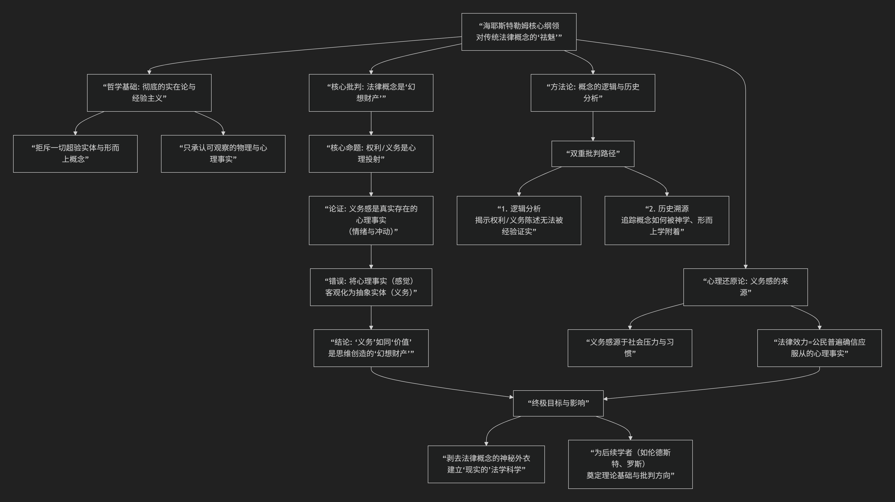

Axel Hägerström
================

基于阿克塞尔·海耶斯特勒姆（Axel Hägerström，通常被误写为“Asel Hayestelmer”）现实主义法哲学核心思想

---------------------------------

海耶斯特勒姆是 **斯堪的纳维亚现实主义法学的奠基人和核心代表**，其思想以 **彻底的经验主义、反形而上学和心理学还原论** 著称。他的核心目标在于 **摧毁传统法学中“权利”、“义务”、“有效性”等概念的超验（形而上学）基础**，将其还原为可观察的社会心理事实。

为了清晰展示其思想体系的逻辑结构，下图归纳了其核心命题与论证路径：

以下将依据此逻辑框架，对其核心思想进行详细阐释：

---

**一、核心命题：法律概念是“幻想财产”**

海耶斯特勒姆认为，传统法学（尤其是自然法与分析实证主义）中的核心概念——如“权利”、“义务”、“法律效力”——并非描述任何客观实在，而是人类思维的 **“幻想财产”** 或 **“情感投射”**。

*   **心理还原论证**：

    1.  **真实存在的是感受**：当我们说“我有权利要求X”或“我有义务做Y”时，真实存在的是一种 **心理事实** ——一种混合了 **情绪（如被侵犯感）和行为冲动（如要求或服从）** 的复杂心理状态。

    2.  **错误的对象化**：人们错误地将这种内在的心理感受，**投射** 到外部世界，将其想象为一种独立于心灵的、客观存在的 **“实体”** 或 **“纽带”**。这就好比将“美”这个主观感受，误认为是物体本身具有的“美”这一属性。

    3.  **结论**：因此，“权利”和“义务”就像“价值”一样，不是世界中的真实事物，而是我们思维创造的“幻想财产”。它们是用来 **描述和激发特定社会行为的语言工具和心理机制**，而非本体论上的存在。

**二、哲学基础：彻底的实在论与反形而上学**

他的这一批判建立在 **乌普萨拉学派哲学** （一种强调实在论和经验主义的瑞典哲学）之上：

*   **拒斥超验**：他反对任何无法被感官经验直接或间接验证的概念。传统法律概念常常被赋予一种神秘的、超越经验的“约束力”，这正是他所要清除的 **“法律与道德观念中的形而上学元素”**。

*   **只承认事实**：唯一真实的是物理事实和心理事实。法律科学必须基于对这些事实的观察，而不是对虚构概念的逻辑推演。

**三、对法律“有效性”的解释**

对于法律为何有效、为何被遵守这一核心问题，海耶斯特勒姆同样进行了心理学还原：

*   **效力即心理事实**：法律的“有效性”或“约束力”，并非来自某个“基础规范”（如凯尔森所言）或“主权者命令”，而是来自于 **社会成员（尤其是法官和官员）普遍拥有的一种“共同观念”或“确信”——即确信某些规则应当被服从**。

*   **社会压力的产物**：这种确信是社会压力、传统、教育和功利计算等多种因素长期作用形成的心理习惯。因此，法律效力最终是一种 **“社会心理事实”**。

**四、方法论：概念分析与历史溯源**

为实现其批判目标，他运用了双重方法：

1.  **逻辑分析**：分析法律概念陈述的逻辑结构，揭示其无法被经验证实的本质。

2.  **历史溯源**：追溯“权利”、“义务”等概念如何从原始的、与魔法和宗教力量相关的观念（如“法咒”），逐渐被理性化和形而上学化，从而剥离其神秘外壳。

**五、思想总结与定位**

海耶斯特勒姆的思想是斯堪的纳维亚现实主义的 **哲学基石**。他进行了一场激进的 **“概念祛魅”** 运动：

*   **贡献**：他像一位哲学上的“奥卡姆剃刀”，无情地剔除了法学中冗余的形而上学实体，迫使法学家思考概念背后的真实社会与心理过程，为一种基于经验的、科学的法学研究扫清了道路。

*   **局限与批评**：

    *   **自我驳斥**：如果所有规范性概念都是幻想，那么他主张的“追求真理”、“坚持经验主义”本身是否也是幻想？

    *   **解释力不足**：完全消解法律的规范性维度，无法解释法律为何能作为 **行动的理由** （而不仅仅是行为的 **原因** ）。人们遵守法律，常常是因为“这是法律要求”，而不仅仅是出于习惯或恐惧。

    *   **过于激进**：在批判“权利实体”时，可能也抛弃了“权利”话语在组织社会关系、进行道德论辩中不可或缺的实践功能。

总而言之，**海耶斯特勒姆将法学从“概念的天国”拉回到了“事实的人间”**。他的工作提醒我们：当我们使用“权利”、“义务”这些大词时，必须时刻追问——它们究竟指向什么可观察的经验现实？还是仅仅是我们情感与想象的投射？这种彻底的追问精神，使其成为20世纪法律思想史上一位无法绕过的、极具颠覆性的批判者。

------------

 .. toctree::
    :maxdepth: 3

    grok
    copilot
    chatgpt
    deepseek
    gemini
    qwen

