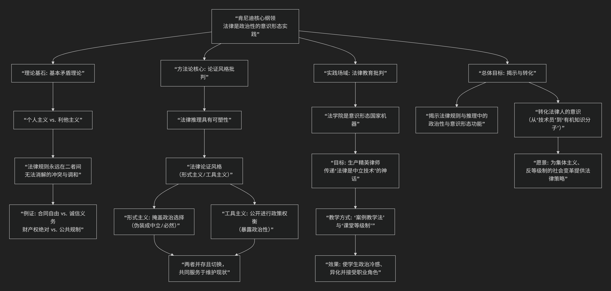

Duncan Kennedy
================

基于邓肯·肯尼迪法学核心思想

---------------------------------

邓肯·肯尼迪是美国批判法学运动最核心、最具战斗性的理论家和组织者之一。他的思想以 **“解构自由主义法律思想的内在矛盾”** 和 **“揭露法律推理中的政治性”** 而著称，其核心可概括为：**法律并非中立的规则体系，而是掩盖并再生产资本主义社会基本矛盾和等级制（尤其是阶级关系）的意识形态装置。**

其思想体系可以概括为以下三个相互关联的核心命题：

**一、核心理论基石：“基本矛盾”理论**

肯尼迪认为，自由主义法律思想内部存在一个 **“基本矛盾”** ，它无法被消除，并渗透于所有法律领域。

*   **矛盾内容**：即 **“个人主义”** 与 **“利他主义”** （或译为“共享目的”、“共同体”）之间的根本张力。

    *   **个人主义**：主张个人自由、自治、自利是最高价值，社会是个人为实现各自目的而进行的自愿联合。在法律上体现为 **合同自由、财产权绝对、形式平等**。

    *   **利他主义**：主张个人应对他人和集体负有义务，共同体的福祉和团结是重要价值。在法律上体现为 **侵权法中的注意义务、合同法中的诚信原则、以及各种规制和再分配政策**。

*   **矛盾的不可消解性**：肯尼迪指出，没有任何一个自由主义法律体系能纯粹地贯彻其中一种价值。所有法律规则都是这两种对立价值观 **“无法调和却又不得不进行的调和”** 的临时产物。例如，绝对的合同自由（个人主义）会受到显失公平原则（利他主义）的限制。

*   **政治性所在**：由于矛盾无法在逻辑上解决，法官在具体案件中偏向个人主义还是利他主义，就成为一个 **“政治选择”** 。然而，传统法律学说却竭力掩盖这种选择性，将其装扮成逻辑推导或概念演进的必然结果。

**二、核心方法论：对“法律论证风格”的批判**

肯尼迪深入分析了法官和律师如何运用语言来掩盖其政治选择。他区分了两种主要的“法律论证风格”：

1.  **形式主义论证风格**：

    *   声称判决是从既定的、清晰的、中立的规则中 **逻辑演绎** 出来的。

    *   将法律描绘成一个 **封闭、自洽的体系**，法官只是“法律的嘴巴”。

    *   **功能**：这种风格的作用是 **否认判决的政治性和自由裁量性**，将其合法化为“必然”结论，从而维护现状的权威。

2.  **工具主义/政策论证风格**：

    *   公开承认法律规则是实现社会政策的 **工具**，判决需要进行 **政策权衡和后果考量**。

    *   **功能**：这种风格看起来更务实、更开放，但肯尼迪指出，它同样具有意识形态性。它预设了社会目标（如“效率”、“社会福利”）是既定的、共识性的，从而掩盖了这些目标本身的政治性和阶级性。

肯尼迪的犀利之处在于指出：**这两种风格并非对立，而是共谋的。** 法律人根据需要在两者间灵活切换，用形式主义来抵制激进变革，用工具主义来推行温和改良，其共同效果是 **维持现有的权力结构**。

**三、核心实践场域：法律教育批判**

肯尼迪认为，法学院是 **再生产法律意识形态和精英律师的关键机构**。其著名短文《法律教育的成本》是批判法学在教育领域的宣言。

*   **法学院的“政治使命”**：不是教授“纯粹技术”，而是系统地 **将学生“去政治化”**，让他们接受法律现状的“自然性”与“正当性”。

*   **“课堂等级制”**：苏格拉底教学法和考试制度制造了恐惧、竞争和个人主义，压抑了合作与集体政治意识，使学生专注于个人职业成功，并内化精英价值观。

*   **“异化”过程**：学生学习将法律视为一套与个人道德情感无关的、需要掌握的“把戏”，从而与自己最初的正义感产生疏离，成为服务于现有权力结构的“技术官僚”。

**四、总结与特点**

邓肯·肯尼迪的思想具有鲜明的战斗性和解构性：

*   **定位**：他是CLS运动中的 **“解构大师”** 和 **“激进旗手”**。与昂格尔的宏大理论建构相比，肯尼迪更擅长对具体法律学说和推理进行 **“内部爆破”**。

*   **目标**：他的工作旨在 **剥去法律“中立”、“客观”、“科学”的外衣**，暴露出其下涌动的政治冲突、价值选择和阶级利益，从而激发法律学生和从业者进行政治反思和行动。

*   **影响与局限**：他的批判极其有力，深刻揭示了法律形式背后的政治性，但也因 **“只破不立”** 而备受诟病。他揭示了矛盾，但未提供明确的解决蓝图。然而，正是这种彻底的揭露，使他的思想成为理解法律与权力关系不可或缺的批判性资源。

**总而言之，肯尼迪教导我们：每一次法律辩论，无论是关于合同解释还是宪法权利，其深层都是一场关于“我们想生活在何种社会”的政治斗争。法律话语的高墙之内，并非真理与逻辑的圣殿，而是意识形态角逐的战场。**

------------

 .. toctree::
    :maxdepth: 3

    grok
    copilot
    chatgpt
    deepseek
    gemini
    qwen

