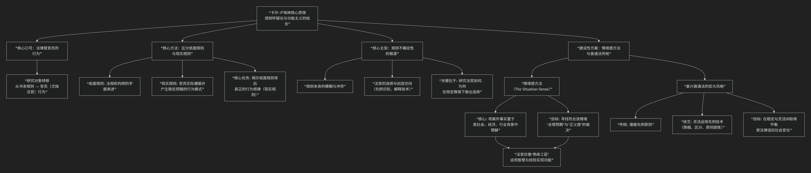

Carl Llewellyn
=========

基于卡尔·卢埃林（Carl Llewellyn）法律现实主义法哲学核心思想

---------------------------------

卡尔·卢埃林是 **美国法律现实主义运动的领袖与系统阐述者**。与杰罗姆·弗兰克激进的“事实怀疑论”相比，卢埃林的思想更为稳健和建设性，其核心可概括为 **“规则怀疑论”** 与 **“功能主义”** 的结合。他强调 **法律研究的重点应从纸面规则转向官员（尤其是法官）的实际行为**，并倡导一种以 **“情境感”** 为核心的司法方法。

其核心思想体系，可以通过下图清晰地概览：

以下，我们将沿此逻辑脉络，深入解析其核心要义。

---

**一、核心命题：法律是官员的行为**

卢埃林最著名的论断是：“**法律就是官员（尤其是法官）关于争端所做的行为。**” 这意味着：

*   **研究对象**的转移：法学研究的焦点不应是书本上静止的规则，而应是法官、律师、警察、行政官员等 **活生生的行为** 及其产生的社会效果。

*   **预测性**：对于律师和当事人而言，法律的意义在于 **预测法院将如何裁决**。因此，研究法官的 **行为模式** 比研究抽象的规则条文更实用。

**二、核心方法：区分“纸面规则”与“现实规则”**

这是其实证研究纲领的基础。

*   **纸面规则**：正式颁布的法典、条例和上诉法院判决中的原则性陈述。它们常常被法律形式主义者奉为圭臬。

*   **现实规则**：官员在实际处理纠纷时 **真正遵循并产生稳定预期的行为规律**。例如，某个法律条文在实践中可能被法官们普遍规避或重新解释。

卢埃林认为，现实主义者的任务就是戳穿“纸面规则”与“现实规则”常常不符的假象，通过细致观察（如研究大量低级法院判决、商业惯例）来揭示法律在现实中究竟如何运作。

**三、核心主张：规则的不确定性及其根源**

他主张 **“规则怀疑论”** ，但与弗兰克不同，他的怀疑主要针对 **上诉法院层面规则的确定性**，认为其存在以下固有局限：

1.  **规则的可塑性**：先例并非只有一个“正确”解释。法官拥有 **“可用的先例识别技术”** （如遵循、区分、限缩、扩展），可以选择性地运用先例来支持不同的结论。

2.  **规则的冲突性**：针对任何复杂案件，往往可以找到支持对立双方的法律原则。

3.  **规则的空缺性**：法律无法为每一个新情况提供现成的答案。

因此，判决不能简单归结为“规则+事实=结论”的逻辑演绎。法官在规则框架内拥有 **相当大的选择和创造空间**。

**四、建设性方案：情境感与“普通法传统”**

卢埃林并非单纯的“解构者”，他提出了建设性的司法方法。

1.  **“情境感”方法**：

    *   这是卢埃林思想中最具建设性的部分。他认为，优秀法官的判决不应基于个人癖好，而应基于对案件所涉 **社会情境的深刻理解**。

    *   法官应像工匠一样，考察案件事实背后的 **商业惯例、行业需求、社会关系类型**，并探究在此情境下，怎样的判决才能实现 **“合理预期”** 和 **“正义感”** 。法律规则应作为服务于此目的的工具。

2.  **复兴“普通法的宏大风格”**：

    *   在《普通法传统》一书中，他追溯并赞扬了普通法历史上一种理想的司法风格。这种风格 **既尊重先例（保障稳定性和可预测性），又灵活运用法律技艺（保障法律的适应性和实质正义）**。

    *   他认为，上诉法院的判决在总体上仍具有相当的可预测性，这种可预测性并非来自规则的僵化，而是来自法官共享的专业传统、推理技艺和对社会需求的敏感。

**五、与杰罗姆·弗兰克的对比**

.. list-table:: 法律现实主义内部两大思想对比
   :header-rows: 1
   :widths: 20 40 40
   :align: center

   * - **维度**
     - **卡尔·卢埃林 （规则怀疑论）**
     - **杰罗姆·弗兰克 （事实怀疑论）**
   * - **怀疑焦点**
     - **上诉审的法律规则** 之确定性与预测力。
     - **初审的事实认定过程** 之可靠性。
   * - **核心研究对象**
     - 法官（尤其是上诉法官）的 **行为模式与裁判技艺**。
     - 法官/陪审团在认定事实时的 **心理过程与主观因素**。
   * - **形象比喻**
     - 法律是 **法官行为模式** 的稳定集合，可被经验研究。
     - 法律是一场结果难测的 **心理戏剧**，充满了偶然性。
   * - **建设性方向**
     - 倡导以 **“情境感”** 为核心的司法方法，复兴普通法的灵活技艺。
     - 建议改革司法程序（如削弱陪审团），要求法官接受心理学训练。
   * - **主要著作**
     - 《荆棘丛》、《普通法传统》、《买卖法的判例与材料》。
     - 《法律与现代心智》、《初审法院：美国司法的神话与现实》。
     
**六、总结与影响**

卡尔·卢埃林的法律现实主义，是一种 **务实、功能导向且富有建设性** 的法学思想。他并非要否定规则，而是主张更诚实、更科学地看待规则在实践中的作用。

他的核心贡献在于：

1.  **将法学研究的焦点从“规则”引向“行为”和“效果”**，为法律社会学、司法行为研究开辟了道路。

2.  **提出了“情境感”这一核心方法论**，强调法律必须回应社会生活的具体需要，这对法律教育和司法实践产生了深远影响。

3.  **其集大成之作《美国统一商法典》**，正是其思想的最佳实践：该法典不拘泥于概念逻辑，而是以商业惯例和交易需求为核心，旨在促进商业活动的便利与公平。

总而言之，卢埃林教导法律人：**不要只做规则的奴仆，而要做善于运用规则、理解社会现实、实现正义功能的“技艺娴熟的工匠”。** 他的思想平衡了现实主义对确定性的怀疑与对法律作为社会治理工具的信心。

------------

 .. toctree::
    :maxdepth: 3

    grok
    copilot
    chatgpt
    deepseek
    gemini
    qwen

