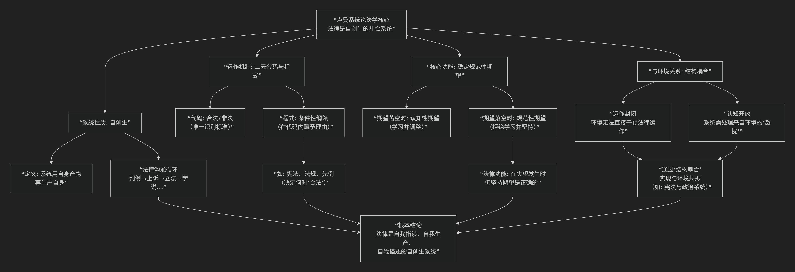

Niklas Luhmann 
==============

基于尼古拉斯·卢曼的系统论法学核心思想

---------------------------------

尼古拉斯·卢曼的系统论法学思想极其宏大且抽象，其核心可概括为：**现代社会的法律是一个功能分化的、“自创生”的社会子系统。它通过“合法/非法”这一二元代码封闭运作，并以“稳定规范性期望”为核心功能，在极度复杂的社会环境中维系自身的独立与存续。**

为了清晰理解其革命性，下图概括了其理论的核心架构：

以下将对其核心思想进行分点阐释：

**一、核心基石：作为“自创生系统”的法律**

这是卢曼理论最具革命性的观点。

*   **自创生**：指系统 **“用自身的产物，再生产自身”** 。法律系统的基本元素不是人、组织或规则，而是 **“法律沟通”** （一次立法、一份判决、一份合同、一条法学论述）。每一次法律沟通都产生并连接到下一次法律沟通，形成一个自我指涉、自我生产的封闭循环网络。

*   **关键推论**：**只有法律能产生法律**。政治压力、道德诉求、经济需求本身都不是法律，它们必须被法律系统“转译”为法律沟通（如转化为法律条文、构成诉讼理由）才能产生法律影响。

**二、运作机制：二元代码与程式**

法律系统如何识别和处理信息？

1.  **二元代码：合法/非法**

    *   这是法律系统的 **“生命密码”**，是其观察世界的唯一方式。任何事物（行为、事件、状态）一旦被法律系统处理，都必须被赋予“合法”或“非法”的值，**非此即彼，没有中间项**。

    *   这个代码是 **排他性的**，不能用“有利/不利”（经济系统）或“执政/在野”（政治系统）的代码来替代。

2.  **程式**

    *   仅有代码还不够，系统需要规则来决定在具体情况下赋予“合法”还是“非法”。这些规则就是 **“程式”**（或称“条件性纲领”）。

    *   法律条文、先例、法律原则等，都是程式。它们为代码的应用提供 **条件**（“如果……那么合法/非法”）。

**三、核心功能：稳定规范性期望**

卢曼认为，法律的社会功能不是实现“正义”——那是一个过于模糊且无法操作的概念。法律的 **核心功能** 是 **“稳定规范性期望”**。

*   **认知性期望 vs. 规范性期望**：

    *   当期望落空时（如朋友失信），我们 **调整期望** 以适应现实，这是认知性期望（学习）。

    *   当期望落空时，我们 **拒绝学习，并坚持期望本身是正确的**，要求对方纠正，这是规范性期望。

*   **法律的作用**：法律将重要的社会期望（如“财产不受侵犯”、“合同应当履行”） **规范化**，并建立一套机制，当这些期望落空时，**不是让期望者调整自己，而是通过（法律）程序来谴责违反者、维护期望的有效性**。这极大降低了社会互动的复杂性，使人能在一个充满不确定性的世界里，仍能稳定地规划未来。

**四、系统与环境：封闭与开放的悖论**

这是卢曼思想最精妙之处。

*   **运作上封闭**：法律系统在操作层面是绝对封闭的。只有法律沟通能产生法律沟通，外部环境（政治、经济、道德）的信息无法直接进入。

*   **认知上开放**：但法律系统必须处理来自环境的 **“激扰”** （如新科技、社会运动、经济危机）。系统通过 **内部的复杂化** （如创造新的法律概念、原则、学说）来“理解”并回应这些激扰，但回应的方式完全遵循自身的逻辑。

*   **结构耦合**：系统与环境之间通过固定的接触点实现共振。最典型的例子是 **“宪法”**，它既是最高法律，又规定了政治权力的产生方式，从而成为 **法律系统与政治系统的结构耦合点**。二者通过宪法互相影响，但各自保持独立运作。

**五、与传统法学的根本转向**

.. list-table:: 卢曼系统论法学与传统法学对比
   :header-rows: 1
   :widths: 20 40 40
   :align: center

   * - **维度**
     - **传统法学**
     - **卢曼的系统论法学**
   * - **研究对象**
     - 规则、原则、判决、意志。
     - **法律沟通及其递归性网络**。
   * - **核心问题**
     - 法律“应当”是什么？（自然法） 法律“是”什么？（实证主义）
     - 法律系统**如何可能**？它如何维系其自主性与功能？
   * - **法律变化**
     - 立法者的修改、法官的创造。
     - **系统的自我演化**：通过“变异”（新案例/法律）、“选择”（司法审查/学术讨论）、“稳定化”（成为先例/教义）的机制。
   * - **人与法律的关系**
     - 人是法律的创造者、使用者、遵守者。
     - **人是法律的“环境”**。法律系统将人（及其行为）作为 **沟通的“主题”或“承载者”** 来处理，而非系统的组成部分。

**总结与评价**

卢曼提供了一幅 **冷酷、复杂但极具解释力的现代法律图景**。他将法律从“意志的产物”或“道德的体现”中解放出来，描绘为一个 **自主运行、自我指涉、自我生产的巨型沟通机器**。

*   **贡献**：

    1.  **深刻解释了法律的自治性**：为何法律拥有专业术语、独立程序和独特逻辑。

    2.  **重新定义了法律的功能**：从追求正义转向管理社会期望的稳定性，这是一个极具社会学洞见的视角。

    3.  **为理解法律与社会的关系**提供了前所未有的精密工具（系统/环境、结构耦合）。

    4.  **完美解释了法律的“悖论”**：为何法律既稳定又变化，既受社会影响又保持独立。

*   **批评**：

    1.  **极端去人性化与去道德化**：人被消解为“环境”，正义被消解为“功能”，这令许多法学家不安。

    2.  **理论的抽象性与复杂性**：使其难以应用于具体的法律论证或改革。

    3.  **潜在的保守倾向**：强调系统的自我维持，可能削弱了批判和改革法律的规范动力。

**总而言之，卢曼的系统论法学是一场哥白尼式的革命。它不再追问法律“是什么”或“应当是什么”，而是追问法律“如何运作”。他将法律视为一个活生生的、自我观察、自我创造的社会系统，这套理论至今仍是理解现代法律复杂性最强大、也最具挑战性的思想框架之一。**

------------

 .. toctree::
    :maxdepth: 3

    grok
    copilot
    chatgpt
    deepseek
    gemini
    qwen

