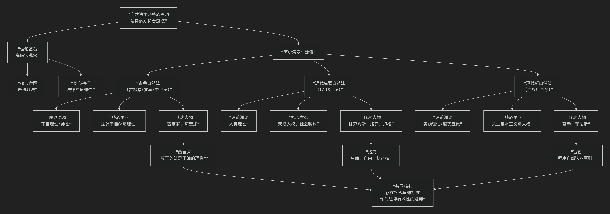

Natural Law School
===========

基于自然法学派（Natural Law School）核心思想

---------------------------------

自然法学派是西方法律思想史上最古老、最具影响力的流派之一。其核心思想可以概括为：**存在一种独立于人类意志、高于并指导人定法的“高级法”（即自然法），这种法源于自然、理性或神意，构成了评判人定法（实证法）正义与否的终极标准。其根本主张是“恶法非法”，法律必须符合道德。**

自然法学派的思想跨越两千多年，其核心演变与架构可以通过下图清晰地展现：

以下，我们将沿此逻辑脉络，深入解析自然法学派的核心要义。

一、核心命题与基本特征

自然法学派的所有论述都围绕几个核心命题展开：

1.  **“恶法非法”**：这是最著名的口号。它意味着，**一部在道德上不公正的法律，就失去了要求人们服从的资格，甚至不能称之为“法律”**。例如，纳粹德国的种族灭绝法律，因其极度不公，可以被视为无效的“恶法”。

2.  **法律的道德性**：法律与道德不可分割。法律的 **有效性** （是否配称为法）与其 **道德正确性** （是否公正）紧密相连。这与法律实证主义的“法律与道德分离”命题直接对立。

3.  **高级法观念**：存在一种普适的、客观的、永恒的道德法则（自然法），它高于任何人定法（实证法），是人定法的来源和评判标准。

二、历史演变与主要流派

自然法思想并非铁板一块，它经历了显著的演变，可分为三大阶段：

1. 古典自然法（古希腊、罗马、中世纪）

*   **理论渊源**：将自然法等同于 **宇宙的理性秩序** 或 **神的理性**。

*   **核心主张**：自然法是普遍、永恒、不变的。人定法只有符合这种更高的理性秩序时，才是正义的。

*   **代表人物与名言**：

    *   **西塞罗（古罗马）**： “真正的法律是与自然相一致的正确的理性；它是普适的、不变的和永恒的……我们无法违背它而不违背我们自己。”

    *   **托马斯·阿奎那（中世纪）**： 将法律分为永恒法（神的智慧）、自然法（理性受造物对永恒法的参与）、人定法（自然法在具体社会中的应用）、神法（《圣经》启示）。自然法是连接永恒法与人定法的桥梁。

2. 近代启蒙自然法（17-18世纪）

*   **理论渊源**：从神意转向 **人的理性**。这是自然法的“世俗化”时期。

*   **核心主张**：强调 **天赋人权** （自然权利），如生命、自由、财产。政府的权力源于被统治者通过 **社会契约** 的同意，其目的是保护这些权利。如果政府违背契约，人民有权反抗。

*   **历史作用**：为美国独立战争（《独立宣言》）和法国大革命（《人权宣言》）提供了直接的理论基础，是现代国际法（格劳秀斯）和宪政主义的基石。

*   **代表人物**：格劳秀斯、霍布斯、洛克、卢梭。

3. 现代新自然法（二战后至今）

*   **背景**：对纳粹暴行的反思。战后纽伦堡审判中，战犯以“服从法律”为借口辩护，法庭最终依据“高于纳粹法律的普遍道德法则”对其定罪，这标志着自然法思想的复兴。

*   **核心主张**：不再追求包罗万象的自然法体系，而是 **聚焦于某些基本的、底线的正义原则**（如尊重基本人权）。

*   **代表人物**：

    *   **朗·富勒**： 提出“程序自然法”，认为法律本身必须具备八项“内在道德”要求（如普遍性、公开性、不溯及既往、清晰性等），否则无法有效指引人的行为，甚至不配称为法律。

    *   **约翰·菲尼斯**： 回归亚里士多德和阿奎那的传统，列出七项基本的“人类善”（如生命、知识、友谊、实践理性等），认为自然法就是为实现这些基本善而要求的实践理性原则。

三、与法律实证主义的主要分歧

理解自然法学派的最佳方式，是与它的主要对手——法律实证主义——进行对比。

.. list-table:: 
   :header-rows: 1
   :widths: 30 35 35
   :align: center

   * - **对比维度**
     - **自然法学派**
     - **法律实证主义**
   * - **核心命题**
     - **恶法非法**
     - **法律与道德分离**
   * - **法律有效性**
     - 法律的效力取决于其 **道德内容** （是否公正）。
     - 法律的效力取决于其 **来源和形式** （是否由权威机构按程序制定）。
   * - **对待不公正法律**
     - 不公正的法律 **无效**，人们没有服从的义务。
     - 不公正的法律依然是 **法律**，但人们可以基于道德理由选择不服从。
   * - **关注点**
     - **法律应该是什么** （应然法）。
     - **法律实际是什么** （实然法）。

四、核心要义总结

.. list-table:: 
   :header-rows: 1
   :widths: 25 45 30
   :align: center

   * - **理论维度**
     - **核心命题**
     - **关键概念与贡献**
   * - **本体论**
     - **存在一种高于人定法的"自然法"，它源于自然、理性或神意。**
     - **高级法、客观道德秩序、理性**
   * - **效力理论**
     - **法律的效力与其道德性挂钩，"恶法非法"。**
     - **道德性、法律有效性、正义标准**
   * - **历史作用**
     - **为宪政、人权和社会契约理论奠定基础，是革命的理论武器。**
     - **天赋人权、社会契约、限制权力**
   * - **现代发展**
     - **聚焦基本人权和程序正义，为国际人权法提供支撑。**
     - **底线正义、程序自然法、基本善**

五、评价与影响

*   **积极意义**：自然法为批判和改造不合理的现实法律制度提供了永恒的道德标尺，是捍卫人权、追求正义的强大思想武器。

*   **挑战与批评**：

    *   **内容不确定性**：自然法的具体内容是什么？不同时代、不同文化的人可能有不同解释，容易陷入主观。

    *   **“自然主义谬误”的质疑**：能否从“事实”（自然是什么）推导出“价值”（法律应该是什么）？

六、总结

总而言之，自然法学派的核心思想在于，它是一位 **“法律的道德良心”和“正义的守护者”** 。它提醒我们，**法律不仅仅是权力的命令，更承载着我们对正义、平等和人的尊严的道德追求。当法律背离这些基本价值时，它不仅会失效，更会沦为暴政的工具。**

尽管其理论面临挑战，但自然法思想所蕴含的 **对超越性正义的信仰**，使其成为西方法治传统中一股永不枯竭的批判和建构力量，激励着人们不断追问：法律究竟为何而存在？

------------

 .. toctree::
    :maxdepth: 3

    grok
    copilot
    chatgpt
    deepseek
    gemini
    qwen
