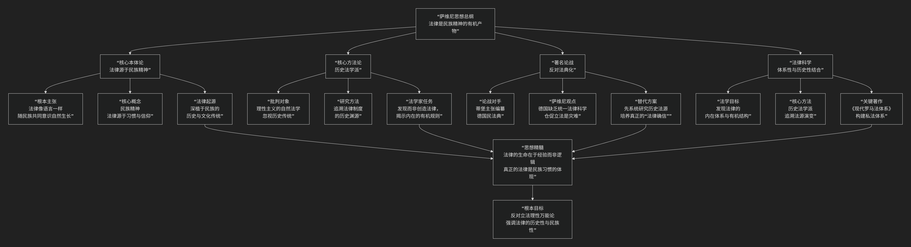

Carl von Savigny
====================

基于弗里德里希·卡尔·冯·萨维尼（Friedrich Carl von Savigny）的历史法学派核心思想

---------------------------------

弗里德里希·卡尔·冯·萨维尼是19世纪德国最杰出的法学家之一，历史法学派的奠基人和核心代表。他的核心思想可以概括为：**一种深刻批判自然法学的“历史法学”观，其核心论点是法律并非人类理性的、有意识的创造物，而是一个民族“民族精神”无声无息、逐渐累积的产物，如同语言和习俗一样，深深植根于该民族的历史经验和文化传统之中。**

萨维尼的思想体系深刻影响了德国民法乃至整个法学方法论，其核心架构与内在逻辑可以通过下图清晰地展现：

以下，我们将沿此逻辑脉络，深入解析萨维尼的核心要义。

一、核心本体论：法律源于“民族精神”

这是萨维尼全部思想的基石，是其对法律本质的根本看法。

*   **根本主张**：法律不是立法者 **理性设计** 的产物，也不是源于某种普适的“自然法”。相反，法律是 **一个民族“民族精神”的体现和有机组成部分**。

*   **核心概念：“民族精神”**：指一个民族在历史进程中形成的、共同的、下意识的 **信念、习惯和价值观念**。它深深地烙印在民族的文化传统中。法律，就像 **语言、风俗、礼仪** 一样，是这种精神自然而然的表达，而非有意识的发明。

*   **法律起源**：因此，法律首先起源于 **习惯** 和 **民众的法律确信**，而不是立法条文。真正的法律生命力存在于民族的生活实践之中。

二、核心方法论：历史法学派

基于上述本体论，萨维尼提出了研究法律的唯一正确方法——历史的方法。

*   **批判靶子**：他猛烈抨击在18世纪欧洲占统治地位的 **自然法学派**。自然法学派认为，可以凭借理性推导出放之四海而皆准的、完美的法律原则。萨维尼认为这种观点是空洞的、非历史的，它忽视了法律与特定民族历史和文化的血肉联系。

*   **研究方法**：要理解一种法律制度，**必须追溯其历史渊源**，考察它是如何从该民族的早期习惯中逐渐演化和发展而来的。法律的“所以然”深藏于它的历史之中。

*   **法学家的任务**：法学家的角色不是去“创造”法律，而是像一个语言学家研究语法那样，去 **“发现”和“阐述”** 已经隐含在民族历史和现行制度中的法律原则。他们是民族法律的“代言人”，而非“发明家”。

三、著名论战：反对蒂堡的法典化主张

萨维尼的思想在1814年与法学家安东·弗里德里希·尤斯图斯·蒂堡的著名论战中得到了集中体现。

*   **背景**：拿破仑战败后，德国民族主义高涨。蒂堡发表文章，呼吁借鉴《拿破仑法典》，立即为德国制定一部 **统一的、理性的民法典**，以促进国家统一和政治自由。

*   **萨维尼的回应**：萨维尼发表《论立法与法学的当代使命》进行反驳，其核心论点如下：

    1.  **时机不成熟**：德国当时缺乏一个统一的 **“法律科学”** ，法学家对德国法的历史渊源（尤其是罗马法和日耳曼习惯法）的研究尚不深入。在此情况下，仓促立法必然是拙劣的、无根的。

    2.  **法律不能移植**：一部法典如果脱离了本民族的“民族精神”和历史传统，将是僵死的条文，无法获得生命力。

    3.  **替代路径**：当务之急不是立法，而是培养一代能够系统研究历史法源的、真正的 **法学家**，让他们来塑造德国的“法律确信”，为未来的法典化奠定坚实的基础。

*   **结果与影响**：这场论战极大地延迟了《德国民法典》的制定（直到1900年才生效），但促使德国法学界投入近一个世纪的时间进行精深的历史研究和体系构建，最终成就了《德国民法典》极高的学术质量。

四、法律科学：体系性与历史性的结合

萨维尼并非反对一切体系化。他认为，法学的最终目标是发现法律的 **内在体系** 和 **有机结构**。

*   **双重任务**：法学研究必须将 **历史性** 和 **体系性** 结合起来。

    *   **历史性**：提供法律材料的具体来源和演变过程。

    *   **体系性**：从杂乱的材料中抽象出普遍原则，构建一个逻辑自洽的概念体系。

*   **代表作**：其巨著《现代罗马法体系》正是这种方法的典范，它系统地整理了罗马法资源，并将其构建成一个适用于现代德国的私法体系。

五、核心要义总结

.. list-table:: 
   :header-rows: 1
   :widths: 25 45 30
   :align: center

   * - **理论维度**
     - **核心命题**
     - **关键概念与贡献**
   * - **法律本体论**
     - **法律是"民族精神"的有机产物，随历史自然生长，而非理性设计。**
     - **民族精神、习惯法、法律确信、有机生长**
   * - **法学方法论**
     - **理解法律必须采用历史方法，追溯其历史渊源。**
     - **历史法学派、反对自然法、历史研究**
   * - **法典化观点**
     - **反对脱离历史传统的仓促立法，强调法典化需以成熟的法律科学为前提。**
     - **反对蒂堡、法典化论战、法律科学**
   * - **法学任务**
     - **法学家任务是"发现"而非"创造"法律，揭示其内在体系。**
     - **体系性、法学家的使命、现代罗马法体系**

六、思想遗产与争议

*   **积极影响**：
    *   奠定了 **历史法学派** 的基础，促进了法学研究的历史维度。

    *   强调了法律的 **文化根基** 和 **连续性**，反对立法万能论。

    *   其学说为后来的 **潘德克顿法学** （概念法学）奠定了基础，间接影响了德国民法的体系化。

*   **争议与批评**：

    *   **保守倾向**：其思想被认为具有保守性，阻碍了通过立法进行社会改革。

    *   **民族主义风险**：过分强调“民族精神”，后来曾被扭曲利用，为狭隘的民族主义服务。

    *   **低估立法作用**：在现代复杂社会中，立法仍是推动社会变革不可或缺的工具，萨维尼对此有所低估。

七、总结

总而言之，萨维尼的核心思想在于，他是一位 **“法律的历史先知”和“民族精神的法学诠释者”** 。他教导我们，**法律的真谛并非刻于理性的石板之上，而是活于民族的历史生命之中。一部有生命力的法律，必须像古树一般，从其扎根的历史土壤和文化传统中自然而然地生长出来。**

他的全部工作是对 **理性万能主义** 的一次深刻反思。在启蒙运动高扬理性旗帜的时代，他提醒人们关注历史的厚度、习惯的力量和传统的智慧。尽管其思想存在争议，但他对法律与历史、文化间内在联系的深刻洞察，至今仍是法学思想宝库中的珍贵遗产。在这个意义上，萨维尼不仅是法学家，更是一位法律哲学家。

------------

 .. toctree::
    :maxdepth: 3

    grok
    copilot
    chatgpt
    deepseek
    gemini
    qwen
