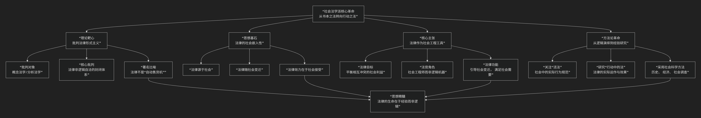

Sociological 
====================

基于社会法学派（Sociological Jurisprudence）核心思想

---------------------------------

社会法学派（或称社会学法学）是19世纪末20世纪初兴起的一场极具影响力的法律思想运动。其核心思想可以概括为：**一场将法律研究的重心从“书本上的法律”转向“行动中的法律”的革命。它主张法律并非一个由逻辑构成的封闭体系，而是深深植根于社会土壤的社会事实，其核心功能在于服务社会需要、平衡社会利益、引导社会变迁。因此，理解法律的关键不在于抽象的教义分析，而在于经验性地考察法律在社会中的实际运作、效果及其与社会因素的互动。**

社会法学派的思想极具现实感和批判性，其核心架构与内在逻辑可以通过下图清晰地展现：

以下，我们将沿此逻辑脉络，深入解析社会法学派的核心要义。

一、理论靶心：批判法律形式主义

社会法学派的兴起，首先是对19世纪占主导地位的 **“法律形式主义”** 或 **“概念法学”** 的强烈反叛。

*   **批判对象**：法律形式主义认为，法律是一个由抽象概念和原则构成的、逻辑自洽的封闭体系。法官的职责就是通过逻辑演绎，从这些概念中推导出具体案件的判决，如同“自动售货机”一般。
*   **核心批判**：社会法学家指出，这种观点是 **脱离现实的幻想**。它忽视了法律的社会根源、实际效果和法官在裁判中不可避免的自由裁量权。法律规则并非绝对确定，其含义和适用往往取决于社会环境和目标。
*   **霍姆斯的著名格言**：**“法律的生命从来不是逻辑，而是经验。”** 这句名言精准地概括了社会法学派的基本立场。

二、思想基石：法律的社会嵌入性

社会法学派将法律视为一种 **社会现象**，其存在和意义完全依赖于社会背景。

*   **法律源于社会**：法律不是由立法者凭空创造的，而是从社会习俗、惯例、道德观念和经济需求中逐渐演化而来的。
*   **法律随社会变迁**：社会是动态发展的，法律也必须随之变化。僵化不变的法律将无法满足新的社会需求，最终会失去效力。
*   **法律效力在于社会接受**：一部法律是否有效，不仅在于它是否由权威机关颁布，更在于它是否被社会大众所 **实际接受和遵守**。不被社会接受的法律只是一纸空文。

三、核心主张：法律作为社会工程的工具

从“法律是社会产物”这一前提出发，社会法学派提出了其建设性的主张。

*   **法律的目标是平衡社会利益**：社会由不同的群体和个体组成，他们的利益必然存在冲突。法律的核心功能就是 **识别、权衡和平衡这些相互冲突的社会利益**，以最大限度地满足社会整体的需要，促进社会团结。
*   **法官是“社会工程师”**：法官不应是机械适用规则的逻辑机器，而应是 **负责任的“社会工程师”**。在裁判时，他们应当考虑判决可能带来的 **社会后果**，并有意识地运用法律来引导社会向更美好的方向发展。
*   **法律是引导社会变迁的工具**：法律不应只是被动地反映社会现状，更应 **主动地引导社会变革**，例如通过立法来推动社会改革、保护弱势群体、促进经济发展。

四、方法论革命：从逻辑演绎到经验研究

这一理论主张带来了法学研究方法的根本性转变。

*   **研究“活法”**：除了国家制定的成文法，更应关注社会中真正起作用的行为规范，即 **“活法”**。这些规范可能存在于商业惯例、行业规则、民间调解中，它们才是真正支配人们日常生活的“法律”。
*   **研究“行动中的法”**：不仅要看法律条文是怎么写的，更要研究法律在现实中是 **如何被执行、解释和运用的**。警察如何执法？法官如何判案？民众如何应对法律？这些才是法律的真实面貌。
*   **采用社会科学方法**：倡导运用 **历史学、经济学、社会学、统计学** 等社会科学的方法来研究法律。例如，通过数据调查来评估某部法律的实际效果，通过经济分析来考察法律规则的效率。

五、主要代表人物与思想亮点

.. list-table:: 
   :header-rows: 1
   :widths: 30 70
   :align: center

   * - **代表人物**
     - **核心观点与贡献**
   * - **罗斯科·庞德**
     - **"社会工程"理论**：法律是社会控制的工具，旨在平衡相互冲突的利益，以实现社会利益的最大化。他系统化了社会学法学的纲领。
   * - **奥利弗·温德尔·霍姆斯**
     - **"法律预测说"**：法律就是对法院事实上将如何判决的预测。**"经验论"**：法律的生命是经验。强调法律的不确定性，为法律现实主义奠定了基础。
   * - **欧根·埃利希**
     - **"活法"理论**：法律发展的重心不在立法或司法，而在社会本身。存在于社会日常生活中的"活法"比国家法更为基础。
   * - **卡多佐**
     - **司法过程论**：法官在裁判时，会综合运用逻辑、历史、习惯、社会学等方法，其中 **社会福利** 是至关重要的考量因素。

六、核心要义总结

.. list-table:: 
   :header-rows: 1
   :widths: 25 45 30
   :align: center

   * - **理论维度**
     - **核心命题**
     - **关键概念与贡献**
   * - **基本立场**
     - **法律的生命在于经验，而非逻辑。必须研究"行动中的法"而非"书本上的法"。**
     - **批判形式主义、经验论、行动中的法**
   * - **法律观**
     - **法律是社会产物，其内容和效力源于社会。**
     - **社会嵌入性、法律与社会变迁、活法**
   * - **法律功能**
     - **法律是平衡社会利益、进行社会工程、引导社会变迁的工具。**
     - **社会工程、利益平衡、社会控制**
   * - **方法论**
     - **应采用历史、经济、社会调查等经验方法研究法律的实际运作与效果。**
     - **社会科学方法、效果评估、功能分析**

七、思想特质与影响

*   **现实感与实用性**：将法律从抽象的象牙塔拉回到复杂的社会现实中，使法学研究更具实践指导意义。
*   **批判性与进步性**：挑战了法律的绝对确定性神话，为法律改革和司法能动主义提供了理论依据。
*   **深远影响**：直接催生了美国法律现实主义运动，并深刻影响了后来的法经济学、批判法律研究、社会学法学等流派。它促使立法和司法更加注重社会调查和后果考量。

八、总结

总而言之，社会法学派的核心思想在于，它是一位 **“法律真相的揭示者”和“法学研究的拓荒者”** 。它教导我们，**要真正理解法律，不能只埋头于法典条文，而必须抬起头来，走进法庭、监狱、市场和社会生活，去观察法律是如何在具体的社会关系中真实地发挥作用的。**

它的全部工作是对 **法律与社会关系** 的一次深刻重塑。在法学思想史上，它完成了一次关键的“社会转向”，使法律学者和实践者认识到，一个优秀的法律人，不仅要是逻辑严谨的律师，更要成为洞察世情的社会学家。在这个意义上，社会法学派不仅是重要的学术流派，更是现代法治实践不可或缺的智慧源泉。

------------

 .. toctree::
    :maxdepth: 3

    grok
    copilot
    chatgpt
    deepseek
    gemini
    qwen

---------------------------

[:doc:`社会法学派与法律现实主义 </chats/outlaw/analyse/foreign/branch/legal/sociolo/compare>`]
