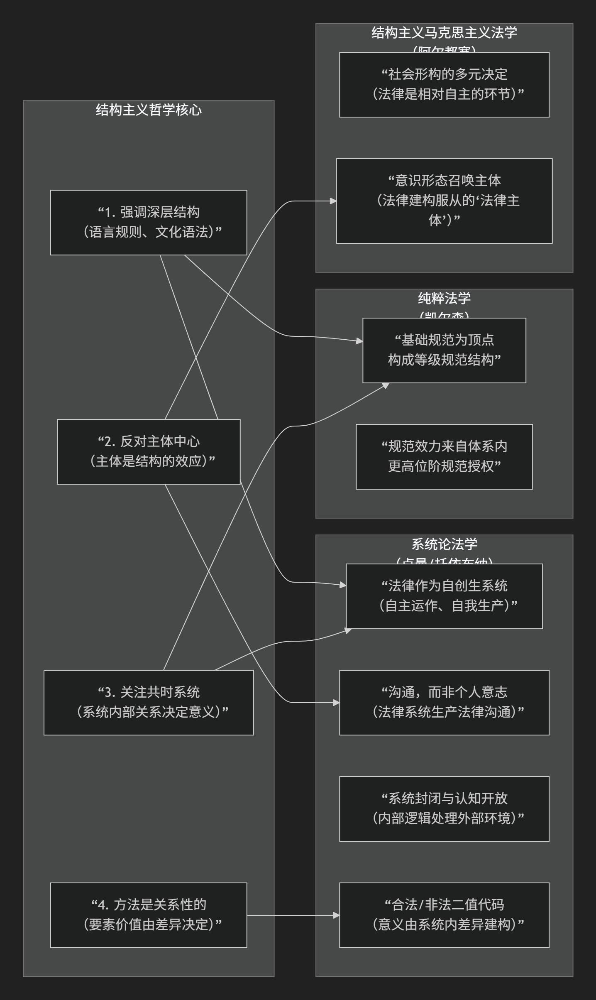

法学中的结构主义
----------------

 **“系统论法学”** 与结构主义哲学思想最为神似 ，尤其是**尼古拉斯·卢曼**和**贡塔·托依布纳**的法律系统理论。此外，**汉斯·凯尔森**的“纯粹法学”和**某些结构主义马克思主义法学**（如阿尔都塞的意识形态国家机器理论）也共享了核心的结构主义思维方式。

这种相似性可以清晰地用下表来概括和对比：

以下对上述对应关系进行具体阐释：

### **1. 系统论法学（卢曼/托依布纳）——最深刻的契合**

这是结构主义思想在当代法学中最彻底、最复杂的发展。它完全体现了结构主义的精髓：

*   **法律作为“自创生”系统**：法律被视为一个**自主运作、自我指涉、自我生产**的封闭系统。这直接对应结构主义将语言/文化视为一个自足系统的观念。
    *   **深层结构**：法律的“深层语法”就是其**二值代码（合法/非法）**。所有社会事件一旦被纳入法律系统，都必须用这个代码来观察和判断。
    *   **反对主体中心**：法律系统的基本单元不是个人或意志，而是 **“法律沟通”** 。是系统在通过沟通生产沟通，个人（法官、律师、当事人）只是承载这些沟通的“连接点”。
    *   **关系决定意义**：一个行为（如“杀人”）的法律意义，不取决于其物理或道德属性，而取决于它在法律规范网络中被**如何界定**（是故意杀人、过失致死、正当防卫还是紧急避险？）。

*   **系统的封闭与开放**：法律系统在运作上封闭（只遵循自己的逻辑和程序），但在认知上对环境（政治、经济、道德）开放。这类似于语言系统（封闭的语法）如何吸收外部世界的指涉。

### **2. 凯尔森的“纯粹法学”——规范结构的层级体系**

凯尔森的理论是更早期、更形式化的结构主义法学典范。

*   **深层结构**：法律体系是一个由 **“基础规范”** 作为顶点，层层授权、衍生出来的**静态或动态的规范等级结构**（金字塔）。每个规范的效力都来自于体系内更高位阶的规范。
*   **去主体化与去意识形态化**：他严格区分 **“实然”**（社会学的事实）与 **“应然”**（规范的效力），法学只研究后者。法律科学的任务是描述这个规范结构本身，排除心理、社会、道德等外部因素，这与结构主义排斥主体和历史的共时分析高度一致。
*   **意义来自位置**：一条法律规范的意义和效力，取决于它在整个规范体系中的**位置和与其他规范的关系**。

### **3. 结构主义的马克思主义法学（以阿尔都塞为代表）**

阿尔都塞将社会视为一个由经济最终决定的 **“多元决定”** 的结构整体，法律是其中一个**相对自主**的环节。

*   **法律作为意识形态国家机器**：法律不仅是镇压工具，更是**建构主体**的意识形态装置。它通过“询唤”将个体塑造成认同法律秩序的“法律主体”，这类似于结构主义中“主体是结构的效果”的论断。
*   **法律功能的系统性**：法律的功能必须在整个社会再生产的结构整体中理解，它服务于生产关系的维持。这体现了结构主义的整体论视角。

### **核心共鸣总结**

| 结构主义哲学核心 | 对应的法学思想体现 |
| :--- | :--- |
| **强调整体性和深层结构** | 法律是一个自主、自创生的系统（卢曼），或一个纯粹的规范等级体系（凯尔森）。 |
| **反对主体中心，强调结构决定** | 法律意义由系统沟通（卢曼）或规范位置（凯尔森）决定，而非立法者或法官的个人意志。法律“召唤”主体（阿尔都塞）。 |
| **关注共时性关系** | 法律分析聚焦于现行法律系统内部要素的相互关系（效力、授权、代码运算），而非单纯的历史起源。 |
| **意义由差异关系产生** | “合法”的意义完全依赖于它与“非法”的对立（卢曼）；一条规范的效力取决于它与其他规范的授权关系（凯尔森）。 |

**简而言之，与结构主义哲学最相似的法学思想，是将法律本身视为一个具有内在逻辑、自主运作、其要素意义由系统内关系决定的“结构”或“系统”。** 系统论法学是这一思想在当代最复杂和成熟的表现，而凯尔森的纯粹法学则是其在规范理论中的经典先声。