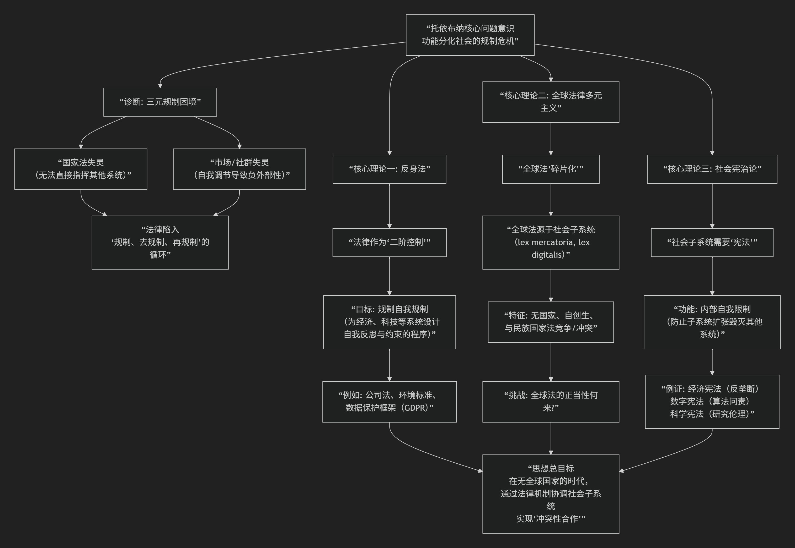

Gunta Toibner
==============

基于贡塔·托依布纳法学核心思想

---------------------------------

贡塔·托依布纳是 **当代德国最具原创性的法社会学家之一**，他是尼古拉斯·卢曼系统论法学 **最重要、最富创造力的继承者与发展者**。托依布纳的核心思想可概括为：**在功能高度分化的全球社会中，传统国家中心的法律模式已然失效，法律必须转向一种“反身性”的治理模式，并通过“社会宪治”来约束各个激进自治的社会子系统（如经济、科技、媒体）的权力扩张。**

如果说卢曼构建了系统论法学的“基础科学”，那么托依布纳则致力于其 **“工程应用”和“危机诊断”** ，聚焦于各社会子系统之间冲突所引发的现代性危机。其思想体系可以概括为三大核心命题：

以下，我们将沿此脉络，深入解析其核心要义。

**一、问题诊断：从“规制三元困境”到“片段化的全球法”**

托依布纳的起点是对现代治理危机的深刻诊断：

1.  **规制三元困境**：传统“国家命令-控制”式法律在干预经济、科技、环境等复杂领域时屡屡失败。国家（规制）、市场（去规制）、社群（自我规制）三者陷入僵局。法律要么因干预过深而窒息系统活力，要么因放任自流而导致系统产生毁灭性负外部性（如金融危机、生态灾难）。

2.  **全球法律多元主义**：他敏锐地指出，真正的“全球法”并非来自联合国或国家条约，而是产生于 **全球化的社会子系统内部**。

    *   **例子**：跨国公司网络产生的 **新商人法**、互联网技术标准构成的 **数字法**、世界体育组织制定的 **体育法**。

    *   **特征**：这些法律秩序是 **“没有国家的全球法”** ，它们是自创生的、片段化的，并与民族国家法律体系并存、竞争甚至冲突。

**二、核心理论一：“反身法”**

这是托依布纳提出的核心治理方案，旨在破解“规制困境”。

*   **核心主张**：法律不应再试图直接规定社会子系统的具体结果（那是 **“实质法”** ，注定失败），而应转向 **“反身法”** ——即法律的功能是 **为其他社会系统（经济、科学、医疗等）设计、激发和规制其“自我规制”的架构、组织与程序**。

*   **运作方式**：法律通过设定程序性规范、组织性要求和决策参与权利，促使其他系统进行 **内部反思和自我约束**。例如：

    *   公司法不规定利润多少，但要求设立董事会、独立审计、信息披露程序。

    *   环境法不规定每项技术标准，但要求企业进行环境影响评估并建立内部合规体系。

*   **本质**：法律从 **“一级控制”** 转向 **“二级控制”** ，即控制“自我控制”的过程。

**三、核心理论二：“社会宪治”**

这是托依布纳最具野心的理论，旨在应对子系统权力膨胀带来的系统性风险。

*   **核心问题**：当经济、科技、媒体等子系统遵循自身逻辑（利润最大化、技术可行性、点击率）无限扩张时，会侵蚀其他子系统（如政治、法律、家庭）的生存基础，甚至威胁人类生存（如金融风暴、生态危机、基因编辑伦理困境）。

*   **核心主张**：因此，这些社会子系统需要自己的 **“宪法”** 。这并非国家宪法的副本，而是一套 **“自我限制的基本规则”** ，用以约束子系统自身的过度扩张倾向，防止其产生毁灭性的“社会性外部成本”。

*   **实例**：

    *   **经济宪法**：反垄断法、金融监管中的系统性风险控制、公司社会责任框架。

    *   **数字宪法**：数据隐私权、算法透明度与问责制、数字人格保护。

    *   **科学宪法**：生物研究伦理审查委员会、科研诚信规范。

*   **宪治机制**：社会宪治通过子系统的 **自省性结构** （如内部审计、伦理委员会、监督机构）和与其他系统的 **“耦合制度”** （如公益诉讼、监管机构）来实现。

**四、核心理论三：作为“边缘地带”的法律与“系统际冲突法”**

托依布纳认为，在现代社会中，法律最重要的位置不在中心，而在 **各个社会子系统相互接触、冲突的“边缘地带”**。

*   **法律的角色**：法律成为处理 **“系统际冲突”** 的中介。当经济逻辑侵犯生命健康（如职业病），或科技逻辑挑战人类尊严（如基因专利）时，法律需要在不同系统的“理性”之间进行翻译、权衡和裁判。

*   **新型法律形态**：这催生了一种 **“异体移植”式** 的法律发展——将某个子系统的逻辑（如经济成本收益分析）部分引入另一个子系统（如环境法），但需经过法律的重构，以避免被单一逻辑殖民。

**五、总结与评价**

托依布纳的思想是系统论法学在 **全球化与风险社会时代的一次重大升级**。

*   **贡献**：

    1.  **提供了治理复杂性的新范式**：“反身法”和“社会宪治”为应对金融、科技、生态等全球性风险提供了极具启发性的理论工具箱。

    2.  **重新定义了法律全球化**：打破了“法律=国家法”的教条，揭示了全球法律秩序真实、多元、碎片化的图景。

    3.  **挽救了法律的规范性**：在卢曼高度描述性、冷峻的理论中，重新注入了 **“批判性”和“建设性”** 的维度，致力于寻找约束系统性权力的法律途径。

*   **批评**：

    1.  **实施难度**：社会宪治依赖子系统的“自我限制”，这在利益驱动下往往非常脆弱。

    2.  **民主赤字**：全球自创生法（如商人法）的正当性来源模糊，缺乏民主问责。
    
    3.  **概念抽象**：其理论框架仍显复杂，转化为具体政策面临挑战。

**总而言之，托依布纳将法律思考从“国家与公民”的经典框架，推向了一个“系统与系统”的未知疆域。他的工作预言并诠释了我们时代的核心困境：在一个没有顶层的、由各种自主运行的力量（市场、技术、网络）构成的全球社会中，如何通过法律来实现文明的自我约束与共存。** 他的思想是理解当代规制理论、全球治理和数字社会法理演进的关键。

------------

 .. toctree::
    :maxdepth: 3

    grok
    copilot
    chatgpt
    deepseek
    gemini
    qwen

